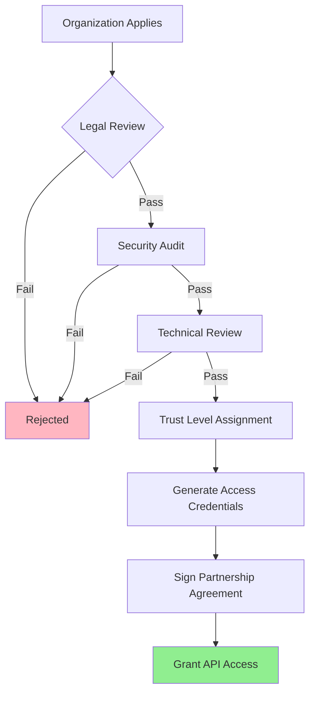

# ACA

<aside>
💡

**ACA** stands for *Access Control Architecture*

</aside>

## 🔐 Selective Internal API Access for Dual Libraries

> Designing a system where trusted sources (Microsoft, enterprise partners, vetted developers) can access internal APIs while maintaining security from untrusted community extensions.
> 

---

## 🎯 The Challenge

### **Requirements:**

- ✅ **Community extensions**: Public APIs only
- ✅ **Trusted partners** (Microsoft, enterprise): Internal APIs access
- ✅ **Symphony internal**: Full access to everything
- ✅ **Prevent leaking** internal APIs to untrusted sources
- ✅ **Scalable trust system** that doesn't require manual intervention

---

## 🏗️ Proposed Architecture: Three-Tier System

### 📦 **Library Structure**

```rust
// Tier 1: Public Community API
symphony-extension-api/
├── src/lib.rs                 # Public APIs only
└── Cargo.toml                 # Published to crates.io

// Tier 2: Trusted Partner API
symphony-trusted-api/
├── src/lib.rs                 # Public + some internal APIs
└── Cargo.toml                 # Private registry or signed distribution

// Tier 3: Full Internal API
symphony-internal-api/
├── src/lib.rs                 # All APIs including infrastructure
└── Cargo.toml                 # Never distributed externally

```

### 🔑 **Access Control Matrix**

| Extension Type | Public APIs | Trusted APIs | Internal APIs | Distribution |
| --- | --- | --- | --- | --- |
| 🌍 **Community** | ✅ Full | ❌ None | ❌ None | crates.io |
| 🤝 **Trusted Partners** | ✅ Full | ✅ Full | ⚠️ Selected | Private registry |
| 🏢 **Enterprise Customers** | ✅ Full | ✅ Full | ❌ None | Signed packages |
| 🎼 **Symphony Internal** | ✅ Full | ✅ Full | ✅ Full | Direct access |

---

## 🔐 Implementation Strategies

### **Strategy 1: Private Crate Registry**

### 🏭 **Setup Private Registry**

```toml
# .cargo/config.toml for trusted partners
[registries]
symphony-trusted = {
    index = "https://registry.symphony.internal/index",
    token = "trusted-partner-token-12345"
}

[source.crates-io]
replace-with = "symphony-trusted"  # Fallback to public registry

```

### 📦 **Dependency Configuration**

```toml
# Community extension (public registry only)
[dependencies]
symphony-extension-api = "1.0"  # From crates.io

# Trusted partner extension
[dependencies]
symphony-extension-api = "1.0"              # From crates.io
symphony-trusted-api = { registry = "symphony-trusted", version = "1.0" }

# Symphony internal
[dependencies]
symphony-extension-api = "1.0"
symphony-trusted-api = { path = "../trusted-api" }
symphony-internal-api = { path = "../internal-api" }

```

### 🛡️ **Security Features**

```rust
// Registry access control
struct TrustedRegistry {
    allowed_organizations: HashSet<String>,
    token_expiry: HashMap<String, SystemTime>,
    rate_limits: HashMap<String, RateLimit>,
}

impl TrustedRegistry {
    fn verify_access(&self, token: &str, org: &str) -> Result<(), AccessError> {
        // 1. Verify token is valid and not expired
        let expiry = self.token_expiry.get(token)
            .ok_or(AccessError::InvalidToken)?;

        if *expiry < SystemTime::now() {
            return Err(AccessError::ExpiredToken);
        }

        // 2. Verify organization is allowed
        if !self.allowed_organizations.contains(org) {
            return Err(AccessError::UnauthorizedOrg);
        }

        // 3. Check rate limits
        self.check_rate_limit(org)?;

        Ok(())
    }
}

```

### **Strategy 2: Cryptographic Signing System**

### 🔑 **Extension Signing Process**

```rust
// Extension metadata with cryptographic proof
#[derive(Serialize, Deserialize)]
struct TrustedExtensionManifest {
    name: String,
    version: String,
    author: String,
    organization: String,

    // Trust level signature
    trust_signature: TrustSignature,

    // API access permissions
    api_access: ApiAccessLevel,
}

#[derive(Serialize, Deserialize)]
struct TrustSignature {
    // Signed by Symphony's private key
    symphony_signature: String,

    // Organization's signature (for enterprise)
    org_signature: Option<String>,

    // Trust level (Community/Trusted/Internal)
    trust_level: TrustLevel,

    // Expiration date
    expires_at: SystemTime,
}

enum ApiAccessLevel {
    Community,           // Public APIs only
    Trusted,            // Public + selected internal APIs
    Enterprise(Vec<String>), // Public + specific internal APIs for this org
    Internal,           // All APIs
}

```

### 🔐 **Verification at Extension Load**

```rust
impl ExtensionManager {
    fn load_extension(&self, extension_path: &Path) -> Result<Extension, LoadError> {
        // 1. Load and parse manifest
        let manifest = self.parse_manifest(extension_path)?;

        // 2. Verify signatures
        self.verify_trust_signature(&manifest.trust_signature)?;

        // 3. Check API access permissions
        let allowed_apis = match manifest.api_access {
            ApiAccessLevel::Community => self.public_apis(),
            ApiAccessLevel::Trusted => self.public_and_trusted_apis(),
            ApiAccessLevel::Enterprise(ref apis) => self.custom_api_set(apis),
            ApiAccessLevel::Internal => self.all_apis(),
        };

        // 4. Load extension with appropriate API surface
        self.load_with_api_access(extension_path, allowed_apis)
    }

    fn verify_trust_signature(&self, sig: &TrustSignature) -> Result<(), SignatureError> {
        // Verify Symphony's signature using public key
        let symphony_key = self.get_symphony_public_key();
        if !symphony_key.verify(&sig.symphony_signature)? {
            return Err(SignatureError::InvalidSymphonySignature);
        }

        // Check expiration
        if sig.expires_at < SystemTime::now() {
            return Err(SignatureError::ExpiredSignature);
        }

        // Verify organization signature if present
        if let Some(ref org_sig) = sig.org_signature {
            let org_key = self.get_org_public_key(&sig.trust_level)?;
            if !org_key.verify(org_sig)? {
                return Err(SignatureError::InvalidOrgSignature);
            }
        }

        Ok(())
    }
}

```

### **Strategy 3: Hybrid Approach (Recommended)**

Combines both private registry AND cryptographic signing for maximum security:

```rust
// Trusted API distribution strategy
enum TrustedApiDistribution {
    // For major partners (Microsoft, Google, etc.)
    PrivateRegistry {
        registry_url: String,
        access_token: String,
        organization: String,
    },

    // For enterprise customers
    SignedPackages {
        signature: TrustSignature,
        custom_api_set: Vec<String>,
    },

    // For internal development
    DirectAccess {
        internal_path: PathBuf,
    },
}

```

---

## 🔒 Trust Management System

### 👥 **Organization Trust Levels**

```rust
#[derive(Debug, Clone)]
enum TrustLevel {
    // Full access to trusted APIs, vetted through partnership program
    TrustedPartner {
        partner_id: String,
        partnership_level: PartnershipLevel,
        api_access: Vec<ApiCategory>,
    },

    // Specific API access for enterprise customers
    Enterprise {
        customer_id: String,
        contract_id: String,
        allowed_apis: Vec<String>,
        expires_at: SystemTime,
    },

    // Community developers - public APIs only
    Community,
}

enum PartnershipLevel {
    Platinum,  // Full trusted API access
    Gold,      // Most trusted APIs
    Silver,    // Limited trusted API access
}

enum ApiCategory {
    PoolManagement,
    DAGTracking,
    ArtifactStorage,
    Arbitration,
    CustomInfrastructure(String),
}

```

### 🎯 **Trust Assignment Process**

```rust
// Partnership onboarding system
struct TrustAssignmentProcess {
    // Legal agreements
    partnership_agreement: bool,
    security_audit_passed: bool,
    compliance_verified: bool,

    // Technical requirements
    code_review_process: bool,
    security_standards_met: bool,
    monitoring_agreed: bool,

    // Business validation
    revenue_threshold_met: bool,
    strategic_value: StrategicValue,
}

impl TrustAssignmentProcess {
    fn evaluate_trust_level(&self) -> TrustLevel {
        match (
            self.partnership_agreement && self.security_audit_passed,
            self.revenue_threshold_met,
            self.strategic_value
        ) {
            (true, true, StrategicValue::Critical) => TrustLevel::TrustedPartner {
                partner_id: uuid::Uuid::new_v4().to_string(),
                partnership_level: PartnershipLevel::Platinum,
                api_access: vec![
                    ApiCategory::PoolManagement,
                    ApiCategory::DAGTracking,
                    ApiCategory::ArtifactStorage,
                ],
            },
            (true, true, StrategicValue::High) => TrustLevel::TrustedPartner {
                partner_id: uuid::Uuid::new_v4().to_string(),
                partnership_level: PartnershipLevel::Gold,
                api_access: vec![ApiCategory::PoolManagement],
            },
            // ... other cases
            _ => TrustLevel::Community,
        }
    }
}

```

---

## 🛡️ Security & Anti-Leaking Measures

### 🔐 **API Leak Prevention**

### **1️⃣ Code Obfuscation for Trusted APIs**

```rust
// Trusted API with obfuscated symbols
mod trusted_internal {
    // Internal API functions get obfuscated names in compiled binary
    #[no_mangle]
    #[export_name = "__symphony_internal_a1b2c3d4"]
    pub fn pool_manager_allocate_advanced() { /* ... */ }

    #[no_mangle]
    #[export_name = "__symphony_internal_e5f6g7h8"]
    pub fn dag_tracker_priority_override() { /* ... */ }
}

// Public wrapper with clear names
pub mod pool_management {
    use super::trusted_internal::*;

    // Only accessible with proper signatures
    pub fn allocate_advanced_pool() {
        verify_trusted_access()?;
        unsafe { __symphony_internal_a1b2c3d4() }
    }
}

```

### **2️⃣ Runtime API Access Control**

```rust
// All trusted API calls go through access control
struct ApiGateway {
    trust_verifier: Arc<TrustVerifier>,
    call_logger: Arc<CallLogger>,
    rate_limiter: Arc<RateLimiter>,
}

impl ApiGateway {
    fn call_trusted_api<T>(&self,
                          extension_id: &str,
                          api_name: &str,
                          func: impl FnOnce() -> T) -> Result<T, ApiError> {
        // 1. Verify extension has access to this API
        let trust_level = self.trust_verifier.get_trust_level(extension_id)?;
        if !trust_level.can_access_api(api_name) {
            return Err(ApiError::AccessDenied);
        }

        // 2. Rate limiting
        self.rate_limiter.check_rate_limit(extension_id, api_name)?;

        // 3. Log the call for auditing
        self.call_logger.log_api_call(extension_id, api_name);

        // 4. Execute the actual API call
        Ok(func())
    }
}

```

### **3️⃣ Trusted Extension Monitoring**

```rust
// Monitor trusted extensions for suspicious behavior
struct TrustedExtensionMonitor {
    call_patterns: HashMap<String, CallPattern>,
    anomaly_detector: AnomalyDetector,
}

#[derive(Debug)]
struct CallPattern {
    api_calls_per_minute: f64,
    unusual_api_combinations: Vec<Vec<String>>,
    data_access_patterns: Vec<DataAccessPattern>,
}

impl TrustedExtensionMonitor {
    fn monitor_extension_behavior(&mut self,
                                 extension_id: &str,
                                 api_call: &str) -> MonitoringResult {
        // Update call patterns
        self.call_patterns.entry(extension_id.to_string())
            .or_default()
            .record_call(api_call);

        // Detect anomalies
        if let Some(anomaly) = self.anomaly_detector.detect_anomaly(extension_id) {
            match anomaly.severity {
                Severity::High => {
                    // Immediately revoke access
                    self.revoke_extension_access(extension_id);
                    MonitoringResult::AccessRevoked
                },
                Severity::Medium => {
                    // Alert security team
                    self.alert_security_team(extension_id, &anomaly);
                    MonitoringResult::UnderReview
                },
                Severity::Low => MonitoringResult::Continue,
            }
        } else {
            MonitoringResult::Continue
        }
    }
}

```

---

## 📋 Trust Assignment Workflow

### 🤝 **Partnership Program Process**



### 📝 **Trust Assignment Criteria**

```rust
struct PartnershipEvaluation {
    // Legal & Business
    legal_entity_verified: bool,
    revenue_threshold: u64,        // $1M+ annual revenue
    business_use_case: String,

    // Security Requirements
    security_audit_report: SecurityAudit,
    code_signing_certificate: bool,
    security_contact_designated: bool,

    // Technical Requirements
    development_team_size: u32,    // Min 5 developers
    rust_experience: ExperienceLevel,
    extension_portfolio: Vec<Extension>,

    // Compliance
    gdpr_compliant: bool,
    soc2_certified: bool,
    iso27001_certified: bool,
}

fn evaluate_partnership_application(eval: &PartnershipEvaluation) -> PartnershipDecision {
    let security_score = eval.security_audit_report.overall_score;
    let business_score = calculate_business_score(eval);
    let technical_score = calculate_technical_score(eval);

    match (security_score, business_score, technical_score) {
        (s, b, t) if s >= 90 && b >= 80 && t >= 85 => {
            PartnershipDecision::Approved(PartnershipLevel::Platinum)
        },
        (s, b, t) if s >= 85 && b >= 70 && t >= 80 => {
            PartnershipDecision::Approved(PartnershipLevel::Gold)
        },
        (s, b, t) if s >= 80 && b >= 60 && t >= 75 => {
            PartnershipDecision::Approved(PartnershipLevel::Silver)
        },
        _ => PartnershipDecision::Rejected(rejection_reasons(eval)),
    }
}

```

---

## 🎯 Enterprise Customer Access

### 🏢 **Custom API Access for Enterprise**

```rust
// Enterprise-specific API access control
struct EnterpriseApiAccess {
    customer_id: String,
    contract_terms: ContractTerms,
    allowed_apis: HashMap<String, ApiPermission>,
    usage_limits: UsageLimits,
}

#[derive(Debug)]
struct ApiPermission {
    api_name: String,
    access_level: AccessLevel,
    rate_limit: u32,
    expires_at: Option<SystemTime>,
}

enum AccessLevel {
    ReadOnly,
    ReadWrite,
    Administrative,
}

// Example enterprise API access configuration
fn configure_enterprise_access(customer: &EnterpriseCustomer) -> EnterpriseApiAccess {
    let mut allowed_apis = HashMap::new();

    match customer.tier {
        EnterpriseTier::Premium => {
            allowed_apis.insert("pool_management".to_string(), ApiPermission {
                api_name: "pool_management".to_string(),
                access_level: AccessLevel::ReadWrite,
                rate_limit: 1000, // calls per minute
                expires_at: Some(customer.contract_end_date),
            });

            allowed_apis.insert("dag_tracking".to_string(), ApiPermission {
                api_name: "dag_tracking".to_string(),
                access_level: AccessLevel::ReadOnly,
                rate_limit: 500,
                expires_at: Some(customer.contract_end_date),
            });
        },
        EnterpriseTier::Standard => {
            allowed_apis.insert("pool_management".to_string(), ApiPermission {
                api_name: "pool_management".to_string(),
                access_level: AccessLevel::ReadOnly,
                rate_limit: 100,
                expires_at: Some(customer.contract_end_date),
            });
        },
    }

    EnterpriseApiAccess {
        customer_id: customer.id.clone(),
        contract_terms: customer.contract.clone(),
        allowed_apis,
        usage_limits: customer.usage_limits.clone(),
    }
}

```

---

## 🔍 Auditing & Compliance

### 📊 **Trust Level Monitoring**

```rust
// Comprehensive auditing system
struct TrustAuditSystem {
    access_logs: Vec<ApiAccessLog>,
    trust_violations: Vec<TrustViolation>,
    compliance_reports: Vec<ComplianceReport>,
}

#[derive(Debug)]
struct ApiAccessLog {
    timestamp: SystemTime,
    extension_id: String,
    organization: String,
    api_called: String,
    trust_level: TrustLevel,
    success: bool,
    error: Option<String>,
}

#[derive(Debug)]
struct TrustViolation {
    timestamp: SystemTime,
    extension_id: String,
    violation_type: ViolationType,
    severity: Severity,
    automated_response: Option<AutomatedResponse>,
}

enum ViolationType {
    UnauthorizedApiAccess,
    RateLimitExceeded,
    SuspiciousCallPattern,
    DataExfiltrationAttempt,
    ContractViolation,
}

enum AutomatedResponse {
    AccessRevoked,
    RateLimitReduced,
    SecurityTeamNotified,
    ExtensionQuarantined,
}

```

### 📋 **Compliance Reporting**

```rust
impl TrustAuditSystem {
    fn generate_compliance_report(&self, period: DateRange) -> ComplianceReport {
        ComplianceReport {
            period,
            total_trusted_extensions: self.count_trusted_extensions(),
            api_calls_by_trust_level: self.aggregate_calls_by_trust_level(period),
            violations_detected: self.count_violations(period),
            automated_responses: self.count_automated_responses(period),
            manual_interventions: self.count_manual_interventions(period),

            // Compliance metrics
            gdpr_compliance_score: self.calculate_gdpr_compliance(),
            security_score: self.calculate_security_score(),
            recommendations: self.generate_recommendations(),
        }
    }

    fn monthly_trust_review(&mut self) {
        // Review all trusted partnerships
        for (partner_id, trust_level) in &self.trusted_partners {
            let behavior_analysis = self.analyze_partner_behavior(partner_id);

            if behavior_analysis.risk_score > RISK_THRESHOLD {
                self.initiate_trust_review(partner_id.clone());
            }
        }
    }
}

```

---

## 🚀 Recommended Implementation Plan

### **Phase 1: Foundation (Weeks 1-4)**

```rust
// 1. Set up dual library structure
symphony-extension-api/      // Public APIs
symphony-trusted-api/        // Trusted APIs
symphony-internal-api/       // Internal APIs

// 2. Implement basic trust levels
enum TrustLevel { Community, Trusted, Internal }

// 3. Create signing infrastructure
struct TrustSignature { /* basic signing */ }

```

### **Phase 2: Trust Management (Weeks 5-8)**

```rust
// 1. Build private registry
TrustedRegistry::new(registry_config)

// 2. Implement access control
ApiGateway::new(trust_verifier)

// 3. Create partnership evaluation process
PartnershipEvaluation::evaluate()

```

### **Phase 3: Security & Monitoring (Weeks 9-12)**

```rust
// 1. Add comprehensive monitoring
TrustedExtensionMonitor::new()

// 2. Implement anomaly detection
AnomalyDetector::new()

// 3. Build audit system
TrustAuditSystem::new()

```

### **Phase 4: Enterprise Features (Weeks 13-16)**

```rust
// 1. Custom API access for enterprise
EnterpriseApiAccess::configure()

// 2. Advanced compliance features
ComplianceReport::generate()

// 3. Automated trust management
AutomatedTrustManager::new()

```

---

## 🎯 Final Architecture Decision

### **Recommended: Hybrid Three-Tier System**

1. **symphony-extension-api** (Public): Community developers
2. **symphony-trusted-api** (Private Registry + Signing): Trusted partners & enterprise
3. **symphony-internal-api** (Direct Access): Symphony internal only

This provides:

- ✅ **Real security** through multiple enforcement layers
- ✅ **Selective access** for trusted organizations
- ✅ **Scalable trust management** through automated systems
- ✅ **Comprehensive auditing** for compliance
- ✅ **Anti-leaking protection** through monitoring and obfuscation

**The key insight:** Trust is not binary - it's a spectrum that requires sophisticated management, monitoring, and enforcement systems.