# Architecture

## 🎯 Purpose

To enable agentic software creation from prompt to production through intelligent orchestration of AI models, UI/UX integration, and backend services.

---

### Old Architecture

[Online FlowChart & Diagrams Editor - Mermaid Live Editor](https://mermaid.live/view#pako:eNqtPGtvI0dyf6Whwy18wKxX79Uu7ANGJCXRpkgdSa29joLFiGxSkx3N0DPD3ZUtA77ECfLw62zDxtkX2AZ83sshuSDIlzs4SP6L_0DuJ6T6Xf0gJW_8ZVcku2qqq-td1fPmyqgY05W7K9MymZ2R4e5JfpL_9KfkxRdfJB06pfmY_XmSV_NTsUJ--RcnK3_-8uNPSZ9mSZ0WeXWWzuRvJyt_eZITMk5LOmI_kU6ffe6sAUwMP5KbN39-ebLS5L-TTpo_fOG0vPXzP3_5yWeA7vU5fD8mYzoDVDQfXZysXJLOOsDuSsSdDfjQ4Iie55h6M_aYJLv1Ck0QLv31JMmy02T0kGPaBOCmwrQFH1oM04svMkSDuizyKdkt8rFB0yjTOh0lGSnRVjmqbYDeU6huw4d9huoFsb3dVDMgyQy24ePi5uPkgoyK8_N5DnjZAo5tBxAcKGx34ENbEPYiIGsU-SRLgVt9WhXZnMEYlHF5mtYlRwRoc9hDxhGurQKSlzhGdirmXJtJnZC9rHhMWk9mWZIL0E5yQUvnsNlKthCv4yf_yTsIy1FS17TMK-_gmTQRorGxxcOLGa0YDg7JP0kwX2II2ev0XnlwPGj1-UN_9Q05roDGdj6b10aQ-sljMiuL81ldRYwBk3TK9s9hW92DuNtoNYW4_jNp5WdJPgL5YtTrB1tLJVaQhfmonjNZTMo6nSSjutJoD3vNVmfAkX7zKYnb5KgsRrSq0nxqIxULJcp9mlM4J8DIjonmtcZ3L-60m_Gw3esCzu9_87fkXpKlYykbGJ9ZKHHGM9j6oyCRg2GvH--3OJUf_TcZ1EWZTKnExyWCEOt8Glgm1aGys7J-cI87dG6N3uHhg8H9bkMJy-AiH52BchXzyrMA8VGbgH5lnHIOGUvQ7z__msSVBYrw81USVesRsPPmuEzhf41mMOy34kNx9F_D_kuanOMTQouUKNEku1mn55TMZ8B-akjaa7Wau3HjZbGhX5I9SsfMppBOUcyW8lRors1OT5uvx9TuXqfdGD5otoatxpBT8vnvSJPWYiHSCMA7L0eUawN7ktyHhI_7u-1hPx62OIs__d8_foBtCGKPux6hl2RXDIhOLyz8_dag17nXkqJsVvuY5UqFtxB2mqQTkgN_6dhB2-jda_XvK5nq0xFIfnmBuW8bumExI_3i8V2yV3KFG5MbYPLgj4qZccfWwWJYy86HBD2YbcoUQk7M-78zXwgz-hxI0qj-WeA0hU0kJF4TgvkfhC8lx229eJf_8sHvyUtFnaQguMBiwzupF8Mkhx-AWb-YGx4Q0lTibuvswfzUGJJ2pzW4Pxi2hGp89tdMAPbSjFYXVU3PwbyCJIIpsUyFtXvEQ3EY75qvQNUZliU7b706fLDf6e3GHQ787nsIuE-nKciU2Q9bvNtvN6Ude_cf0OLdMh1PqbUUdPWo1211h8I4P_0XxodZAXJRI6otEDA_YhOfIdTw5cLdH9HyPK3w9j9E3129_6NW__DBYdwF2yz82hdfsxNAKA7B105pqXFwCGbOBRM-_ifreWDXqb10_zjuC0H4_Pd46f48KceL1UXbJfH8c8a0UFSg1qFlxpIsRHJVdKAAG7Ady0pqAwfaGzAmSwzlYa_bBq6JQ3oPkVbkKXBNo2Bm6LjfaD0AK9d4WZ7Kx_9ItB0dlqBp6ECURQQ_DHHDfrsbNqUQbkzTnF7DPfRmtmfozahAscwhdHqNly1B-uQjcEdgElz56fc6Hea8QD16_Wa7GwumfA8mRtvcRlGU4xRiPIsvwuLaDzGW13nQsg0OhKNIRfCHPIj5YclOj_rtXr89vK8chqDk_X-HuCstID6_EILxCO35F8et45ZFOKgN2Mo59dhz2Orvt2zUn7xNDmk5pS7egNbsJhWg7IBQjWlWBRWGLTnsyAUC_1MH7irt4CjYyn0wethJhdhlQTWKbM0GAPk9HvaYqey0ZBAAcda8Lm5CVjLLKPI2Ikhqg8FudVUMzTxLWhMZzSJxIQQismH86oPGQUtFSu-x0K9OnpDGGbVUSAqLT-y6S-ww3hVxNKP07_4Enu9UMA2tabb39vQikZ6kkwmJIfe6eINiEjvt7hCtfPonloFCEAoWsqoTFpNfReCGS2C_tRc3QKUwAU9Bclg4XpTkgGYziwRkn-SuPv_EMp2eMBPSGx60-g9240FLObZefQaCJqQIi5CmPCCr--mVxh2W2HYdnO7_BAGvElmAUbacgfO_r2XX9kHesOJazzdM2e1DvnZgr_xPCAogwTtboOOWHVMqfrURg6dLAy3_utY2pOZAVtnsKBOktecgyccZdvHHgwN76TfkaF6dBRZ2OvbC38LCLHMWLtgGjyXViYgP3LfhtMjfSb911IP4Q2QM0jPOior50As3PAXS9h1H-veg_Ek-9d2ok9EIp_T5V5YuCO9fLDHA3LLMCqbFVwUueqUr4iIEC2K6Mm7RQDpyMWgaODYLiAgzlEc9bpKwp3rPJwWL8jBuxsPYjggPaZ2MWUnGjge16zciY7n9q6XGUKKCFEPatfRg0I2PBgc9CM4h01bh2Md_JIM8mVVnBTAJEvNg2HHUibvdQNhxlCV5jjhiqiLC9YhtWmUUx_8ExOgwHQMnRL64y-SUp4six3DkSCy9frao0HHx_jWTNPXNc_15tTRN3Bd27UMnn-sX8xoxYH9deIWvhJUd0PJROkIR1YGIl75gj5Y_kl45OqM8f0esb6_rctFZwmpfdtVIZEwHvYGoPnzwFUqZDoqqXpgzSTaqHO7ooj4r8pts824WF8gXOdSH70koF2CP__zt2ySEDSzMEEg23IHc9omvUq17OmWE1JkXk8iurjf52xkmFTOZREGwzxBxVLOkBt9zI1S-8_c1jAcvP-j3jodK6_9V4HHOVgp3r2_qKZDQgteXD1lmGneLui7OhUzHbSBMxqBOeMpXXV-cAZNiKPy5wMSpXYrk-n2WiOfj-QgLmwiVPn4HUiZRu_TOJVYl1k7nkNclplaNyj8YHGO__x0jz4mNfAJtWD-8Dpk0K8Hxw2sQKFFMlnnKN6ruXFqL9sAcHksL_v5_kT2wgvOSWkuwBfzgM14mcGwfClRtqtZ9quz0TxmEUObHBa89OAbZe00-_ukfyL20moPQveHso9XUWfbTX33_9ntgP74jrXFqI1xA5oZP5uD48DDumweDMZqfnyel92ARFKNivA6LnVNHT8fBsV3WKYpMGqi3-YdlJZxer2N77G8FvCfA_WGbJQfYV__SyLvtq5vxvhU4Pf039pUXNUEg1rFDWVHCg0AsC0aztk3QDw9FSOpHqULAz9j0FYJxEOxwcZfliLdlJCRbKUV-oKIWKfOQg1V4GRN7JPMxuKqUhYFGPdgqLs4qIuWm8zCZod9BgJWdOqrofFywVqcF35Tdke_IHihABvJoLRCCeN-WwotARw2zngeVNwTNjwBniM18vfhBHOA77gE6WK4KQjmoG9T6YoHi2ZBYC8lCwbhI4DkCJw5nifReq3G_YYni97_-jj2yk07o6GKU0YA-NA7a4NEeHPUg8L-vxEAz66iAoP9iSTQqVspI4rO_0dIBX11ZeBUPb2Fd_NZAW6rIiiMgpgPRkYMn_UZYyvNZSXkt1URM3Wbr1XZ3X3OLJoARnNWYPlmyjyHN4DRqCGa1AOtvboi6RZ2OlvmtYavTglQAwuQGxPjmxFg4olGBgc3sYzsewFk9gBPr3H_NJGjHFRyTXy45iocQnXQdkfiD6lZdIzk7rtOM1-cgurB1QP7yA3ouso0vbdMXX-pvPDHzubUXyzzIKWUuQBFwD1lST4rynKiAXH2xzE104uFer3_44JXWrgqYX6GnkDgbSTtoxZ2hiM8_-pgc0CSrz7wCtaLepRrnhP12Y6COE5LB0khPOEySbPz8bTjFWVZcXGEbRLPo098yPWjS6mGt256EdFUjBza3WBR0i4y3_rkwxGuy9cf7-ilrPCX8sRUfb7hBjtu4Ewuk7Or2PKtdjHhdQS3m6W9JX59DWiM6nie5ahDrJrNcO0og-yHnyCpekiYnSM5vsIYYER0xDlKgVPcS9dAWV4JRvCp2a4DkvAlzN7Dr2bwmIEn8MQkqw8rJEFysBQrRJ41GLecoqvkUeBIkFVGAdim5qGkYiRLVVBR4JRWmDgxM1X8HJhsYLEdzDpYSuMuJQCW9k1wXdBWvWUV3ZG8CHyPeAa4wK3BZYX6kk66lGEypWMHzUnHCbF-VVh6sRbpd6lUIVKkXUsKrTsCu_SoEutpV2vM9iaxKs17spV3DXFzVvVrulsu2tWH0QQKzpwFN9bwiNzj0BMmQu10MrgajRIHWPFNq5Dktp7wMeelUdkHprc8KkajeqhEHeW6mPejxy67HGtZzYffIeYRSeIcnuFar0PBarYeEza4EwE0F14BnmQ-OTJ8jhaoeayRQ12PZ2VCOoNaVXQfeLtJqTogi7Vi1W9W5CF8UxOPWbz15dpFBJFkKtVokzCgbFYaUi7cn0yiVNXLJCpTMACX5WLFwiWj7KKRoGq_gGQNXMn0cUp5Gahtm7xXDk48kI21pvJai6b0wMzHP1FSPpsA7WEmRONe8gERO1g8DAmbj8Q5WbU6eqzhHicVoHR_b8dHpwxVFgWXnKmoJ2D8aN6ScE_KNLhcluBwM5fCVGuQTxgoeL3xU5Xo1lRJqI8kyQpYyuo4RcoBZ4nlGTcMVjQlflL0mgD44DT9iJfKQZ7uGsZZUn8sGgWGDRi8VErcVTnL7s0-Sha9SZeLLQE8DDJbThdBmS7UhPNM3TbkzpLW3SbedoKMA1U6weCUw1cl0GjJgbqfBmFPZaWBjr7ly6wLXWco2e-Hh8psQChvqQnCe4z0KBfeQBc0hYv417CFarQRG6aviurKVi47tOpIpNuBiXmSgPEEQ-PqIIhwFWjbLR-aenkSmDq-YYYmChAa2C_nHAmxLx6AC_LZnjOSzZeLGTSKbHBJR3IjNBpOZHvG89CaO2GbsbyRCXvwjLMS6pSZ8MU4r23FIWkikyNpZ5DSal6VycxKjNTLqzzkxM-l-p_nOpxYMBo72UZqoKdFUeBpvmGcJTjGwozAqRcS7tuZ8lmDS0SLeM4pa7SGgkxwPV-mIkwuEfbhZwSoSTLwyCvnfotMNTGCZYEmqONX6E4jKXc1B4r-ISqEGHNdMzKcr8my9sWVfNGmCWsAlvy3vJOA5t4a4diA1LTDfHJZPhUrP2cVcBjmaBgqgFomigtdTYDfEhBdHcGjl9gGh009XxueG7jBzBKZBKkkIHeJCJQuHSjKegwCikHFw-yqNEoHVmI7SClmzYl6DOaMKhbc9iUFzhmWS05xxQ2F4nauW8T_tBVK63ELf0HJmozJtdR7raW74AZ_slKmYrS90mwSsXVi1ZEvhmeGV83hWeMyrZ8VhWm3PjMKOfH8wuOm5PTOKBR5sH5Kq-taY5iCERr1PwVaOibixZPyNEoYfBZkUjB8Fl7aUPwIuJ4b5f-MzwvPjnEGz_WNRZoTqivBKTpn41sHywoIAPuFsJR83JCUkK6bC_qwvJF-7GkS8qpPwArKCX2iUsd9zrTLKDTgN17Cn2svLaMLsAHGspM78D2dOU-I6GA6Pbr1CTwfAGWrXLHhgIuZFRJIBSaK-bTNnEQdODeqCVHp06JIcnOQHcrHxhcK5ymXm3tb-OlssXV9ZVNVNyJymczhUkW_Oc9FO0AB7YLl16kbLlM8VgFxV6m8Ox0v6OoMX8okAZahDn9DRHFUIxJAPKymey9OQc0AI9Gh-mqXV2a1qflqNyvRUPI-y0R_xGD4SBHZVbqqdPyoeUjZRcs7L-3z547Q-I_J5ruOTozGo29GWzOTzbhSS0uqhwZLmYpsq3kPTQQZS7lff9VOND3VZVkbYnUC7v2J3J8fwGN4plyNAuHmvGiV1nYzOIF7guEVzAu3QIgt39J8RnBnWZwTlSvWMsGAzn_mpzdYzgspxgmeAdqIpPWlmZAstVx0y1moT92KFaIuhDG5vmejZ_nYB_ETMZwgET2rZndPw2sUuAE_Q4IbIQ2Q9RWPQjnUBBq0kuKCqoS1XugADq-DJTFRML9kosPe8CoMpRRoOSm-5ALQSIyOLoLGDXIRhBj6GG8QxzuQwD_EYlCcrelyQy8pzemjwZ274LYM-OKqcSFnRTwQZIkow9TwiCr0xLBYZ5uHApZHG4J4DqqNuDBoUF_LSoNd1oK2YG2PQ4oLNaQgDjrgxgpkeFJK2dcLYNk4TCEvOKweJirkxgqlqhQo_qe7hjqkDiwNui4Cy-Csqo20pPQT-eTguHucOCn3SqMAILtxYfH7CGoBY1UhKWDZaKN1WE1szObF1aQ12XROLPHqS8WmuS2vi65oosAjw6qvCwwTmmjiYEADPZjNZ8tXO4prwMzQsdqkmya4J6xy48hjXZSDvOVRqzuwST6Gh8-ajhix-Y1YgeMiibmbHCazmP0PvKbi0xhh9HMe8OYTexCGsGBsg4dMSZlrRh-3zAofbkp8kaabCOHcgxwQ54cQzywrzsgybcAUo7jKI-Owaz0MbUAY3nTL-Ozu2O06s2IKersdRWKgntyt133ojgz0IGsQh-a1NmBvVWQwPwItSsc21KZOveSVbM9bkKJhvhyXGEIHNYbyTG2EUeXUdb1jRxCLWY9S7HkTNeZ7PqxB77MlDhUJ3H2XEJMbT7C1mataQB77uTCJkkO5X5sUZ2YXwOI_kC1rKeUblYVlTiix6s75QKOToYJEFDxwNGyoM8iPRowd8nFBSIfmiklA0ghgG5yOGNix6r4iaSwwfh5wLFKIhp3XkyNhlaLIQwhP_S-dYDC7c6bDnDU9y-7MtHWgkBaNwpxBB-p1vcMAEnj-dnpmM9rEauLu05vGW7YjjKZPHAoUappRNUjZnt1is9krKXh5CZoUsh6tmQeXbrbBUdVnPCyTzFOy7cYlsONZPTpE2igKKKJroWkcyvvW4TGvqiycrMLTXVZWYlmzOiFT8zo9s6CaCZwcLOsHC4pkeshKiBBdR_Ia0AJvKETH-FKvsYkYFnBdKyHBVvztC75G9MIKWJHkEBis5zXSuot_1cIleIiEwiL91PSlhF73SPK1R4WGkXhuhEZhXS1hI5PtnnsyKihUi5GM5jvioraHZCyUw9WZ0beRAac7vWs_RnWnQ-tIBOW4Tm954TcCyqccXLOfoUWgqMk0Bw253qcJSAUJhQ5TznL0fR0qGs16WJzQtvoF2GWlCGvcFGuK88bsy8HnN9HJhLdjYuGov6pdlBMFbOcRBdv0PvTTLvD5DAvO_VeVvXp8V7BZKgIumMK5P24PXIZ8NbvbiCavZi6U-zu6x_iwhOm4H2oohOmU3z8rkzP50zo-k2WkZOPSlwHL3ZLTkqFEdZkiIlK4QW7yTwWzRnO10Dq32OPcEXCOWskbZoyXTYgu55JhAw6jQRMViLOExRiRXoQaoUR81ne5V0JuKw9ypBf29dmp75iB5-I788RkfTOdqzwfWA303DmKCbx_CPXMJYmuDD4adiA2pjs2HCUyu2KDOqQUwuG1dBx6flxkYJD4i8b8e50inU7Df6pWEQupyIjMVnKg4kCpiAwllB82y9cXnKFGYnkcNzh-H9LHrMdrXgfK9KjvO60BOrRFbT7muRjDyJ6TDMwUmgOC3eK3ggUdNyiGC0xQBlZyuFLEImohsssxSLlZlfwlid_MRjArMlHKoywSyMGLS70XdBs_hmzhIO9IFsIFZ633M9gVgAVXRA8GWjvig1l0EM0-N5wMCz3MV66qZYWQNAyT4bTp1ZKZPt4ASczNFXQLC0qJlUiu-kxarapd10UA5Rx_6h2vTogdfV5kWwRvb56AJeayrsfmaWV2hmubCkeOj5MUiksxmeuDWekvqIVr8Cj1dvBBy5kO1sAvfQpreG8hoBF0j5x3Rrlq4WxaPK1qGMe7jptp4nIo3u_p1EJDjnMrCs2qyodKPXSALzfTh1Nep2CwsWakXN42DlSMHy9JCG9iXJJ_PQmCyoqBSnpxlW3b9QWEiFb8FKXuRoeIF0wcWygbBgxUzVA9RTekZBIssfJPTxxyHLnaxaNjJT0T0bMcbOHj2sksBUMqXEnrrUfp9kela7ChLqqpJJ2SiLrxN0iy7-xO6MVmfjCPAVDykd3-yduf29nhdfrz5OB3XZ3fXZ08QvDEQEsNkMtmgqxrDZOv2aHXVxrBhYUAxtEZBTynVKMYb60DUMiJOxZs7rk2AAy3fcyLBN-jWZEuD3z5dmyRLOZCkinc7ky26oyE3dnboxmgZ5EwFxBJ-bbI1MdteXd_ZGa8tgz_nNyQl2SO6SUcaeLS-trN1ehVwhg5th64Znp2OVtfHS0ln1X3FsEkymfwAsmv5YhK56zG9PdnW4Ft0Y-t0KbgKS8PCQrc27mxsLT0v3XqSCMaTbbqhEWyPN0ebSwnIxNvFJfTWBIvL9va2DbrmaIt5R7WEX51sTozQbCZ3VmlI3PSYjbChpD6jBLCy2Xah1vAPdXS74mZfPmcNTviOoXPnzmRjZ9kumQMPyvXmKJlsLVUo5LvDKjm5s7NcJbW_Dp7xZHNzY2N7uUpXNGzR1tfubE82ArDGb_KiO2MrKFddoBwEsZfEa9Fu1IiaEbq4qGypWmNMdWRi5sguL0WqBIYiLQmOC0ORKSdEKD_H9Qf10GgvkpNEkUwmhHlUC_aj_fXoIGqvR9rzSAuoVrSjThSDXdOEoJJ0JBK-SIVckUzotDFTQIdRVxgoTZjs4kcy_oxkez1CjfLItLwj0biOTA86wjME0n5pElHROrK9coQCksjuMzArpjCg0YbIdAqlrVKLvG6Ufm2_EgvUkI5wazlS_eFId3oj2bWNVAM2wgM4Js6QqO12U-QV9yOnVB9ZIU2EQpNIRUlRoL0Q2c2PyGtjcKuihckE9ZF97zCyLk9G9gW0CF9PjfBl08jcG43sm4KRf-EPbJQixE8LIrslELmXEyL3klbk3jmIAteljG3TT3ZyiMid6oz8_C_CM6NRaAQzcm9ORN74fGRdK4nsyyHahGrJRHlwZK4URviyeqRvvUfmBnpk3kYa2VfLI_uieGTe_8kN8Eq0MgXLs3K3Luc0WjkHW5Wwjytv8jeNrIALY0X6u_DnmE6SeVafrJzkbwHYLMlfK4pzBVkW8-nZyl3QtQo-iUpGU0y76CW85dAo5nm9cndzc5XjWLn75sqTlbs31-9sP7-1tbWzugnhLIS0O9HKxcrdjY07z6_urK5t3F69vbG9tX37rWjlDf7Utec37myvb63vbG7vrK3f2dl56_8AufvRgg)

```mermaid
graph TB

%% === Legend ===
subgraph Legend ["📖 Relationship Legend"]
  direction LR
  L1["A"] -->|"Direct Link<br/>🔗 Required dependency"| L2["B"]
  L3["C"] -.->|"Optional/Weak<br/>🔗 Optional/fallback"| L4["D"]
  L5["E"] ==>|"Strong Bond<br/>🔗 Critical relationship"| L6["F"]
  L7["G"] <-->|"Bidirectional<br/>🔗 Two-way communication"| L8["H"]
  L9["I"] ===|"Conflict Resolution<br/>🔗 Arbitration control"| L10["J"]
end

%% === Data Flow Explanation Layer ===
subgraph DataFlowExplanation ["🔄 Data Flow Patterns"]
  direction TB
  subgraph FlowTypes ["Flow Types"]
    direction LR
    FLOW_USER["👤 User Input"] -->|"Raw prompts, config"| FLOW_ENHANCED["📝 Enhanced Data"]
    FLOW_ENHANCED -->|"Structured artifacts"| FLOW_MODELS["🤖 AI Processing"]
    FLOW_MODELS -->|"Generated content"| FLOW_VALIDATION["✅ Validation"]
    FLOW_VALIDATION -->|"Approved artifacts"| FLOW_STORAGE["💾 Storage"]
  end
  
  subgraph CommunicationPatterns ["Communication Patterns"]
    direction LR
    COMM_SYNC["🔄 Synchronous"] -->|"Direct API calls"| COMM_ASYNC["⚡ Asynchronous"]
    COMM_ASYNC -->|"Event-driven"| COMM_STREAM["📡 Streaming"]
    COMM_STREAM -->|"Real-time updates"| COMM_FEEDBACK["🔁 Feedback Loop"]
  end
  
  subgraph ConflictPatterns ["Conflict Resolution Patterns"]
    direction LR
    CONFLICT_DETECT["🚨 Detection"] -->|"Resource conflicts"| CONFLICT_ARBITRATE["⚖️ Arbitration"]
    CONFLICT_ARBITRATE -->|"Resolution strategy"| CONFLICT_RESOLVE["✅ Resolution"]
    CONFLICT_RESOLVE -->|"Rollback if needed"| CONFLICT_RECOVERY["🔄 Recovery"]
  end
end

%% === Top Row: Frontend & Extensions ===
subgraph TopRow [" "]
  direction LR

  subgraph Frontend ["🎨 Frontend Layer (React)"]
    direction TB
    A1["📱 React UI"]
    B["🏪 Jotai State"]
    C["⚡ TanStack Query"]
    D["📡 Communication Hub"]
    FILESYSTEM["🗂️ Filesystem Interface"]
  end

  subgraph Extensions ["🔌 Extension System"]
    direction TB
    EXT_GLOBAL["🌍 Extension Registry"]
    EXT_BRIDGE["🌉 Extension Bridge"]
    EXT_COMPONENTS["🧩 Component Extensions"]
    EXT_API["🔗 Extension API"]
  end

  subgraph Permissions ["🔐 Permission System"]
    direction TB
    PERM_MANAGER["🛡️ Permission Manager"]
    PERM_STORE["📋 Permission Store"]
    PERM_GUARD["🚪 Permission Guard"]
  end
end

%% === Conflict Management Layer ===
subgraph ConflictManagement ["⚖️ Conflict Management Layer"]
  direction TB
  subgraph ConflictCore ["Conflict Detection & Resolution"]
    direction LR
    CONFLICT_MONITOR["🔍 Conflict Monitor"]
    RESOURCE_TRACKER["📊 Resource Tracker"]
    ARBITRATION_ENGINE["⚖️ Arbitration Engine"]
  end
  
  subgraph ConflictOps ["Conflict Operations"]
    direction LR
    LOCK_MANAGER["🔒 Lock Manager"]
    ROLLBACK_COORDINATOR["⏪ Rollback Coordinator"]
    RECOVERY_MANAGER["🔄 Recovery Manager"]
  end
  
  subgraph ConflictStrategies ["Resolution Strategies"]
    direction LR
    PRIORITY_RESOLVER["🎯 Priority Resolver"]
    QUEUE_MANAGER["📋 Queue Manager"]
    MERGE_RESOLVER["🔀 Merge Resolver"]
  end
end

%% === Base ML Models Layer ===
subgraph BaseMLModels ["🔧 Base ML Models"]
  direction TB
  subgraph BaseModelGrid [" "]
    direction LR
    subgraph BaseCol1 [" "]
      AUTOCOMPLETE["⚡ Auto-complete"]
      COMMIT_GEN["📝 Commit Generator"]
      SYNTAX_CHECK["🔍 Syntax Checker"]
    end
    subgraph BaseCol2 [" "]
      TAB_MODEL["↹ Tab Model"]
      DIFF_MODEL["🔄 Diff Analyzer"]
      LINT_MODEL["🧹 Lint Assistant"]
    end
    subgraph BaseCol3 [" "]
      REFACTOR_MODEL["🔧 Refactor Helper"]
      CONFLICT_MODEL["⚔️ Conflict Resolver"]
      OTHER_BASE["🧩 Other Base Models"]
    end
  end
end

%% === Git Management Layer ===
subgraph GitManagement ["🌿 Git Management Layer"]
  direction TB
  subgraph GitCore ["Git Core Operations"]
    direction LR
    GIT_MANAGER["🌿 Git Manager"]
    BRANCH_MANAGER["🌳 Branch Manager"]
    MERGE_MANAGER["🔀 Merge Manager"]
  end
  
  subgraph GitOps ["GitOps Operations"]
    direction LR
    COMMIT_HANDLER["📝 Commit Handler"]
    PUSH_HANDLER["📤 Push Handler"]
    PULL_HANDLER["📥 Pull Handler"]
  end
  
  subgraph GitState ["Git State Tracking"]
    direction LR
    REPO_STATE["📊 Repository State"]
    CHANGE_TRACKER["📈 Change Tracker"]
    CONFLICT_DETECTOR["⚠️ Conflict Detector"]
  end
end

%% === Checkpoint Management Layer ===
subgraph CheckpointManagement ["🛡️ Checkpoint Management"]
  direction TB
  subgraph CheckpointCore ["Checkpoint Core"]
    direction LR
    CHECKPOINT_MANAGER["📍 Checkpoint Manager"]
    METADATA_STORE["📋 Metadata Store"]
    ROLLBACK_HANDLER["⏪ Rollback Handler"]
  end
  
  subgraph CheckpointOps ["Checkpoint Operations"]
    direction LR
    SNAPSHOT_CREATOR["📸 Snapshot Creator"]
    RECOVERY_PLANNER["🔄 Recovery Planner"]
    VALIDATION_CHECKER["✅ Validation Checker"]
  end
end

%% === Middle Row: Backend & Bridge ===
subgraph MiddleRow [" "]
  direction LR

  subgraph Backend ["⚙️ Backend (Rust)"]
    direction TB
    G["🌐 Communication Router"]
    G2["🧠 Core Services"]
    H["🎛️ Service Orchestrator"]
    I2["💾 Shared Storage"]
    EXT_HOST["🏠 Extension Host"]
  end

  subgraph Bridge ["🌉 Python-Rust Bridge"]
    direction TB
    E["🐍 Python Bridge"]
    F["🦀 Rust Bridge"]
    CONTEXT["🧠 Context Manager"]
    EVENTS["📡 Event Bus"]
  end

  subgraph Tasking ["📡 Task Dispatch & Validation"]
    direction TB
    TASK_ROUTER["📬 Task Router"]
    VALIDATOR["✅ Response Validator"]
  end
end

%% === Bottom Row: AI & Models ===
subgraph BottomRow [" "]
  direction LR

  subgraph AI ["🧠 AI Core"]
    direction TB
    I["🎩 Conductor"]
    L["📄 Artifact Manager"]
    A["🤖 LLM Integration"]
  end

  subgraph Models ["🎻 AI Models"]
    direction TB
    subgraph ModelGrid [" "]
      direction LR
      subgraph Col1 [" "]
        ENHANCER["🎤 Enhancer"]
        FEATURE["🎼 Feature"]
        PLANNER["🏗️ Planner"]
      end
      subgraph Col2 [" "]
        COORDINATOR["🎛️ Coordinator"]
        VISUALIZER["🧮 Visualizer"]
        EDITOR["🧑‍💻 Editor"]
      end
      subgraph Col3 [" "]
        SUMMARIZER["🧾 Summarizer"]
        OTHER_MODELS["🧩 Other Models"]
      end
    end
  end

  subgraph Pool ["🌀 Pool"]
    direction TB
    POOL_MANAGER["📦 Pool Manager"]
    ARTIFACT_STORE["📁 Artifact Store"]
    DAG_TRACKER["🧭 DAG Tracker"]
    STALE_MANAGER["🗂️ Stale Manager"]
  end
end

%% === Artifact Layer ===
subgraph Artifacts ["🧩 Artifacts"]
  direction TB
  ART_ENHANCED["📝 Enhanced Prompt"]
  ART_FEATURES["📋 Feature List"]
  ART_PLAN["🏗️ Architecture"]
  ART_COORD["📊 Task Map"]
  ART_VIS["🧠 Pseudocode"]
  ART_CODE["💻 Final Code"]
  ART_SUMMARY["🧾 Summary"]
end

%% === Stale Management & Archival Layer ===
subgraph StaleLayer ["🗄️ Stale Management & Archival"]
  direction TB
  subgraph StaleManagement ["🗂️ Stale Management"]
    direction TB
    STALE_DETECTOR["🔍 Stale Detector"]
    LIFECYCLE_MANAGER["♻️ Lifecycle Manager"]
    ARCHIVAL_POLICY["📋 Archival Policy"]
  end
  
  subgraph Archive ["🗃️ Archive System"]
    direction TB
    ARCHIVE_STORE["📦 Archive Store"]
    COMPRESSION["🗜️ Compression"]
    INDEXING["🔍 Search Index"]
  end
  
  subgraph Telemetry ["📊 Telemetry & Analytics"]
    direction TB
    TELEMETRY_COLLECTOR["📡 Telemetry Collector"]
    USAGE_ANALYZER["📈 Usage Analyzer"]
    PATTERN_DETECTOR["🔮 Pattern Detector"]
  end
end

%% === Utility Row ===
subgraph UtilityRow [" "]
  direction LR

  subgraph Fallbacks ["🛟 Fallback Manager"]
    direction TB
    FALLBACK_MANAGER["🔄 Fallback Manager"]
  end

  subgraph Platform ["🌐 Platform"]
    direction TB
    PLATFORM_WEB["🏠 Website"]
    HEALTH["💓 Health Monitor"]
    FALLBACK["🔄 Fallback"]
    METRICS["📈 Metrics"]
  end

  subgraph Modes ["🚀 Deployment"]
    direction TB
    M["🖥️ Desktop"]
    N["🌍 Web"]
  end
end

%% === Frontend Flow ===
A1 -->|"User interactions<br/>& UI updates"| B
B -->|"State changes<br/>& data requests"| C
C -->|"API calls<br/>& cache management"| D
A1 <-->|"File system<br/>operations"| FILESYSTEM

%% === Base ML Models Integration ===
FILESYSTEM ==>|"Code input for<br/>auto-completion"| AUTOCOMPLETE
AUTOCOMPLETE ==>|"Completion<br/>suggestions"| FILESYSTEM
FILESYSTEM -->|"File changes for<br/>commit generation"| COMMIT_GEN
COMMIT_GEN -->|"Generated commit<br/>messages"| GIT_MANAGER
TAB_MODEL <-->|"Tab completion<br/>requests"| FILESYSTEM
SYNTAX_CHECK <-->|"Syntax validation<br/>requests"| FILESYSTEM
DIFF_MODEL <-->|"Diff analysis<br/>requests"| GIT_MANAGER
REFACTOR_MODEL <-->|"Refactoring<br/>suggestions"| FILESYSTEM
CONFLICT_MODEL <-->|"Conflict resolution<br/>assistance"| MERGE_MANAGER

%% === Git Management Integration ===
FILESYSTEM ==>|"File system<br/>operations"| GIT_MANAGER
GIT_MANAGER ==>|"Git status &<br/>file changes"| FILESYSTEM
GIT_MANAGER <-->|"Branch operations<br/>& merging"| BRANCH_MANAGER
BRANCH_MANAGER <-->|"Merge conflict<br/>resolution"| MERGE_MANAGER
COMMIT_HANDLER <-->|"Commit operations<br/>& validation"| GIT_MANAGER
PUSH_HANDLER <-->|"Push operations<br/>& sync"| GIT_MANAGER
PULL_HANDLER <-->|"Pull operations<br/>& updates"| GIT_MANAGER
REPO_STATE <-->|"Repository state<br/>tracking"| GIT_MANAGER
CHANGE_TRACKER <-->|"Change detection<br/>& monitoring"| GIT_MANAGER
CONFLICT_DETECTOR <-->|"Conflict detection<br/>& alerts"| MERGE_MANAGER

%% === Coordinator Model Git Integration ===
COORDINATOR ==>|"GitOps commands<br/>& operations"| GIT_MANAGER
COORDINATOR ==>|"Branch management<br/>requests"| BRANCH_MANAGER
COORDINATOR ==>|"Commit coordination<br/>& sequencing"| COMMIT_HANDLER
GIT_MANAGER ==>|"Git status &<br/>operation results"| COORDINATOR
CHANGE_TRACKER ==>|"Change notifications<br/>& updates"| COORDINATOR
CONFLICT_DETECTOR ==>|"Conflict alerts<br/>& resolution needs"| COORDINATOR

%% === Editor Model Git Integration ===
EDITOR ==>|"Code generation<br/>completion"| COMMIT_HANDLER
EDITOR -.->|"Code structure<br/>for commits"| COMMIT_GEN
ART_CODE ==>|"Final code for<br/>commit preparation"| COMMIT_HANDLER

%% === Checkpoint Management Integration ===
CHECKPOINT_MANAGER ==>|"Checkpoint creation<br/>requests"| GIT_MANAGER
GIT_MANAGER ==>|"Git commit metadata<br/>for checkpoints"| METADATA_STORE
METADATA_STORE ==>|"Checkpoint metadata<br/>storage"| CHECKPOINT_MANAGER
ROLLBACK_HANDLER <-->|"Rollback operations<br/>& git reset"| GIT_MANAGER
SNAPSHOT_CREATOR <-->|"Snapshot creation<br/>& git tagging"| GIT_MANAGER
RECOVERY_PLANNER <-->|"Recovery planning<br/>& git history"| GIT_MANAGER
VALIDATION_CHECKER <-->|"Validation checks<br/>& git status"| GIT_MANAGER

%% === Coordinator Checkpoint Integration ===
COORDINATOR ==>|"Checkpoint requests<br/>& rollback commands"| CHECKPOINT_MANAGER
CHECKPOINT_MANAGER ==>|"Checkpoint status<br/>& rollback results"| COORDINATOR
ROLLBACK_HANDLER ==>|"Rollback completion<br/>notifications"| COORDINATOR
RECOVERY_PLANNER ==>|"Recovery options<br/>& recommendations"| COORDINATOR

%% === Conflict Management Integration ===
CONFLICT_MONITOR ==>|"Monitor resource<br/>access patterns"| RESOURCE_TRACKER
RESOURCE_TRACKER ==>|"Track file/artifact<br/>access requests"| CONFLICT_MONITOR
CONFLICT_MONITOR ==>|"Detect concurrent<br/>access conflicts"| ARBITRATION_ENGINE
ARBITRATION_ENGINE ==>|"Resolve conflicts<br/>via strategies"| PRIORITY_RESOLVER
ARBITRATION_ENGINE ==>|"Queue conflicting<br/>requests"| QUEUE_MANAGER
ARBITRATION_ENGINE ==>|"Merge concurrent<br/>changes"| MERGE_RESOLVER
LOCK_MANAGER <-->|"Manage resource<br/>locks & releases"| RESOURCE_TRACKER
ROLLBACK_COORDINATOR <-->|"Coordinate rollback<br/>operations"| ROLLBACK_HANDLER
RECOVERY_MANAGER <-->|"Manage recovery<br/>processes"| RECOVERY_PLANNER

%% === Conductor Conflict Management ===
I ===|"Arbitration Control<br/>& Conflict Resolution"| CONFLICT_MONITOR
I ===|"Resource Access<br/>Coordination"| ARBITRATION_ENGINE
I ===|"Priority & Queue<br/>Management"| PRIORITY_RESOLVER
I ===|"Rollback & Recovery<br/>Orchestration"| ROLLBACK_COORDINATOR
CONFLICT_MONITOR ==>|"Conflict alerts<br/>& status reports"| I
ARBITRATION_ENGINE ==>|"Resolution decisions<br/>& outcomes"| I
PRIORITY_RESOLVER ==>|"Priority assignments<br/>& queue status"| I
ROLLBACK_COORDINATOR ==>|"Rollback completion<br/>& recovery status"| I

%% === Model Conflict Integration ===
ENHANCER -.->|"Request artifact<br/>access"| RESOURCE_TRACKER
FEATURE -.->|"Request artifact<br/>access"| RESOURCE_TRACKER
PLANNER -.->|"Request artifact<br/>access"| RESOURCE_TRACKER
COORDINATOR -.->|"Request artifact<br/>access"| RESOURCE_TRACKER
VISUALIZER -.->|"Request artifact<br/>access"| RESOURCE_TRACKER
EDITOR -.->|"Request artifact<br/>access"| RESOURCE_TRACKER
SUMMARIZER -.->|"Request artifact<br/>access"| RESOURCE_TRACKER
RESOURCE_TRACKER ==>|"Grant/deny access<br/>based on conflicts"| ENHANCER
RESOURCE_TRACKER ==>|"Grant/deny access<br/>based on conflicts"| FEATURE
RESOURCE_TRACKER ==>|"Grant/deny access<br/>based on conflicts"| PLANNER
RESOURCE_TRACKER ==>|"Grant/deny access<br/>based on conflicts"| COORDINATOR
RESOURCE_TRACKER ==>|"Grant/deny access<br/>based on conflicts"| VISUALIZER
RESOURCE_TRACKER ==>|"Grant/deny access<br/>based on conflicts"| EDITOR
RESOURCE_TRACKER ==>|"Grant/deny access<br/>based on conflicts"| SUMMARIZER

%% === Conflict Management Storage Integration ===
LOCK_MANAGER ==>|"Lock metadata<br/>& access logs"| I2
RESOURCE_TRACKER ==>|"Resource access<br/>tracking data"| I2
ARBITRATION_ENGINE ==>|"Arbitration decisions<br/>& history"| I2
ROLLBACK_COORDINATOR ==>|"Rollback operation<br/>logs"| I2

%% === Core Communication ===
D ==>|"HTTP/WebSocket<br/>requests & responses"| G
G -->|"Route requests<br/>to services"| H
H -->|"Orchestrate<br/>service calls"| G2
H ==>|"Cross-language<br/>function calls"| F
F <-->|"Serialize/deserialize<br/>data structures"| E
F <-->|"Manage execution<br/>context & memory"| CONTEXT
F <-->|"Publish/subscribe<br/>events"| EVENTS
E ==>|"Invoke AI models<br/>with context"| I

%% === AI Core Flow ===
I -->|"Create task<br/>with instructions"| TASK_ROUTER
I -->|"Manage artifacts<br/>& dependencies"| L

%% === Artifacts Used in Tasks ===
ART_ENHANCED -->|"Attach as<br/>input context"| TASK_ROUTER
ART_FEATURES -->|"Attach as<br/>input context"| TASK_ROUTER
ART_PLAN -->|"Attach as<br/>input context"| TASK_ROUTER
ART_COORD -->|"Attach as<br/>input context"| TASK_ROUTER
ART_VIS -->|"Attach as<br/>input context"| TASK_ROUTER
ART_CODE -->|"Attach as<br/>input context"| TASK_ROUTER
ART_SUMMARY -->|"Attach as<br/>input context"| TASK_ROUTER

%% === Model Dispatch Flow ===
TASK_ROUTER -->|"Send prompt<br/>enhancement task"| ENHANCER
TASK_ROUTER -->|"Send feature<br/>extraction task"| FEATURE
TASK_ROUTER -->|"Send architecture<br/>planning task"| PLANNER
TASK_ROUTER -->|"Send task<br/>coordination task"| COORDINATOR
TASK_ROUTER -->|"Send code<br/>visualization task"| VISUALIZER
TASK_ROUTER -->|"Send code<br/>generation task"| EDITOR
TASK_ROUTER -->|"Send summary<br/>generation task"| SUMMARIZER
TASK_ROUTER -->|"Send specialized<br/>processing task"| OTHER_MODELS

%% === Model Response Flow (Validator) ===
ENHANCER -->|"Return enhanced<br/>prompt text"| VALIDATOR
FEATURE -->|"Return feature<br/>backlog CSV"| VALIDATOR
PLANNER -->|"Return architecture<br/>plan JSON"| VALIDATOR
COORDINATOR -->|"Return task<br/>instructions JSON"| VALIDATOR
VISUALIZER -->|"Return pseudocode<br/>& flow diagrams"| VALIDATOR
EDITOR -->|"Return generated<br/>source code"| VALIDATOR
SUMMARIZER -->|"Return project<br/>summary markdown"| VALIDATOR

%% === Validation to Artifacts ===
VALIDATOR -->|"Validate & store<br/>enhanced prompt"| ART_ENHANCED
VALIDATOR -->|"Validate & store<br/>feature list"| ART_FEATURES
VALIDATOR -->|"Validate & store<br/>architecture plan"| ART_PLAN
VALIDATOR -->|"Validate & store<br/>task mapping"| ART_COORD
VALIDATOR -->|"Validate & store<br/>pseudocode"| ART_VIS
VALIDATOR -->|"Validate & store<br/>source code"| ART_CODE
VALIDATOR -->|"Validate & store<br/>final summary"| ART_SUMMARY

%% === Pool Routing ===
VALIDATOR -->|"Queue artifacts<br/>for processing"| POOL_MANAGER
VALIDATOR -->|"Update dependency<br/>graph"| DAG_TRACKER
VALIDATOR -->|"Report validation<br/>failures"| FALLBACK_MANAGER
I -->|"Request artifact<br/>allocation"| POOL_MANAGER
I -->|"Handle model<br/>failures"| FALLBACK_MANAGER
DAG_TRACKER -->|"Signal dependency<br/>completion"| I
POOL_MANAGER -->|"Store validated<br/>artifacts"| ARTIFACT_STORE
POOL_MANAGER -->|"Update task<br/>dependencies"| DAG_TRACKER
POOL_MANAGER -->|"Track artifact<br/>age & usage"| STALE_MANAGER
FALLBACK_MANAGER -->|"Retry failed<br/>tasks"| I

%% === Stale Management Flow ===
STALE_MANAGER -->|"Detect unused<br/>artifacts"| STALE_DETECTOR
STALE_DETECTOR -->|"Analyze artifact<br/>lifecycle"| LIFECYCLE_MANAGER
LIFECYCLE_MANAGER -->|"Apply archival<br/>rules"| ARCHIVAL_POLICY
ARCHIVAL_POLICY -->|"Archive old<br/>artifacts"| ARCHIVE_STORE
ARCHIVE_STORE -->|"Compress archived<br/>data"| COMPRESSION
ARCHIVE_STORE -->|"Index archived<br/>content"| INDEXING
STALE_MANAGER -->|"Collect usage<br/>metrics"| TELEMETRY_COLLECTOR
TELEMETRY_COLLECTOR -->|"Analyze usage<br/>patterns"| USAGE_ANALYZER
USAGE_ANALYZER -->|"Detect system<br/>patterns"| PATTERN_DETECTOR
PATTERN_DETECTOR -->|"Send insights<br/>to website"| PLATFORM_WEB
TELEMETRY_COLLECTOR -->|"Send raw<br/>telemetry"| METRICS
LIFECYCLE_MANAGER -->|"Free up pool<br/>resources"| POOL_MANAGER
ARCHIVAL_POLICY -->|"Notify about<br/>archival events"| EVENTS

%% === Storage ===
L ==>|"Read/write<br/>artifacts"| I2
I2 ==>|"Persist shared<br/>state"| H
METADATA_STORE ==>|"Store checkpoint<br/>metadata"| I2
GIT_MANAGER ==>|"Store git<br/>state data"| I2

%% === Extension System ===
EXT_GLOBAL ==>|"Register available<br/>extensions"| EXT_BRIDGE
EXT_BRIDGE ==>|"Load & initialize<br/>components"| EXT_COMPONENTS
EXT_BRIDGE -->|"Expose extension<br/>APIs"| EXT_API
EXT_GLOBAL <-->|"Sync extension<br/>state"| B
EXT_BRIDGE <-->|"Render extension<br/>UI components"| A1
EXT_API <-->|"Handle extension<br/>API calls"| D
EXT_HOST ==>|"Host extension<br/>runtime"| H
EXT_HOST ==>|"Manage component<br/>lifecycle"| EXT_COMPONENTS

%% === Permission System ===
PERM_MANAGER ==>|"Load permission<br/>policies"| PERM_STORE
PERM_MANAGER ==>|"Enforce access<br/>control"| PERM_GUARD
PERM_GUARD ==>|"Authorize extension<br/>API access"| EXT_API
PERM_GUARD ==>|"Validate extension<br/>permissions"| EXT_BRIDGE
PERM_STORE ==>|"Store permission<br/>data"| I2
PERM_GUARD ==>|"Authorize AI<br/>operations"| I
PERM_GUARD ==>|"Control feature<br/>access"| FEATURE
EXT_GLOBAL -.->|"Request permission<br/>info"| PERM_STORE
EXT_HOST -.->|"Check runtime<br/>permissions"| PERM_GUARD
PERM_STORE ==>|"Validate LLM<br/>access rights"| A
PERM_GUARD ==>|"Authorize git<br/>operations"| GIT_MANAGER
PERM_GUARD ==>|"Control checkpoint<br/>access"| CHECKPOINT_MANAGER
PERM_GUARD ==>|"Control conflict<br/>resolution access"| ARBITRATION_ENGINE

%% === Platform Integration ===
D -.->|"Send usage<br/>metrics"| METRICS
F -.->|"Report system<br/>health"| HEALTH
FEATURE -.->|"Report model<br/>health"| HEALTH
EXT_HOST -.->|"Report extension<br/>health"| HEALTH
GIT_MANAGER -.->|"Report git<br/>health"| HEALTH
CHECKPOINT_MANAGER -.->|"Report checkpoint<br/>health"| HEALTH
CONFLICT_MONITOR -.->|"Report conflict<br/>management health"| HEALTH
HEALTH ==>|"Trigger fallback<br/>on failure"| FALLBACK
HEALTH ==>|"Collect performance<br/>metrics"| METRICS
FALLBACK ==>|"Restart failed<br/>AI components"| I
FALLBACK ==>|"Restart failed<br/>extensions"| EXT_HOST
FALLBACK ==>|"Restart failed<br/>git operations"| GIT_MANAGER
FALLBACK ==>|"Restart failed<br/>conflict resolution"| CONFLICT_MONITOR

%% === Event System ===
EVENTS <-->|"UI events &<br/>state updates"| D
I <-->|"AI model events<br/>& status updates"| EVENTS
FEATURE <-->|"Feature processing<br/>events"| EVENTS
EXT_BRIDGE <-->|"Extension lifecycle<br/>events"| EVENTS
GIT_MANAGER <-->|"Git operation<br/>events"| EVENTS
CHECKPOINT_MANAGER <-->|"Checkpoint<br/>events"| EVENTS
AUTOCOMPLETE <-->|"Completion<br/>events"| EVENTS
CONFLICT_MONITOR <-->|"Conflict detection<br/>& resolution events"| EVENTS
ARBITRATION_ENGINE <-->|"Arbitration<br/>events"| EVENTS

%% === Fallback System ===
FALLBACK -.->|"Retry failed<br/>feature requests"| FEATURE
FALLBACK -.->|"Restart failed<br/>extensions"| EXT_HOST
FALLBACK -.->|"Retry failed<br/>git operations"| GIT_MANAGER
FALLBACK -.->|"Retry failed<br/>checkpoint operations"| CHECKPOINT_MANAGER
FALLBACK -.->|"Retry failed<br/>conflict resolutions"| CONFLICT_MONITOR

%% === Deployment ===
D -.->|"Desktop app<br/>communication"| M
D -.->|"Web app<br/>communication"| N
M -.->|"Native OS<br/>integration"| G
N -.->|"Browser<br/>communication"| G

%% === Additional Stale Management Connections ===
ARTIFACT_STORE -->|"Report artifact<br/>access patterns"| STALE_MANAGER
DAG_TRACKER -->|"Signal completed<br/>dependencies"| STALE_MANAGER
I -->|"Request artifact<br/>cleanup"| STALE_MANAGER
INDEXING -->|"Enable archived<br/>artifact search"| L
ARCHIVE_STORE -->|"Restore archived<br/>artifacts"| ARTIFACT_STORE
COMPRESSION -->|"Optimize storage<br/>usage"| I2
EXT_HOST ==>|"Store extension<br/>data"| I2
EXT_GLOBAL ==>|"Store registry<br/>data"| I2

%% === Styling ===
classDef frontend fill:#e3f2fd,stroke:#1976d2,stroke-width:2px
classDef extensions fill:#fff3e0,stroke:#f57c00,stroke-width:3px
classDef permissions fill:#ffebee,stroke:#d32f2f,stroke-width:2px
classDef bridge fill:#fff3e0,stroke:#f57c00,stroke-width:2px
classDef backend fill:#f3e5f5,stroke:#7b1fa2,stroke-width:2px
classDef ai fill:#e8f5e8,stroke:#388e3c,stroke-width:2px
classDef platform fill:#e1f5fe,stroke:#0288d1,stroke-width:2px
classDef modes fill:#fce4ec,stroke:#c2185b,stroke-width:2px
classDef models fill:#fff8e1,stroke:#fbc02d,stroke-width:2px
classDef pool fill:#f3faff,stroke:#0288d1,stroke-width:2px
classDef tasking fill:#ede7f6,stroke:#5e35b1,stroke-width:2px
classDef fallback fill:#ffebee,stroke:#e53935,stroke-width:2px
classDef artifacts fill:#fdf6e3,stroke:#6d4c41,stroke-width:2px
classDef legend fill:#f5f5f5,stroke:#666,stroke-width:1px
classDef explanation fill:#f0f4f8,stroke:#4a90e2,stroke-width:2px
%% === Complete the last styling line ===
classDef stale fill:#f1f8e9,stroke:#689f38,stroke-width:2px
classDef git fill:#e8f5e8,stroke:#4caf50,stroke-width:2px
classDef checkpoint fill:#fff3e0,stroke:#ff9800,stroke-width:2px
classDef conflict fill:#ffebee,stroke:#f44336,stroke-width:2px
classDef base fill:#e3f2fd,stroke:#2196f3,stroke-width:2px

%% === Apply styles to components ===
class A1,B,C,D,FILESYSTEM frontend
class EXT_GLOBAL,EXT_BRIDGE,EXT_COMPONENTS,EXT_API extensions
class PERM_MANAGER,PERM_STORE,PERM_GUARD permissions
class E,F,CONTEXT,EVENTS bridge
class G,G2,H,I2,EXT_HOST backend
class I,L,A ai
class PLATFORM_WEB,HEALTH,FALLBACK,METRICS platform
class M,N modes
class ENHANCER,FEATURE,PLANNER,COORDINATOR,VISUALIZER,EDITOR,SUMMARIZER,OTHER_MODELS models
class POOL_MANAGER,ARTIFACT_STORE,DAG_TRACKER,STALE_MANAGER pool
class TASK_ROUTER,VALIDATOR tasking
class FALLBACK_MANAGER fallback
class ART_ENHANCED,ART_FEATURES,ART_PLAN,ART_COORD,ART_VIS,ART_CODE,ART_SUMMARY artifacts
class STALE_DETECTOR,LIFECYCLE_MANAGER,ARCHIVAL_POLICY,ARCHIVE_STORE,COMPRESSION,INDEXING,TELEMETRY_COLLECTOR,USAGE_ANALYZER,PATTERN_DETECTOR stale
class GIT_MANAGER,BRANCH_MANAGER,MERGE_MANAGER,COMMIT_HANDLER,PUSH_HANDLER,PULL_HANDLER,REPO_STATE,CHANGE_TRACKER,CONFLICT_DETECTOR git
class CHECKPOINT_MANAGER,METADATA_STORE,ROLLBACK_HANDLER,SNAPSHOT_CREATOR,RECOVERY_PLANNER,VALIDATION_CHECKER checkpoint
class CONFLICT_MONITOR,RESOURCE_TRACKER,ARBITRATION_ENGINE,LOCK_MANAGER,ROLLBACK_COORDINATOR,RECOVERY_MANAGER,PRIORITY_RESOLVER,QUEUE_MANAGER,MERGE_RESOLVER conflict
class AUTOCOMPLETE,COMMIT_GEN,SYNTAX_CHECK,TAB_MODEL,DIFF_MODEL,LINT_MODEL,REFACTOR_MODEL,CONFLICT_MODEL,OTHER_BASE base
```

---

[Simplistic Diagram](https://mermaid.live/view#pako:eNqdW-uO48aVfpWCggwcoNozklp9gycAW5duJZTUkdQzmWwvBmyypOYORTK8dI_iNuAkXmAvviVjeBA7C8eA194NdgPsvwW82IfxC2weYU9dWUVSmvb8mWmR55yqOuerc6vi2w038kjjqLFMnPgKzY8vwovwhz9EDx8-RDZZktCjf16EaX7JKcTDv7lo_PWLF5-iKQmczI_C9MqPxbuLxt9ehAh5fkJc-grZU_rbbgKPBS_Rzs6Pby8aPfYe2X747K3L5P6P__rFJy9B3C9zeO4hj8QgioTu-qJxi-wW8B4LwXYbfnSZoDeZpElMh3GC-4-Jo8lSjxdOEFw67jMmaReYe1JSB370qaSHD6mgWZZE4RIdR6FXiOkmfua7ToASbalM1B5wD6SoffhxQkW9xZd37CsFOEEhbX4T7dw4a-RGq1UeglxKwKQdgIBTJo3qsLBCz8kcNAiiG9R_HgdO6HCdOmuSlExDKSmhTsfs9Ml7mpQzJ8tIEqYVM1HbI6SkUeL5OiYplcE42S_BVrUvQgN78vjp-aw_ZYP-7it0nsIch2GcZ4XZp84NipNoFWcpBi2EC39Jl894--NTa9zt9zi4_gX1wysndAENdPZqYINUSAXL5W6WU-Q4SeYvHDdLldjRpNe3Z0zoV58ia4jOksglaeqHS1MoJxQiT0hIEicDiTDLjISZkvfIsoc9az6cjEHmd3_8e_TICXxPWFKXVxAKmVYMS7-uneRsPplaJ302y9__L5plUeIsiZDHEIGQYZ-ujiBpVGor40XZ3HV2605Go6ezJ-OuBMtsHbpXsBWiPK3sV-tsiGA3BGzmjNMSrN999iWyUoNVk8-ohKj-Nahzx0t8-F-Jmc2nfWvETf8lrD8hzkq3kEYkoUScYCfzVwTlMaifFFMa9Pu9Y6v7U76gX6MBIR71AMiOoljXqbnV5lGMptHNERokzOQeugebDv5I6bYv7TYgBlqqcFTr8czNJAWyGX34b8UDvpHfgLW42Y9qjMR3JUJWk6vmvxAjRedDRXzM3nz0Z_STKHN8UB3oolCbsMzcCeEFqOBnOUnW6nVPKtxEzWl-qavJWIumEa7f94tHAJ00I6st6-j_fP70xJ4cWzZjfv8DjXlKln6aabOjxMfTYU_si_f_USM-TnxvSQxSsP3ZZNwfz_lm_-bf6ariCKycabM2WADOfBEvNdHwcOPqz0iy8lN9-R9rz169_rP-dPR0ZI1hr3M_-fmX__ffH-kiRuC7lyRRMhgHdQ9cCS_-2RgP_AQxSU_OrSk362d_1klPcifxNoN_5HteQDj-jwEoHP5cyyXoc9K7o1-KY1D8A12ufPLGNE-3wv6EG_7jEj6nUZ5pKjppcYP_CcgSgmYkufZdLVad8m33OR1avESTxL0igDYHNKgIhy3lgK8cGk1MP8wxczqZzfmW-5MGmtMozTaiRqhRovhsnV1F4Q5dfBnHNTuGcX38geAqMwzY66_fRXXSupPxHKZcaAeczvOsArH-I7VpwBUw94yOlQevLmfupM_ANyPJQX-jnp_GTuZeAWpqAmJ1XXNr9tOn08n5XGyEF__B5ZRsK4LoZCqC7ZSksKVTIgdR1qvB9HGUZdGKYxri_j00gmQ3KHtyTnV3OIMkqVD4s6tvwOoquXv5kLqi0IMcRQMb94Av3kOWyAYqdrFk0mLbI0ikMgIT0LRaNYxYHx_zWzo9_mTLBE3eE8CProb6jMFIQ4JmmQEAxdMzbtgPv5KZXGIQDfrW_Fx4tQ__B4K0QzM4g-TMtsZjIeajl8xRQmobGoJEclSeVas6q-5kMu0NxwJM0iF0oyjx_NDwAwx4w9k5YO8XYvhv_oIe-WkOoPtVaR393lBK_OZ33737AfiPb1Hf802BG6bZrk5zdj4aWdNiYHBG-WrlJJWBJ_PT_lRPbyHiTbIryCdKVtdGF3_UBLYoCoSDepf92BbEJhPbCGIvvub8FQBP58OB1Z3r8evXBd7N6NWzTp7Op5C2yYX_J32E5gkNFoXM2dyy-8boL3_DHHvmQPwyZ1DjE9TgdSWUfCm2EOjTKjL12noJVri5bjljhY7gpJQC8jMZyQXmoQpOdTIKew3zFoQqPyOutj0oFYMzl_RP3HWOnFh7DwCWfuosJbkX0VLf4O-JeuNbNIANEAAeDQIOxCcmCtc1Naqu-hUNHvf4nK9BZp2aGT1_wQ34XtmAJSmvKlYZq8a5ARYrVsZthDVHVq8_73flhv7kAyGgR6gBdO89HPS7T7oGFL_7w7d0SNtfEHftVtBItdo9HUJEe3o2sYfdJxIGSllnUeC76y1VH6cUmcTL3yp0wKNXpp588L6-F78uuI2tSDNpgOmM17gw0h-5p1zFCWHZZJExjXv9nw_HJ0pbxAGJEKw88nzLOuYkAGtAro8UgNUTMDuAcZ357ra4Ne_b_VF_Pn0COLbtwmI0HVGiwMEGptnOZ2Crp2Ax-4l0sC_-AZ2nYCY-rO5kz6w5ZCfjEiT-IovqMihqvM155gd-tqYpSGkPiDffo4YUbSzhmz7_Qj2pwKyqrYFl27QiNvwmlPobRNSEh8DJFlGyQjIhlw-2hQnbmg8mUJI87h_LhPkxuUx9rT497Vv2nOfnv3-BTqGkz2gqEhrRU86-PGtFQIEw7M6kOUdg_AI99WmSUONn74IV4yBav8I38M7Ep_9K90GPpM8y1UhAaCxLWVjcZiiokp810xgYrKZoZbBOmQ-vIdaxHiPrGN6DKl_vbcBUjlXDCx4iF-LMkkhij_b4EvLLHMoa3gu5CGXLRbVtBK3rQPWDVppXvEU9bbKsjjJrLjbjnmiVns7nZ_dhubMIYnPGhMqRYf8mIkdnszi5CE9kx4am9mqKjCuLUKrKtVt0ehGeCuKiQCOMUpAV3aeTFiXm8-kmUZruQG64zGFFjH6Rh9yEimFwEQ5kfxbKQJ_lcvcBCvJvxsfUmMqGImPsa4x8oyDynLg5Fc94XFFY3UMrsoqSNe9EsdpLYz3LLwM_vboPOEzdxL_k4xFabvFhWBl2EfbFoobhdfSM0Cx-xfI5Rn7jwwYR41GmoZ7b8HJEQ9hQKLObEAqYDLKEQoof8mXyrsitXpEVnGK9qmMpwSYb9D5XkV2TYqW0A-zBMCw7EWWXnjBJcGYZwBE5XLZPG8b6Co1p6VnUa7LT7Oo1WVnK9Zq8kI699qi9_muyihTuNbiLxhDFXlHdF9jSyKVXou6Nd_c5tHkizFIyCj0GclEabuRf8JyYC3ieCY-o-IXxN7I7WrLMZNDDkJB2K6QEUVRulKA2iSsrQ318rYjcKIEm2kzCtagYTRFFZflqCUt-DKGz83pzI2vK0_RN3EV1uVlCTFzuEPk5WKzOS5QUvfSsYEW1aBhW3lCNmh9x3EgEqDY-mCpEAitqRMAQksBUPSBwptz8Jq8OGZoXBNESdWePSqzC7iZrLVzQT2aTcYlbs7spQcFFd6d1EgqzmwJiVZwJ37qgavN8B5KVVVoSwo1vCljKoyoeJ6M8oWGS1XIGb2H60gSS6O9AA5ybowdSg-SZF92EJRHK0kWLD0EILzw-s7BiEOMIYgLxMaV1hu4cpMOgA-mx4Y5ShOlRwCroW6PKvqMIHQKIml_KoYC5owwKAtBZHLMjq9uiPr8jf6wV6Leyer8jb8ngMmLcVYGs8k9lbX-rV_6avVl7h-Zv1AvUGvlnOcnLeQIUCCjWTltvjdZRVcY5S3a103_uxWjSzjLUokNU5Z2SOEoydK2AyWfg-IFM48pFUJHkTHlKqmbPcREEUXFAb05cMp46IT01YfnZHcbTFiAdrr-k-i-t2IUdERA5NKR4-uiqBKCpnliu2PvGubLZfKuVIfStXFg5qzMUXsPPenMlrS0pvvKUnZrcmt06cN8llRSOCHwO1Z1YCJ1RWk5vKw2iIhcxhpEn1qw6R3mYp3XqMbs9UoT8LTMm3hIwlxjI_g5LfMt9oIuw8qg4_g_WPOJci0shSR4QYSyjM0SzN-OBFCHaNVFQa3CtwSMliJ-yDhAtHDELoReP3a-41ds-9eysrWPyarcjZC-o3hyiF8OhwVhXsky_revmQHpSfVgySyErVvccbks9novQ_G2iI2Vds4qIcucH0F96oidMEPn95VVR0d7IJset0QPZtiImJ3FuuAjZwKISRG9jM6wGCaFXIFAMLlpU4jwkpFW_VY-qcQQoAmRegn8vQiJtSFaLU203sqNRvv9sUbJOiePdv0n8jFThOYR6fdgShGckSSFko5Sds_I4xi8usCaAGqV8tUCkkOoWgRqXXh0gCXKuwYk4l4GqH9Sp_612nYBL4H8LCXbk0ANvP_QzrRngygsESkBxycAQIm62PI-jlDYHxLBMhnU2VNz0aoE-e9mNWIduiUtp49gY5y3pMGEnJiWW8yEy52s1OS_t_rxlBKzKDIsuSY_z0FNu2eyJwFAmR5KH9OaNsFaJXrQM1FyqTrOsyCLNKF-l4PbWb03o9ooVOd_BtH0uQldxbaKWvR9CbgJZk-PS5ER5soSee91qFykEM_tbsFp5dhXR07gaLXJxhrUr_CoNM9mLtVTAWqxF3VSksb-0eunF6T7bMmlryKijWFSGMsxWWLpcH0Z1VaxP1eEamsWFTJlNlebng8rLllHIEazdKwIJhUBXnVoqltHVojRr2yNtuihh3pntCB1rsqWtnazLLqeYDvPKtQFLeeVBsWqWf2oB5Yp1s9keYV1urXo1WIrsscpRVpBgMaFTZeP_C7XMYf1L8BbyIiy3f4hErqqnqiVOGbPBCFRTtF7brAghQnlk8GAwUy2ps8r-aXgXrqoPp_rQQwS7r2KEBxarpMsDt8jDGLpXeFa9r96j-bwgls1WwSIqcsqSpzqPDIfSooJdHugWRc-mHm_FpReRTrnKDbzFkYI8vdEXrzSqEFPKrWXJrB8VqN1c5f7-BikOVErbSRycIKiTZXQ1b0GPNOLH5HIzIeSnI0k4hqeQEk9mwsto12TY6cNYEh4n0U1KknqJJ3oD2_N8fnO7WnOAVwyJaPLIhrZWZpnFqFkZcWekp5ml6mhjeSjqQZmul6q0kpStRS2gygnzuI5NZO8ylQlpFmXm-lISStkpr-j71xUKFDY0RNWy11anWu0hD4BiCAI0YqU802QyVGFJo1wp7-BR0XSNelCsZI2cIRHXTiv0Wqq7DlTfww2cNO2RBVrIA72FHwRHPyDtRWvhYZAUPSNHP2ge7u95LfFz58b3squjVvxc4y_2kZCwWCza5IGSsOjsuw8emBLahgQtNioR5JIQJcJrt2BS2yZxyW8m3nkCJW5xj1Owt0ln0VHs-5fNhbNVA44vdXew6JADxdk-OCBtdxtnLGO34G8uOoti2Q9aBwdecxv_ip0Ai2m7ZJe4itltNQ86l69iDjSjHZBmobNL90HL2zp12kmTCls4i8X3mHYmLl6KVXtkf7Gn2Duk3bncyi4TgHqwkE77sN3Zai_V5hUCvMUeaSsBe96uu7t1AgH_ekhwdxY6XPb29kzWZmm3FF-1CP4Hi91FAZpd5_AB2Qq3lPlywdwEsx0Wgx8cLtoH25j98NpP_UspIEucMI2hdg0zKUR7RH0H44QSDB_jLu4pbyFfFM4IF7kANgsjLIs3LeQKdr2kwUUijLUsXs-c5aB4gMW5NBZJEncAkuAEn7TwKR62sPKtYo9LiiG2sQU7V01Ea3BgnjximURgkRyq7SqZRnjMt6CamDgTwiIRweKwBmvHLrg4QMH8GAQXJxpYP5ESO1RNUWuBYDPuYC3kYrNrRfeplKAdlOGi7yx2oySq9DbVh2cSC9rxBtYPKrA8bcDq3ACLMwAs2_lYP84tIqkQbTYvcaVVhEuNH2wEbawFXyzzAFzTrMJmKw1XmmJsi8lJ2U1st7DdxvYutjvY3sP2PrYPhBdQapOfjWHjyy6sfZKFS59TYf2TKay-X8LFl0ZY-1wIG98E6Y5EmZd9y4PVdw1YXQnHxTUtrC5IY3rpmf7TwuwGr3INDdxYwvsGuIKc4MYKNqBDfzbeZhfgGtkVoT2TI_jTIwsnD7KLxkX4DrDFTviLKFpJziTKl1eNIwBQCr942dHjB4KKhHWAuhGUyo2j9t4-k9E4ervxvHF0uPtmq9052DtoNg_bzd39XdxYN452Op3DNx_s7bVbB_vwrLW__w5u_IqN2n7zcHe31dlvHXYeNA_ae813_h_9nKUC)

```mermaid
graph TD

%% === Legend ===
subgraph Legend ["📖 Relationship Legend"]
  direction LR
  L1["A"] -->|"Direct Flow"| L2["B"]
  L3["C"] -.->|"Optional"| L4["D"]
  L5["E"] ==>|"Critical"| L6["F"]
end

%% === USER LAYER ===
subgraph UserLayer ["👤 User Interface"]
  direction LR
  UI["📱 React UI"]
  STATE["🏪 State Management"]
  QUERY["⚡ Data Queries"]
  COMM["📡 Communication"]
end

%% === EXTENSION LAYER ===
subgraph ExtensionLayer ["🔌 Extensions & Security"]
  direction LR
  EXT_REG["🌍 Extension Registry"]
  EXT_BRIDGE["🌉 Extension Bridge"]
  PERM_MGR["🛡️ Permission Manager"]
  PERM_GUARD["🚪 Permission Guard"]
end

%% === BACKEND LAYER ===
subgraph BackendLayer ["⚙️ Backend Services"]
  direction LR
  ROUTER["🌐 Router"]
  SERVICES["🧠 Core Services"]
  ORCHESTRATOR["🎛️ Orchestrator"]
  STORAGE["💾 Storage"]
end

%% === BRIDGE LAYER ===
subgraph BridgeLayer ["🌉 Language Bridge"]
  direction LR
  PY_BRIDGE["🐍 Python Bridge"]
  RUST_BRIDGE["🦀 Rust Bridge"]
  CONTEXT["🧠 Context Manager"]
  EVENTS["📡 Event Bus"]
end

%% === AI ORCHESTRATION ===
subgraph AILayer ["🧠 AI Orchestration"]
  direction LR
  CONDUCTOR["🎩 Conductor"]
  ARTIFACT_MGR["📄 Artifact Manager"]
  TASK_ROUTER["📬 Task Router"]
  VALIDATOR["✅ Validator"]
end

%% === AI MODELS ===
subgraph ModelLayer ["🤖 AI Models"]
  direction LR
  subgraph ModelGroup1 ["Generation Models"]
    ENHANCER["🎤 Enhancer"]
    PLANNER["🏗️ Planner"]
    EDITOR["🧑‍💻 Editor"]
  end
  subgraph ModelGroup2 ["Analysis Models"]
    FEATURE["🎼 Feature"]
    COORDINATOR["🎛️ Coordinator"]
    VISUALIZER["🧮 Visualizer"]
  end
  subgraph ModelGroup3 ["Output Models"]
    SUMMARIZER["🧾 Summarizer"]
    OTHER_MODELS["🧩 Other Models"]
  end
end

%% === ARTIFACT MANAGEMENT ===
subgraph ArtifactLayer ["📦 Artifact Management"]
  direction LR
  subgraph ArtifactPool ["🌀 Pool Management"]
    POOL_MGR["📦 Pool Manager"]
    STORE["📁 Artifact Store"]
    DAG["🧭 DAG Tracker"]
  end
  subgraph ArtifactTypes ["📋 Artifact Types"]
    ART_PROMPT["📝 Enhanced Prompt"]
    ART_PLAN["🏗️ Architecture"]
    ART_CODE["💻 Code"]
  end
end

%% === LIFECYCLE MANAGEMENT ===
subgraph LifecycleLayer ["♻️ Lifecycle Management"]
  direction LR
  subgraph StaleManagement ["🗂️ Stale Management"]
    STALE_MGR["🗂️ Stale Manager"]
    LIFECYCLE["♻️ Lifecycle Manager"]
  end
  subgraph Archive ["🗃️ Archive System"]
    ARCHIVE["📦 Archive Store"]
    SEARCH_IDX["🔍 Search Index"]
  end
end

%% === PLATFORM LAYER ===
subgraph PlatformLayer ["🌐 Platform Services"]
  direction LR
  HEALTH["💓 Health Monitor"]
  FALLBACK_MGR["🔄 Fallback Manager"]
  METRICS["📈 Metrics"]
  TELEMETRY["📡 Telemetry"]
end

%% === DEPLOYMENT ===
subgraph DeploymentLayer ["🚀 Deployment"]
  direction LR
  WEB["🌍 Web App"]
  DESKTOP["🖥️ Desktop App"]
end

%% === MAIN FLOW (Top to Bottom) ===
UI --> STATE
STATE --> QUERY
QUERY --> COMM
COMM ==> ROUTER

%% === BACKEND FLOW ===
ROUTER --> SERVICES
SERVICES --> ORCHESTRATOR
ORCHESTRATOR --> STORAGE

%% === BRIDGE FLOW ===
ORCHESTRATOR ==> RUST_BRIDGE
RUST_BRIDGE <--> PY_BRIDGE
PY_BRIDGE --> CONTEXT
CONTEXT --> EVENTS

%% === AI ORCHESTRATION FLOW ===
PY_BRIDGE ==> CONDUCTOR
CONDUCTOR --> ARTIFACT_MGR
CONDUCTOR --> TASK_ROUTER
TASK_ROUTER --> VALIDATOR

%% === MODEL DISPATCH ===
TASK_ROUTER --> ENHANCER
TASK_ROUTER --> PLANNER
TASK_ROUTER --> EDITOR
TASK_ROUTER --> FEATURE
TASK_ROUTER --> COORDINATOR
TASK_ROUTER --> VISUALIZER
TASK_ROUTER --> SUMMARIZER

%% === VALIDATION FLOW ===
ENHANCER --> VALIDATOR
PLANNER --> VALIDATOR
EDITOR --> VALIDATOR
FEATURE --> VALIDATOR
COORDINATOR --> VALIDATOR
VISUALIZER --> VALIDATOR
SUMMARIZER --> VALIDATOR

%% === ARTIFACT MANAGEMENT FLOW ===
VALIDATOR --> POOL_MGR
POOL_MGR --> STORE
POOL_MGR --> DAG
ARTIFACT_MGR --> STORE

%% === ARTIFACT CREATION ===
VALIDATOR --> ART_PROMPT
VALIDATOR --> ART_PLAN
VALIDATOR --> ART_CODE

%% === LIFECYCLE FLOW ===
STORE --> STALE_MGR
STALE_MGR --> LIFECYCLE
LIFECYCLE --> ARCHIVE
ARCHIVE --> SEARCH_IDX

%% === EXTENSION FLOW ===
COMM --> EXT_REG
EXT_REG --> EXT_BRIDGE
EXT_BRIDGE --> PERM_MGR
PERM_MGR --> PERM_GUARD

%% === PLATFORM INTEGRATION ===
ORCHESTRATOR --> HEALTH
HEALTH --> FALLBACK_MGR
FALLBACK_MGR --> CONDUCTOR
SERVICES --> METRICS
LIFECYCLE --> TELEMETRY

%% === DEPLOYMENT CONNECTIONS ===
COMM -.-> WEB
COMM -.-> DESKTOP

%% === FEEDBACK LOOPS (Dotted for clarity) ===
FALLBACK_MGR -.-> TASK_ROUTER
HEALTH -.-> SERVICES
DAG -.-> CONDUCTOR
EVENTS -.-> COMM
PERM_GUARD -.-> CONDUCTOR
SEARCH_IDX -.-> ARTIFACT_MGR

%% === STYLING ===
classDef userLayer fill:#e3f2fd,stroke:#1976d2,stroke-width:2px
classDef extensionLayer fill:#fff3e0,stroke:#f57c00,stroke-width:2px
classDef backendLayer fill:#f3e5f5,stroke:#7b1fa2,stroke-width:2px
classDef bridgeLayer fill:#fff3e0,stroke:#f57c00,stroke-width:2px
classDef aiLayer fill:#e8f5e8,stroke:#388e3c,stroke-width:2px
classDef modelLayer fill:#fff8e1,stroke:#fbc02d,stroke-width:2px
classDef artifactLayer fill:#fdf6e3,stroke:#6d4c41,stroke-width:2px
classDef lifecycleLayer fill:#f1f8e9,stroke:#689f38,stroke-width:2px
classDef platformLayer fill:#e1f5fe,stroke:#0288d1,stroke-width:2px
classDef deploymentLayer fill:#fce4ec,stroke:#c2185b,stroke-width:2px
classDef legend fill:#f5f5f5,stroke:#666,stroke-width:1px

class UI,STATE,QUERY,COMM userLayer
class EXT_REG,EXT_BRIDGE,PERM_MGR,PERM_GUARD extensionLayer
class ROUTER,SERVICES,ORCHESTRATOR,STORAGE backendLayer
class PY_BRIDGE,RUST_BRIDGE,CONTEXT,EVENTS bridgeLayer
class CONDUCTOR,ARTIFACT_MGR,TASK_ROUTER,VALIDATOR aiLayer
class ENHANCER,PLANNER,EDITOR,FEATURE,COORDINATOR,VISUALIZER,SUMMARIZER,OTHER_MODELS modelLayer
class POOL_MGR,STORE,DAG,ART_PROMPT,ART_PLAN,ART_CODE artifactLayer
class STALE_MGR,LIFECYCLE,ARCHIVE,SEARCH_IDX lifecycleLayer
class HEALTH,FALLBACK_MGR,METRICS,TELEMETRY platformLayer
class WEB,DESKTOP deploymentLayer
class L1,L2,L3,L4,L5,L6 legend
```



### New Architecture

### System Architecture

[Online FlowChart & Diagrams Editor - Mermaid Live Editor](https://mermaid.live/view#pako:eNp9WFtv48YV_isDLmKkAL3WxbJlIQ5ASZTERLdSdLZpVBgUNZQIU0OGl7WV9QJpntIiNyTBBk0fkjwkaYvmoW996o_pH2h-Qs_ceJElPyzWnDnnm3Ob75zRC8UJllhpKavIDtfIas_JnLz2Grq8vERDvMJkSf-ckzhdcAmx-N5c-fW7r14hE_t24gUkXnuh2Jsrf5gThJZehB26hYYm_R5WQUeDTXR8_Ob9XOmyfTT0yM0bi-jkzV-_-_obgHs_hfUlWuIQoDBxtnPlHg1roNsWwMM6fHQY0FOGNAnpMbZ_8gzbBaxs2bV9f2E7NwzpFJS7EqkBHzpFurykQLMkCsgKtQOyzGE6kZd4ju2jqOAqgzoD7Z6EOoePPoV6g7vX9rIA2H6OZt0Gx7f2FjnBZpMSwKUCDK0JAAOJdgEfBjfsEsA6AXF9D6Jl4jjwU6qTQ2rRwksiBgSwBHzwGWC1AiBvMUSalTyvI2NsjLQh6kxMHc3enVn6iCc5k-hBHBKa5qG9xdFOBWSbrAY--9uu9Osmtp3kNw_KgNYWQlqVl86_EBNDV4YQbLP1z_-B3goS20OzxE6w2OrA1n-__QFZNoFl5wb9NsXRVmx2Od4PqFMMKRqkCyHQM4Y695JJfvPR__79Oep5Po63cYI3yADjI9d28J5QteG0Q3GQe8y4v1BQufK6mcYHA9BnVnzyxY69ZpCCGUKnX2NCP38PQhFGMxw99xwci90BD_xf6ZFiC00iZ41jWgaBBDE4yJf_QbO1Te_UDPbs1V43I2-5wvu95Fvc6D-h6TZZB-SYOii2DripM40vPhUaZeEe2_zpQ_QQpzMZW_rvrNx_yM5dgkY2AdOla_o7-tiaycTrzzEBlDTe45k10Clk96pjTUx0zGu-bWrGeMdPOGiZOhAhFnEe4b-XVK01RiPPiYIbHBHsg9m2Rw54b3CAX3LYfRmi_x4aILNNjWDG5Jr0gJ1ieEi0CFna7O1rc3Jl6SaP0T_h6sQ35Rpjoe4NjY51TYPCqvgVLamMbCSxBLmKqc8mV2ZHlyqA_WdGSmkERVhOEkvEISenQeAzDzNltvKIU9PJZHg90sZaX3r1E9PZORUYxrSMngZuzazMyD-CM4nnUsKhtwBnwl2tf22ZWudtAfrzL3QJWRG9yiVPynU19dOVB8ngFFIuJb4nthjq15-UFQ5UzXR41S_K76nnKfQgN4g2e-9qtikpRi4cPE-zehNzdP1MF-z7PXqGF7GXMe9A14YW55svv0IDbPvJGo0C4uVFMdIt0-iIy_gxGuEk8px9V7GLQz_YbuhdLZs9ggkk5jZ_-2FB7IDVnMZf_UhrtYvjmyQIheSY-_0pdWKPAcV-B7U_1juWMRnPCr0v62Q9P7idE60qZpWrGGLt0T5hM0ti1n2PoHmhNFxCo4ppxwXr2kKBdS_krG2ywlIY5GwYIt5P4S4z-c6cdIS8NjUQzBi-lHVsuPJowyqbh-IedZlBYryg_QvxBsZUghBzfmDIecsTjjEeKTWcOemKqWdgWVMYnRazAEo-YWjSSnQEBschoHIP-3PSFxYzLsncYVpJgOKMnO7RYE4GQjhnMMwkhRh3mQHXqDC3pxMFcXzsQ-hS8J7JuynhFZAp9OakJ2MBjOjZvvcBPoE6kn8zPRZyOBcoJ424VXpBkTMHwnfYyWcqR3ScI7TBmyBi86doSgXVabrwvXh9AkUcO5G34Odh2on4MaxDzYkunDLIc-gbOf8x8VsPbpM4jyoZWbZk0-D8n-eWGCKinQjTCoOq8uLQTpw1zwCwPDu-0AFyHcnnNG2cdKXDjO9j4WneE3JVEalCwUkIplVqC7mWyaujfBxkMMjH3iKr54qMfhH1hqdRPgY8flyBtEXE2AwHg3YhdPwKFwIhsGF2TDHDjpErEhFGAXgSe2T10KZSRDLHYAx_vhNH26EYqBTOncCUPmVWeDxo8YrQ4IcBLptU_MoIh1aK8APz54stWh5DKHfFvRhXjMoKTy-Gwjj6QdQLH9ICb0UTsKMN75zQxzLbssDlJErKVom7Ag-D5cktPLvwQzcMIAqjJgSnOIo9qK-YzbecWfizgbEPO0r0XVogKzFBHSNtOERwn3VzDM-g3tWYNQJtaFjvwhXPuFOcAglCLqXbnGMFS3s5KM8S9O9yyeUImoE20Of8MmUeoZ3SYwjlkssxZGmxuis8AzmzrsTt4BjlUssxZFkVmgunrjtofHHZE6Ogx_aX8Ipw7NBeeD48irPOVmR9rilCL8aRQvBp2xHP9hlttGksOX4jB4d7OVJQuhWyJg6DKCnyz5rNIizTbEaB_sH-l00k8H368wKkjJpgE-fwKcxY_ogQ4xnh9C3JHto8Z3Z0lBdZsfN3aayEMKPsoDiyH2oNpTNEnZZ-F9hRLIS2MCTlARXDELLDUN698m8Mo4IwNPzDguM5GUnBMawC1U1mTLRQ8mIgGEvBdhTcQiXsR-wX5rBZsvWh3vnc5fh2HHexi1w5e8Fd81tPcN2tuUsVYgh9s_WkenF-tqyJz-Nbb5msW7XwrqC_4A9Vru26bh1XMm23ce5UKo9qi6e7UK_jhtvI1M8XVdd-9HAnazvC-qbbwM0MoN5s4rpTBjgtAYQ8_dJ6Z5k523qyrNcgFmXt-o62uGni9KrbcHGmX6k1m8vqY-Zv2AQuDnfwKXYyZadWbTYWjyn7_BdBod1wi5E7Ozsrq1apKqsELQz9LQxnWx_uEEdDWlVtqx21qxZIWNaFlNHVnirmMVVcIZ56KdBX-zV1oEKXEEmVG4ZaoGa1RLJqiS7VYnNUyz1KLXa-LO3yCHpFRS7zpfyRpXKOUgX1ZHmTsiN1zHOhqMoKnFJaMLtiVdlgoDD6qbxgT2olWQNzz5UW_LnErp36MD_OyUtQC23y-yDYSM0oSFdrpeXafgxfnLK6ng1XOBehvB51gpQkSuvigkEorRfKndKqVs6fVpvVs1qlfnpRPT2tNVVlC8v1xtPaxXn9vHZ-Wmlc1E_rL1XlA3Zq5WnzvFKpVk8r9Xrl7KxeO3v5f1m2sLQ)

```mermaid
graph TB

%% === Legend ===
subgraph Legend ["📖 Relationship Legend"]
  direction LR
  L1["A"] -->|"Direct Link<br/>🔗 Required dependency"| L2["B"]
  L3["C"] -.->|"Optional/Weak<br/>🔗 Optional/fallback"| L4["D"]
  L5["E"] ==>|"Strong Bond<br/>🔗 Critical relationship"| L6["F"]
  L7["G"] <-->|"Bidirectional<br/>🔗 Two-way communication"| L8["H"]
  L9["I"] ===|"Conflict Resolution<br/>🔗 Arbitration control"| L10["J"]
end

%% === MINIMAL CORE SYSTEM ===

%% === Frontend Layer ===
subgraph Frontend ["🎨 Frontend Layer (React)"]
  direction TB
  A1["📱 React UI"]
  B["🏪 Jotai State"]
  C["⚡ TanStack Query"]
  D["📡 Communication Hub"]
  FILESYSTEM["🗂️ Filesystem Interface"]
end

%% === Backend Layer ===
subgraph Backend ["⚙️ Backend (Rust)"]
  direction TB
  G["🌐 Communication Router"]
  G2["🧠 Core Services"]
  H["🎛️ Service Orchestrator"]
  I2["💾 Shared Storage"]
end

%% === Bridge Layer ===
subgraph Bridge ["🌉 Python-Rust Bridge"]
  direction TB
  E["🐍 Python Bridge"]
  F["🦀 Rust Bridge"]
  CONTEXT["🧠 Context Manager"]
  EVENTS["📡 Event Bus"]
end

%% === THE CONDUCTOR - CORE BRAIN ===
subgraph ConductorCore ["🎩 CONDUCTOR - The Microkernel Brain"]
  direction TB
  I["🎭 Conductor Orchestrator"]
  
  subgraph ConductorServices ["Core Orchestration Services"]
    direction LR
    TASK_ROUTER["📬 Task Router"]
    CONFLICT_CORE["⚖️ Conflict Arbitrator"]
    RESOURCE_CORE["📊 Resource Manager"]
  end
  
  subgraph ConductorPools ["Resource Pools"]
    direction LR
    POOL_MANAGER["📦 Pool Manager"]
    ARTIFACT_STORE["📁 Artifact Store"]
    DAG_TRACKER["🧭 DAG Tracker"]
  end
end

%% === Plugin System ===
subgraph PluginSystem ["🔌 Plugin System"]
  direction TB
  PLUG["🔌 Plug"]
end

%% === Platform Layer ===
subgraph Platform ["🌐 Platform"]
  direction TB
  PLATFORM_WEB["🏠 Website"]
  HEALTH["💓 Health Monitor"]
  METRICS["📈 Metrics"]
end

%% === Deployment ===
subgraph Modes ["🚀 Deployment"]
  direction TB
  M["🖥️ Desktop"]
  N["🌍 Web"]
end

%% === CORE SYSTEM CONNECTIONS ===

%% Frontend Flow
A1 -->|"User interactions<br/>& UI updates"| B
B -->|"State changes<br/>& data requests"| C
C -->|"API calls<br/>& cache management"| D
A1 <-->|"File system<br/>operations"| FILESYSTEM

%% Core Communication
D ==>|"HTTP/WebSocket<br/>requests & responses"| G
G -->|"Route requests<br/>to services"| H
H -->|"Orchestrate<br/>service calls"| G2
H ==>|"Cross-language<br/>function calls"| F
F <-->|"Serialize/deserialize<br/>data structures"| E
F <-->|"Manage execution<br/>context & memory"| CONTEXT
F <-->|"Publish/subscribe<br/>events"| EVENTS
E ==>|"Invoke Conductor<br/>with context"| I

%% Conductor Core Operations
I -->|"Create & dispatch<br/>tasks"| TASK_ROUTER
I -->|"Arbitrate resource<br/>conflicts"| CONFLICT_CORE
I -->|"Manage system<br/>resources"| RESOURCE_CORE
I -->|"Request resource<br/>allocation"| POOL_MANAGER
I -->|"Track task<br/>dependencies"| DAG_TRACKER

%% Internal Conductor Flow
TASK_ROUTER -->|"Queue tasks for<br/>processing"| POOL_MANAGER
CONFLICT_CORE -->|"Resolve resource<br/>access conflicts"| RESOURCE_CORE
RESOURCE_CORE -->|"Allocate/deallocate<br/>resources"| POOL_MANAGER
POOL_MANAGER -->|"Store processed<br/>artifacts"| ARTIFACT_STORE
POOL_MANAGER -->|"Update dependency<br/>graph"| DAG_TRACKER
DAG_TRACKER -->|"Signal dependency<br/>completion"| I

%% Storage
ARTIFACT_STORE ==>|"Read/write<br/>artifacts"| I2
I2 ==>|"Persist shared<br/>state"| H

%% Plugin Integration - ALL EXTERNAL FUNCTIONALITY
FILESYSTEM ==>|"All file operations<br/>& integrations"| PLUG
TASK_ROUTER ==>|"All AI model requests<br/>& processing"| PLUG
CONFLICT_CORE ==>|"All conflict resolution<br/>strategies"| PLUG
RESOURCE_CORE ==>|"All resource management<br/>extensions"| PLUG
I ==>|"All extended capabilities<br/>& services"| PLUG

%% Platform Integration
D -.->|"Send usage<br/>metrics"| METRICS
F -.->|"Report system<br/>health"| HEALTH
HEALTH ==>|"Collect performance<br/>metrics"| METRICS

%% Event System
EVENTS <-->|"UI events &<br/>state updates"| D
I <-->|"Core orchestration<br/>events"| EVENTS
EVENTS <-->|"Plugin communication<br/>events"| PLUG

%% Deployment
D -.->|"Desktop app<br/>communication"| M
D -.->|"Web app<br/>communication"| N
M -.->|"Native OS<br/>integration"| G
N -.->|"Browser<br/>communication"| G

%% === Styling ===
classDef frontend fill:#e3f2fd,stroke:#1976d2,stroke-width:2px
classDef bridge fill:#fff3e0,stroke:#f57c00,stroke-width:2px
classDef backend fill:#f3e5f5,stroke:#7b1fa2,stroke-width:2px
classDef conductor fill:#e8f5e8,stroke:#388e3c,stroke-width:4px
classDef plugin fill:#ffcdd2,stroke:#d32f2f,stroke-width:3px
classDef platform fill:#e1f5fe,stroke:#0288d1,stroke-width:2px
classDef modes fill:#fce4ec,stroke:#c2185b,stroke-width:2px
classDef legend fill:#f5f5f5,stroke:#666,stroke-width:1px

%% Apply styles
class A1,B,C,D,FILESYSTEM frontend
class E,F,CONTEXT,EVENTS bridge
class G,G2,H,I2 backend
class I,TASK_ROUTER,CONFLICT_CORE,RESOURCE_CORE,POOL_MANAGER,ARTIFACT_STORE,DAG_TRACKER conductor
class PLUG plugin
class PLATFORM_WEB,HEALTH,METRICS platform
class M,N modes
```



### Extension System

[Online FlowChart & Diagrams Editor - Mermaid Live Editor](https://mermaid.live/view#pako:eNqdWv1u48YRf5WFghQtsL5asiX7jF4AmqJlIpSoUNQll7owKGolE0eTKkk5p3wAKZAWbZqv3h1yyCXFJUDaS4M2_aP_JEiRvItfoPcInSWX5O6Skt3CMCAtZ2ZnZ2ZnfjPUGw03nJLGQWMeOYszZB-eBCfB88-jW7duIYPMSTClH0-CeDnJKNjiL08az548-BgN_eXcC5BFfCfxwiA-8xaM5KTxq5MAoakXEZc-QoZFvxtNYGVcCtCgra0X3ixW1PD8fBl4birsF5Po5y88e_LwEbrtOelOyAsSEs0cl5w03kRGqxR1yLYzdso1lYq_dYuKV8OIoC5ZgF4kcFelZIv8egkaxqn4VOhuerSH77GVTGpbWkRbN1K1zQVV1PGRDoqBgUS1VSdAr4XRXVB7yvZO_FW6S6dUs5tuQi1Wmt4-1tDQGPeQPrA160hRNckNlFfPjYFy7Qq2LTQOvAsSxaCadi8hQUw9oJfWk3xD_Y5S1prT039h49Sa7AAo_TIi0YXnkphxVN2eCT-1tJ4-sq07Wfj8sQyfuRcn0apgT4kNU-lqFpBePv4ipzRCZ0oikU4Z6pnWj3IqWBFJDi2929NSqvf-kFMdRt50ntsitb_oBO0VWxuMdHOAVMXWeqala6PMDQWJoqM-3B8_Lq0cS55SdEaR7v7lx7U8axxSCEkZeqAvlYI2WLngUEO_KRIjpA2OlYGamvTZkw--RFpw5gQuZ06EjjTFHluZpT74NzoiTrKMCEcwNJTBgIn48NF_vv0QrOkEASckNaKsS0vWRTVNq6sPFNtk6nxKZalhGE29wElCXqnb-misGPqrbNun30BCiJeO770u6K519Vza0z9dvv3-syf3v0fa1OOF1Sq3Iys3Gvf7ilVu-AMaLc_PnUja0IT7Zp32za5mjDLCvyEzOSMRc7C8a02MHToxQX3jyiiidH2Dj6SHT9czXxVOqbT_OaQoV11YKWPbVM3-0NBsjd1WZZmEW254vvBJQgSv9_u6fdrTBlkG-HOa8b0E9QiEkOT20Z2Brbxyqh5r6ovZkd9Ho1WQOPeQekbcuxtjjilbiTtbOcw8RjX93XfIdiaZ_Tiarn50VBDBtu-grjebIQUS_UqMAAPyM0f59DtkQIlCShxDPnOC5GoFK7FnaZDuIY55BZ5ChoS8DeZBx8RfCCqo5uDI0NVSjcvHD7OrFMx8z02ANQ79i5rAPVRGmhi2WUBdN3Z74Le-Ezhzcg6FbX3sAh1HliXhH9dzXxW8wJgXICoj_WwuSFZ8N1WgHkReXxkoPXatBSVK8xxakCSPRcp_QbGAVHlWIe5rVk8TaB--jfokmhOJlJlRPom5iNlB6KdrHYPdIUjlXYPtWd6jYyeY-nyBHI-ORdIv0XAZn9UQGoZI-Bcg9H2JcM0xRomTFB7JvtiR4971gvmGk1ja0Dwd2YqdheGDdyFWF2FME_Yqk1Iwq6AaGNq2FPXFXMHfQxpwgjnbijtLcSW6kJHUrCZcPv5cuBVdSExumW9qwjvNMYuQ3ufrRHlJLgf7p1-kO18h7qqwL_nz6Ock0qVNIUNT6NBMkxUXqg_er2rFh7atdBVbAQ-ZDBEAYuuTxJk6iQP-4fe0TMM4BN9wIXT54dfICn1_As65RhSVmrA7wal2rXsxGijD0bFpn6qWVsCKB9-iUeAs4rMQjBQRocJYmmre1qw7pzymgWRvETeEfLmqIJvbAELAIoAIs6KUHfOz36LbgEWmqYJSZaoLqzwCrxVUjFgMqcvHHwux_P_FE-POo0mZXlAwOJWvCLBuTEZF9RkU6AvqdKlbGHii0Ufm2FKlq_xuWqWWkVu9zIp1qANtanVt0NMHWmkBJZp4SRYZAGYB05NNAcZUysMr1_BawWWYENtCmr8PvQgEtnxriosgAlzhMtSh3CIYhU24YLy6nOQnGlGTQEdF0nOm5X-ZHqZ8sKlPs3TodOw7p9RTxu28W_gnGkZeGHnJqgooXhprY7EIQqJ4aUmWZE29FEQXBVOSW3N3xvr6qzLWuUeZzl-JDFfdiLGe3wVgg3q6CGH7ZJOtoEM8pcjXHGgDu2gBCtbq3hkLoK--Nsp1tM_g6q4jfZn2raXol2nHWiO3LhzGet6VsyNdo0mnW_a1wXhUpvtguU43SLaWrY5T7S7f-4peyNFZGCXucu3Ju7pimL1M-v2_A6x2_HC-5jii64ckOvfidIwxWsUJOV8fCSUpo8zC7KONMtaNRDSrL0R2Vsw5SWKEp_RCweQ35UpmStgbK1Y3JXz8NU_YWzrRlCccmpBkdRYzDz5DwxAu-kpWX7QYACifXKvKpJQyann0TurQ9UKuuk4pa36jZDk1MZixQx23FUPjoVvW-KUCJNRGG7AjTb2jGnz6ufzke6q64c2Iu3L9ahJSLPVYh2KembUYRimRe-ZdOD6z7oarlVFmZZN9zAJqw7GyTTU-OP5aCBLBFE0pkCLp6ClzxWdZuT9fRCQNkIJSH3S1V_RBr7AScUAi0oMpubdBf5v44IUEqgowll9-krW4iefGGw5iawakLxtKlQq1rnTSgy84udDZ-qKnxiNwzyk4ybjzaongxzF4ptpZDxXb1qyBFAXfoKGTJCQKroHeOUi2Nu5LGrF0SJDuypBnuNDM4SAUMigA0EozIYWebKLB0_NTjQq5BkFt66rE8PRz8PO5E4CfKiwv0UEZFG8On_7jI6jFQAaVmwenormOHIZN1horp5Cr7KdP6pjXWOpIYehIQjmFBPGqWmmY8V3pw9-AdWmAiQ2FqlvqGJriQ4D-LxYzY9WL3CU0pIcA_EtISfcfD09HmnVbV1lKvf8DOoTtlwuxSIo2UqLEo1OYa-XUnFg2FxTxzXLWWE6xbJ0Ohk6Hlglaj1hT-0kGg5nAYRSC6nERDQUTAOjB6Mi0-qXJCyYA3EE8C6NzUmGTA7vgkcOu4ACr6tyoNk1xjAcs63EzW6m8iy87oK0YwMWHBMhP3BXfR6S0pxtCdwaCkxAlZyR7YxHkM2764ieVehKwmTa3who-boVD69xqOXjmFrMxM7dQTou5RX42zC2fBPy0VFAgn4zykrkJKLdczDC5tXJmyS2W40luURwwCirwk8TKWei4UDgJN0_j1sXxGfdAGJVVT85uOe8lbnYlLJeTKuFY-TCJly2MjerOmlcY4WTVeYlwDn4uwmsgzUB4R0qzCUFvcQrBh19l3iBqKfXeglCxy-YeVftpPmC4NrfuZPXXRO5deWfJ3ST3TGgbK4FSwwB3T2i4-EtZtFXSImugpNW0x5HWinZGWmc9i6AH3xbwpy3Qv7yYIn15MUf1gmgR_gqXWYK6glMFRFt5olW04jAmt5rjST7ZVOEe91REdfwBJQQnnLGoK9VcV_uogoOEKBIQj7CPDDeEmOWgBW8XEUnwiU3EDWJSr1RnwQXVKlz3uO50NYVV2BiqYs1b-CD7EcDWC-Jbd3k9e8Eur9KX59JS9vqc7Zf-imCr7gcbgGIc-sovRj9NzqJwOc9-LvAzsVSwn07QNwXkIhuwvFnUZbpr9twKlwmhtd0t5sCUsJqai4rMGNVwSoCJvhm4SvTcy2QKFagmsRaS2cgQWtHoSr2dcjhJKat5V-jVV74XzDOs4_pOHHfJDC2oZ2ee7x88N5t1Jp0JjpMovEsOnpvutGatGfu69Zo3Tc4Odhf3OF7HY5y7xJ26uwXn9nbnZtsVOVsC54S-BGS87cnetFnyNtt7NyebeMGgjPVmxyWTctsW2QOdN7GWbs6PTFynvVdImLX33O3tjRJy9-Qmuzmb7RT8zrS5W4ir5V_mJnP2ScedFZw7-_tkZ6PJFuXoJt_bcZx2IcHttPZb-5skxOl4I2OeTp3t6bRg7jjNyU1nE_NF2atmEvb3XELKaGm2O213o-lmef_F1N-etPacgp902s3NpndykM9O0JrsTknBvzdpzpyNzvezX5Wx3dv0rzx_pyOyNilr1hAsFv4KbLfyadJLpaU3EgtpD3PJDucpDnOJLb1oOX_eQGDWNmCGyzCHfXDZGOAs-eCyCcAC9He8XDAP_HEJ9zEP8nEB7XEJ6HEJ47EI3rEI2TEH1Oktznfmsi8W4TkWQDkWEyHmATjmYTcuwTYWITauAmuaZJki1eSNRTSNZQyNZeSMZbyMa1AyVzLynaWUjmWEjKv5GfNoGNdhYCwjX1zBu1hAuVjCtnnKKoJPwLe4RLWYw7K4QLBYwK2YR6vLIu54rIpLhIpLXIpFNFpms1yEiElxBYliCX9iAXViDmviHGHiGlyJRTSJKxgyzZK5UgVcwjJ0xFXAiGWYWObMXJ4MFrEAEbEEDLEMB_MUWlz3CiTEdUAQV-EfrgN9eYZt4MY88qaNgyRaEtw4B1859GvjjXTK20jo26STxgF8nJKZs_QB4ZwEbwHbwgleDcPznDPFZ40DUDuGb8sFGIN0PWceOSUJ_clqpIbLIGkctFMJjYM3GvcaB1utmzs7N_Y7-6295s5eZ6fV2cWNVeOgub1_Y3v7Zmt7p9Vsb-9s77yFG6-nm-7daLe2m8391k6nvdvc291_67-fUMKR)

```mermaid
graph TB

%% === THE PLUG INTERFACE (ORCHESTRA KIT) ===
subgraph PlugInterface ["🔌 Orchestra Kit - Universal Extension Interface"]
  direction TB
  PLUG["🔌 Orchestra Kit"]
  
  subgraph PlugCore ["Orchestra Kit Core Services"]
    direction LR
    PLUG_REGISTRY["📋 Extension Registry"]
    PLUG_LOADER["⚡ Extension Loader"]
    PLUG_API["🔗 Extension API"]
    PLUG_BRIDGE["🌉 Extension Bridge"]
  end
end

%% === EXTERNAL ENSEMBLE - INSTRUMENTS (AI/ML MODELS) ===
subgraph Instruments ["🎻 EXTERNAL ENSEMBLE - Instruments (AI/ML Models)"]
  direction TB
  subgraph InstrumentGrid [" "]
    direction LR
    INSTRUMENT_1["🎼 Instrument A"]
    INSTRUMENT_2["🎵 Instrument B"]
    INSTRUMENT_N["🎻 Instrument N..."]
  end
end

  %% === OPERATORS (WORKFLOW UTILITIES) ===
  subgraph Operators ["⚙️ Operators (Workflow Utilities)"]
    direction TB
    subgraph OperatorGrid [" "]
      direction LR
      OPERATOR_1["⚡ Operator A"]
      OPERATOR_2["📝 Operator B"]
      OPERATOR_N["⚙️ Operator N..."]
    end
  end

%% === EXTERNAL ENSEMBLE - ADDONS/MOTIFS (UX/IDE EXTENSIONS) ===
subgraph Addons ["🧩 EXTERNAL ENSEMBLE - Addons/Motifs (UX/IDE Extensions)"]
  direction TB
  subgraph AddonCore ["UI & Experience"]
    direction LR
    ADDON_COMPONENTS["🧩 UI Motif A"]
    ADDON_THEMES["🎨 Theme Motif B"]
    ADDON_WIDGETS["📊 Tool Motif C"]
  end
  
  subgraph GitMotifs ["Git Integration Motifs"]
    direction LR
    GIT_MANAGER["🌿 Git Manager Motif"]
    BRANCH_MANAGER["🌳 Branch UI Motif"]
    MERGE_MANAGER["🔀 Merge Tool Motif"]
  end
end

%% === INTERNAL ENSEMBLE - INFRASTRUCTURE AS EXTENSIONS (IaE) ===
subgraph InternalEnsemble ["🏛️ INTERNAL ENSEMBLE - Infrastructure as Extensions (IaE)"]
  direction TB

  %% Conflict Management Extensions
  subgraph ConflictManagement ["⚖️ Conflict Resolution Infrastructure"]
    direction TB
    subgraph ConflictCore ["Core Services"]
      direction LR
      CONFLICT_MONITOR["🔍 Conflict Monitor"]
      ARBITRATION_ENGINE["⚖️ Arbitration Engine"]
      LOCK_MANAGER["🔒 Resource Lock Manager"]
    end
  end

  %% Artifact Management Extensions (Pool Management)
  subgraph ArtifactExtensions ["🧩 Resource & Pool Management Infrastructure"]
    direction TB
    
    subgraph ArtifactCore ["Core Resource Operations"]
      direction LR
      ARTIFACT_PROCESSOR["⚙️ Resource Processor"]
      POOL_MANAGER["🏊 Pool Manager"]
      LIFECYCLE_MANAGER["♻️ Lifecycle Manager"]
    end
    
    subgraph StaleManagement ["🗄️ Optimization Services"]
      direction LR
      STALE_DETECTOR["🔍 Cleanup Monitor"]
      ARCHIVE_STORE["📦 Archive Service"]
      TELEMETRY_COLLECTOR["📡 Analytics Service"]
    end
  end
end

%% === Legend ===
subgraph Legend ["📖 Extension Architecture Legend"]
  direction TB
  subgraph LegendTypes ["Extension Types"]
    direction TB
    subgraph ExternalTypes ["🌟 External Ensemble (Community)"]
      direction LR
      L_INSTRUMENTS["🎻 Instruments<br/>AI/ML Models"]
      L_OPERATORS["⚙️ Operators<br/>Workflow Utils"]  
      L_MOTIFS["🧩 Motifs<br/>UX/IDE Tools"]
    end
    
    subgraph InternalTypes ["🏛️ Internal Ensemble (Infrastructure)"]
      direction LR
      L_INTERNAL["🏛️ Infrastructure<br/>Core Services"]
    end
  end
  
  subgraph LegendComm ["Connection Types"]
    direction TB
    L1["External Extension"] -.->|"🎻🧩⚙️ Community API"| L2["Orchestra Kit"]
    L3["Internal Extension"] ==>|"🏛️ Infrastructure API"| L4["🔌 Orchestra Kit"]
  end
end

%% === ORCHESTRA KIT CONNECTIONS ===

%% External Ensemble - Instruments (Blue arrows)
INSTRUMENT_1 -.->|"🎻"| PLUG
INSTRUMENT_2 -.->|"🎻"| PLUG
INSTRUMENT_N -.->|"🎻"| PLUG

%% External Ensemble - Operators (Orange arrows)
OPERATOR_1 -.->|"⚙️"| PLUG
OPERATOR_2 -.->|"⚙️"| PLUG
OPERATOR_N -.->|"⚙️"| PLUG

%% External Ensemble - Addons/Motifs (Green arrows)
ADDON_COMPONENTS -.->|"🧩"| PLUG
ADDON_THEMES -.->|"🧩"| PLUG
ADDON_WIDGETS -.->|"🧩"| PLUG
GIT_MANAGER -.->|"🧩"| PLUG
BRANCH_MANAGER -.->|"🧩"| PLUG
MERGE_MANAGER -.->|"🧩"| PLUG

%% Internal Ensemble - Infrastructure (Red arrows)
CONFLICT_MONITOR ==>|"🏛️"| PLUG
ARBITRATION_ENGINE ==>|"🏛️"| PLUG
LOCK_MANAGER ==>|"🏛️"| PLUG
ARTIFACT_PROCESSOR ==>|"🏛️"| PLUG
POOL_MANAGER ==>|"🏛️"| PLUG
LIFECYCLE_MANAGER ==>|"🏛️"| PLUG
STALE_DETECTOR ==>|"🏛️"| PLUG
ARCHIVE_STORE ==>|"🏛️"| PLUG
TELEMETRY_COLLECTOR ==>|"🏛️"| PLUG

%% Orchestra Kit Core Services
PLUG --> PLUG_REGISTRY
PLUG --> PLUG_LOADER
PLUG --> PLUG_API
PLUG --> PLUG_BRIDGE

%% Inter-Extension Communication Examples (through Orchestra Kit)
INSTRUMENT_1 -.->|"Model requests"| PLUG
PLUG -.->|"Route to operators"| OPERATOR_1
GIT_MANAGER -.->|"Git events"| PLUG
PLUG -.->|"Route to resources"| ARTIFACT_PROCESSOR
CONFLICT_MONITOR -.->|"Conflict alerts"| PLUG
PLUG -.->|"Route to arbitration"| ARBITRATION_ENGINE

%% === Styling ===
classDef orchestraKit fill:#ff6b6b,stroke:#d32f2f,stroke-width:4px,color:#fff
classDef instruments fill:#4ecdc4,stroke:#00695c,stroke-width:3px,color:#fff
classDef operators fill:#ffa726,stroke:#ef6c00,stroke-width:3px,color:#fff  
classDef motifs fill:#66bb6a,stroke:#2e7d32,stroke-width:3px,color:#fff
classDef internalEnsemble fill:#ab47bc,stroke:#6a1b9a,stroke-width:4px,color:#fff
classDef conflict fill:#ff9ff3,stroke:#ad1457,stroke-width:2px,color:#000
classDef artifact fill:#d2b4de,stroke:#7b1fa2,stroke-width:2px,color:#000
classDef legend fill:#f5f5f5,stroke:#666,stroke-width:1px,color:#000

%% Apply styles
class PLUG,PLUG_REGISTRY,PLUG_LOADER,PLUG_API,PLUG_BRIDGE orchestraKit
class INSTRUMENT_1,INSTRUMENT_2,INSTRUMENT_3,INSTRUMENT_4,INSTRUMENT_5,INSTRUMENT_6,INSTRUMENT_7,INSTRUMENT_N instruments
class OPERATOR_1,OPERATOR_2,OPERATOR_3,OPERATOR_4,OPERATOR_5,OPERATOR_6,OPERATOR_7,OPERATOR_N operators
class ADDON_COMPONENTS,ADDON_THEMES,ADDON_WIDGETS,ADDON_MENUS,ADDON_SHORTCUTS,ADDON_DIALOGS addons
class GIT_MANAGER,BRANCH_MANAGER,MERGE_MANAGER,COMMIT_HANDLER,PUSH_HANDLER,PULL_HANDLER,REPO_STATE,CHANGE_TRACKER,CONFLICT_DETECTOR git
class CONFLICT_MONITOR,RESOURCE_TRACKER,ARBITRATION_ENGINE,LOCK_MANAGER,ROLLBACK_COORDINATOR,RECOVERY_MANAGER,PRIORITY_RESOLVER,QUEUE_MANAGER,MERGE_RESOLVER conflict
class STALE_DETECTOR,LIFECYCLE_MANAGER,ARCHIVAL_POLICY,ARCHIVE_STORE,COMPRESSION,INDEXING,TELEMETRY_COLLECTOR,USAGE_ANALYZER,PATTERN_DETECTOR stale
class ARTIFACT_PROCESSOR,ARTIFACT_TRANSFORMER,ARTIFACT_VALIDATOR,ARTIFACT_SERIALIZER artifact
class L1,L2,L3,L4,L_EXTERNAL,L_INTERNAL legend
```



---

## 🔧 Layered Architecture

### 1. 🎨 **Frontend Layer**

- Built using **React** with modular state handled via **Jotai**.
- **TanStack Query** manages server-state sync.
- `symphony-client.ts` serves as a communication layer with support for WebSocket and IPC protocols.
- Integrates bidirectionally with extension system and event bus.

### 2. 🔌 **Extension System**

- Managed via a **Global Extension Registry**.
- Bridges frontend, backend, and AI with defined APIs and lifecycle hooks.
- Each extension has metadata, permission needs, and integration points.

### 3. 🔐 **Permission System**

- Consists of a **Permission Manager**, **Store**, and **Guard**.
- Validates runtime behavior and manages access control for models, extensions, and user operations.
- Tied into the Metrics and Health systems for observability.

### 4. ⚙️ **Backend Layer (Rust)**

- Built using **Tauri** to offer system-level performance.
- Hosts services like Git, LSP, FS, and Terminal.
- Coordinates tightly with the Python-Rust bridge and extensions host.

### 5. 🌉 **Bridge Layer (Python ↔ Rust)**

- Core of AI integration and orchestration.
- Composed of a Python bridge client and Rust bridge server.
- Connects to Event Bus and Context Manager.

### 6. 🧠 **AI Core (Python)**

- Central brain of the IDE.
- **Conductor Model** manages orchestration across specialized models:
    - Enhancer → Feature → Planner → Coordinator → Visualizer → Editor
- Interfaces with multiple LLM providers.
- Artifacts (prompts, backlogs, code) are generated and stored.

### 7. 🌐 **Platform Layer**

- Web platform hosting user portal, billing, downloads.
- Integrates with health monitoring, fallback management, and metrics collection.

### 8. 🚀 **Deployment Modes**

- Supports both **Desktop Mode** (IPC, shared memory) and **Web Mode** (HTTP/WebSocket).
- Backend adapts based on selected deployment type.

---