# ERD

## Vs Code ERD

*This Diagram covers possible tables that VSCode May use internally/externally*

<aside>
❗

This is not True Source Data but hard-coded mind

</aside>

[Online FlowChart & Diagrams Editor - Mermaid Live Editor](https://mermaid.live/view#pako:eNq9Wl1v2zgW_SuGgXlZtLNtOk1av7mOO2M0cQLbabeLAgIt0TYnkqghKSdu1f--h9S3SLlJOrN9SG1dUiTvx7nnXvrb0OcBHY6GVJwzshUk-hIP8O-XXwYTLujgOl2HTO6o-Pc53dOQJ1QMprFiilGZj7y-eXcxW_4xXSwH3_In-p9UgsXbQVJO91gwuP5gyQMmk5AcvJhE1BKmMfsrpUY2uLHn0oiw0Hp6R9eSKeqlwpaRPVFEtEU0TqPGNtUhoYMvQxYHbM-ClIQZF1sSs69EMR5nEfMFl3yjvgzrV6w5DymJB3sq2IbRoJYERFHFsH1fUHwMPKIcwjQJLOGfkscDn8eK-Mpj8Ybbh_maCuqRwFM0JjEGBfaOIiJuqYKGfYzcCkojipHE92miyn1-_xJ3DOldTi_fue0Z0Wjda8yWsd_b8lTaIqN-gd1C6fwupiIjQcTiTB9dsHWquMj2jN5R0dS40Q5cMWJSwizSodQ_OYs7Oi21ApWyPe2c_mbpPnG56eseB3R55lGv3jK1S9eefq9TXrmYthNPO5btGp-v_6R-e8jDnC4kUnkh37LY9rtE0A0VNPaptLWnaAg3UuLgwe_WIbU3F3KfhPbB9LJfedxVPJBmeg8f1obMMaeNL9P_rKbz5exq7rIOLWc-0SWdFjhqvoBKX7BEo4ElAwBI13MaQ83UK8Tw9L3UqFs8R5hHCeBlzUKmDk03N8FRH_EWqITJKcvuuLiVCaI6A9zZgUH8W7Klnv5i7UXQhAMgOezngsgdj2iiJ7uE63QrnYKQ-dijrSyGMG5PMBu8pQecIJCdx2sSbKn8O9CzEpb2dwNBQOHpPlEOH4aaNGoavGw5mQVeUhGVStglh5WsfmmWxtX62ZrEwCPbVoL5WK8D8eUG8SYNfo7dASWpp0ESG7TE_o7EWyTrbXtEFXJVSHkfAXo9oVV4ax_29emkMzv_-oOIeIz_BsgSIQfyufxwL9l9W7BmWEgNNiyknmRfbReVO3Ly-tTbEbl7tP_APJ4AHJKm65sjgGZsqfLgQ2rDRQTvuGPxq5Pn96e_ZSGL03vzKSACj81Hqnwr8ruedSDxLTxpg6zT9qQqPFkYNDypsvdkvJr-frWYTV121q661XDgNnQf-3oySGpMqB_COHQLTim5UB4wAXneUvMG0Y90F_R68dHz_chTm-cvxT3JiSTEgDRy04AAiyclSak5yORqvlrM3t2s9L6ur2bzlVPnjYk_GWAuSCpILPJKhG3KDHi71ow23sosBDSkiC6ZabIPgigztQPOyUzGLEmokkAwAD2MAgmRtzJLBEeejy6J8nf6qYak4q_WAEEk4ymgMpWat23YNhU5XfZ5yCHSJpdZzBXosW8keLVmbzEJzXMKU2MhkmIrSP75mExHIIKFYqxU2HymDwQ5tupHOvPlG_FTqXg0DXRSk5mO9OVBKhpdCw4Kj61ZoBvQDYuZspHHBJpZ3EO1g5VsZ2yRnspPxpPV7OPYGH36ceo2unnjY62dUwAzs7Aqjy8KE2Y8nuQmxqdzbTT8_746f80SCitJiD9CZfjvRjD8_ZSr8JrENNQvaygSX8ctaywoajGp8HxVWA761crWT-AmK-wOH-eFMbN_OQAqP8eehCm1K52ANcKoUuzFeP77zfh3Z2SXrvzECKqmtyHM7Mfki-oF0iXVs2yB0KxapzYwOri4NbUVH26-hJm7jhZWf0wvnSowofvE8-dz24fP4cMICndDjrpFytruVLbDXwN5KB0c1s2n1buvk6ERuIKuJmIbkoZwcT2ym7yuLi_H83M3jBrvf-L5y9l9GQ5FiKOKKdNFFznENjXY5EmAZER6gcO7Q1DZfLjA55yw3Stp56HLupY3yeecoYhAFih2cjlefJiuri_Gkynq99X4fLwaPyYbFkQJKKFIGHqm8rSkFfnqiDd4qAYEu9HxpJ27yfnKHJ8_786tpIbqdqW5A6EWNdrRdSfzZV85W5YCmjh1A09SIvydZ5ce-d4LsQDF0gtBtcLChIKG6F0QLEQ6NlpMP86mn1x-WhztaW7q6pp0OED-_mYV01Y5wvjl89eukG27uPa8crP689_WyNrRMNmkobdHdpD9jTMvSWGEFpt2EuEdCwIaZ8htEchKSFVNhytrzObL1fjiwmWO0sf_MXsUCzjKyrzw9_oaBWW9YDeFiL_TWYXpBoCuVdoFQGWBauUjTR8coKcvlipexJDd2zGGKDUnOQyls0OjwZjp4gvm2GfyEPsW5yqn9gTPzRJJ3ltNL5DoVovPrlRX9Z1-1m7akWIeHyLUg646SlJZvOcYD6u5Ig7d-FKklYwKARqVUKENSmKfWirJX1cro2Uq_Qcai5LH-lCth4d7WdlPLbfaBtpmFvpUcsqyAOqymU9Xiw_La2QhV-RVjLTHhkdiq57qYCy1sDDOhodg_lkEUsEE5yqjUdLurZkj1_NyXtY1UKVKQfPaIyDKwQdRC-e53cUYH9GO5Qlt9qwrvVc69Y42Q1vaff-ICHHWNg4lSap0OnEdjgCRHTuva_Tz6fV0fj6dT55WpQcUugHo-4cftOMaA0sGWz3JqqnnjmfXxL91oEEJ6rqGBfVlsQM5uWl1kLD39DDeB-f9GNZ8GJ7hIGDHZkItcmyXxX6YBk1f7Kqpr-XSDPMl9VPB1MFE-UcSsqAR4svp5GYxW332lpOx0xGlT_6JtoZ5bWHUiIR3RCDppGEM1pn3zrOEh8w_9DfSkpxHZgmRsuqkZX-lBLxPMVd_1qwpqASQuNxei7vXTA0lYGttFK4rusXNcuXN5uezyXh1tXhUSFS3e9VNkX3zWI6RCdyWiyMjNLClKMwOjjFGBfnjvAvQSd8tXVQsjtj8PQW6SbbV_R7b2cZ4fFBIN8bb3qUSlpByMIOfhqg89T1UPvb86tP84mp87o3n44vPq9nkUWrTG60rGP2t1_vKUQ4GZ-oTkBCdg3-e3pWx2FdY5e7rYlskYS2iVSl0OR0vJn8cVVFR7Lgj9K-UWtVtEQAIBFRAsUMrDyBXdcyY1V1-smGhguo8kiQhc6wiQQF99RBsyzfsmasuO_g0wKVJAvwzHjeTMqWDlQC0VnVrDd2z5fLGmbKYnvZEmNO3cAJn9XrvxPO3F2inW3tF-ZmZNpwmmrLA6AfWdc6efBseNf_I_JBrbIQGebjHhzseqw27t0A1EYybFPFlGPK7LKIBSyPTI8qwjm4bhhaa4tiCB6mv8qshmsj_B7t9evFa3rZLjV2Q6fqoY7CmUy1omPPDHUvsX8dk2fPn_FvzPntU3S_1jrZ_lDEaoP5r_mbhyMg1DTn4GvbtmFD2K0aDO9iLut5ZFdGjsjpwjWpQ_tEAQOYaY8XTqIgBaZElx5zqmrJx-GPjGxdCthLsia5Lm1F-S0B7V7Nb_iMkOmYuTjzee6i6oT0ayByEepco2r5Qfn6VIfsPUPRIRwgQgF7PyCxztwmParV2ExRBlO37d9HwlkYfond4t-QfDZDqweVU_wod5jmq-Nf60Hdgi2gdPayDYWirIjNQfbP6Y8-rvPtBftoqikZF7XLMe34wtV8Trbl5NTIqawX56Bm5LqzL5eNx6Be3UL2_QTgajdUPChLqazr6o7f0uYrVpeiCmNcC6PK-plSSxa6-c-NmrUklXWLx8NlwK1gwHIEC02fDiIqI6K9DQydMSRfRL8ORKVPNHYjOmd8xLSHxfzmPypmCp9vdcLQBgca3PFcVP9ishmgHEBNNIIejk5O3b8xLhqNvw_vh6PnJixe_vj49Ozt58durN29OXp-ePhse8Pz05dtfz07enJ2-fnl2cvLi5OT7s-FXs_DrX1-9OD09e3n29uXp21enb958_x9AB7Wc)

```mermaid
erDiagram
    %% Core Publisher/Developer Entities
    PUBLISHERS {
        string publisher_id PK
        string display_name
        string unique_name UK
        string email
        string website_url
        string avatar_url
        enum publisher_type "individual|organization|microsoft"
        boolean verified
        datetime created_at
        datetime updated_at
        json contact_info
        string azure_ad_tenant_id
        boolean marketplace_agreement_accepted
        string VISIBILITY "[External] - Shown in marketplace"
    }

    PUBLISHER_MEMBERS {
        string member_id PK
        string publisher_id FK
        string user_id FK
        enum role "owner|admin|contributor|viewer"
        json permissions
        datetime joined_at
        boolean active
        string VISIBILITY "[Internal] - Team management only"
    }

    USERS {
        string user_id PK
        string email UK
        string display_name
        string github_username
        string microsoft_account_id
        string azure_ad_object_id
        datetime created_at
        datetime last_login_at
        json preferences
        boolean telemetry_enabled
        string locale
        string timezone
        string VISIBILITY "[Internal] - User accounts & auth"
    }

    %% Extension Core Entities
    EXTENSIONS {
        string extension_id PK
        string publisher_id FK
        string name
        string display_name
        string description
        string version
        string engine_version "vscode engine compatibility"
        enum extension_kind "ui|workspace|web"
        json package_json
        string repository_url
        string homepage_url
        string bugs_url
        string license
        string icon_url
        json keywords
        json badges
        datetime created_at
        datetime updated_at
        datetime published_at
        boolean deprecated
        string replacement_extension_id FK
        enum status "active|deprecated|unpublished|banned"
        json pricing_info
        boolean preview
        string readme_content
        string changelog_content
        string VISIBILITY "[External] - Core marketplace display"
    }

    EXTENSION_VERSIONS {
        string version_id PK
        string extension_id FK
        string version_string
        string engine_version
        json package_json
        string download_url
        string vsix_url
        bigint file_size
        string sha256_hash
        datetime published_at
        boolean pre_release
        json target_platform "win32-x64|linux-x64|darwin-x64|etc"
        enum status "active|yanked|failed"
        string build_info
        string VISIBILITY "[External] - Version history shown to users"
    }

    CATEGORIES {
        string category_id PK
        string name UK
        string display_name
        string description
        string icon
        integer sort_order
        boolean featured
        string VISIBILITY "[External] - Marketplace categories"
    }

    EXTENSION_CATEGORIES {
        string extension_id FK
        string category_id FK
        string VISIBILITY "[External] - Marketplace filtering"
    }

    %% Extension Capabilities and Contributions
    CONTRIBUTION_POINTS {
        string contribution_id PK
        string extension_id FK
        string version_id FK
        enum type "commands|keybindings|languages|grammars|themes|snippets|debuggers|tasks|problemMatchers|views|viewsContainers|menus|configuration|colors|icons|notifications|terminals|notebooks|authentication|timeline|testing|comments|scm|webviews|customEditors|fileSystemProviders"
        json definition
        json activation_events
        boolean enabled
        string VISIBILITY "[Internal/External] - Powers functionality users see"
    }

    ACTIVATION_EVENTS {
        string event_id PK
        string extension_id FK
        enum event_type "onLanguage|onCommand|onDebug|onFileSystem|workspaceContains|onView|onUri|onWebviewPanel|onCustomEditor|onAuthenticationRequest|onTerminalProfile|onTaskType|onNotebook|*"
        string event_value
        json conditions
        string VISIBILITY "[Internal] - Extension loading logic"
    }

    LANGUAGES {
        string language_id PK
        string extension_id FK
        string language_name
        json file_extensions
        json file_names
        json first_line_patterns
        json configuration
        string icon_path
        string VISIBILITY "[External] - Language support users see"
    }

    THEMES {
        string theme_id PK
        string extension_id FK
        string theme_name
        enum theme_type "dark|light|highContrast"
        string theme_path
        json theme_definition
        boolean default_theme
        string VISIBILITY "[External] - Theme picker shown to users"
    }

    COMMANDS {
        string command_id PK
        string extension_id FK
        string command_name UK
        string title
        string category
        json arguments_schema
        boolean enabled_when
        json keybinding_contexts
        string VISIBILITY "[External] - Command palette visible to users"
    }

    %% Marketplace and Discovery
    MARKETPLACE_METADATA {
        string extension_id FK
        bigint install_count
        bigint download_count
        float average_rating
        integer rating_count
        integer review_count
        json trending_metrics
        datetime last_updated_stats
        json search_keywords
        float search_ranking_score
        json featured_metadata
        string VISIBILITY "[External] - Stats shown in marketplace"
    }

    REVIEWS {
        string review_id PK
        string extension_id FK
        string user_id FK
        string version_reviewed
        integer rating "1-5"
        string title
        text review_text
        datetime created_at
        datetime updated_at
        json helpful_votes
        boolean verified_purchase
        enum status "active|hidden|spam|deleted"
        string VISIBILITY "[External] - Reviews shown to users"
    }

    INSTALLS {
        string install_id PK
        string extension_id FK
        string user_id FK
        string version_installed
        string vscode_version
        string platform
        string machine_id "hashed"
        datetime installed_at
        datetime last_used_at
        boolean auto_update_enabled
        enum install_source "marketplace|vsix|dev|sync"
        json install_metadata
        string VISIBILITY "[Internal] - Telemetry & business analytics"
    }

    USAGE_TELEMETRY {
        string telemetry_id PK
        string extension_id FK
        string user_id FK "anonymized"
        string session_id
        enum event_type "activation|deactivation|command|error|performance"
        json event_data
        datetime timestamp
        string vscode_version
        string extension_version
        string platform
        json performance_metrics
        string VISIBILITY "[Internal] - Microsoft business intelligence"
    }

    %% Workspace and Configuration
    WORKSPACES {
        string workspace_id PK
        string user_id FK
        string workspace_name
        enum workspace_type "folder|multiroot|empty"
        json workspace_config
        json extension_recommendations
        json disabled_extensions
        datetime created_at
        datetime last_opened_at
        string VISIBILITY "[Internal/External] - User workspaces, some shown in UI"
    }

    WORKSPACE_EXTENSIONS {
        string workspace_id FK
        string extension_id FK
        boolean enabled
        json workspace_settings
        datetime added_at
        string VISIBILITY "[Internal/External] - Workspace-specific extension config"
    }

    EXTENSION_DEPENDENCIES {
        string extension_id FK
        string dependency_extension_id FK
        enum dependency_type "dependency|extensionDependency|extensionPack"
        string version_constraint
        boolean optional
        string VISIBILITY "[Internal/External] - Powers auto-install, some shown to users"
    }

    EXTENSION_PACKS {
        string pack_id PK
        string extension_id FK "the pack extension"
        string included_extension_id FK
        integer sort_order
        string VISIBILITY "[External] - Pack contents shown during install"
    }

    %% Security and Validation
    SECURITY_SCANS {
        string scan_id PK
        string extension_id FK
        string version_id FK
        enum scan_type "malware|vulnerability|policy"
        enum status "pending|passed|failed|quarantined"
        json scan_results
        datetime scanned_at
        string scanner_version
        string VISIBILITY "[Internal] - Security operations only"
    }

    TRUST_INDICATORS {
        string extension_id FK
        boolean microsoft_verified
        boolean sponsor_verified
        boolean community_verified
        json verification_metadata
        datetime verified_at
        json trust_signals
        string VISIBILITY "[External] - Verification badges shown to users"
    }

    %% Analytics and Business Intelligence
    DOWNLOAD_ANALYTICS {
        string extension_id FK
        date download_date
        string version_downloaded
        string country_code
        string vscode_version
        string platform
        integer download_count
        enum source "marketplace|api|sync"
        string VISIBILITY "[Internal] - Business reporting & CDN planning"
    }

    SEARCH_ANALYTICS {
        string search_id PK
        string query
        json results_returned
        string user_id FK "anonymized"
        datetime searched_at
        json filters_applied
        string selected_extension_id FK
        integer result_position
        string VISIBILITY "[Internal] - Search algorithm improvement"
    }

    %% Support and Issue Tracking
    EXTENSION_ISSUES {
        string issue_id PK
        string extension_id FK
        string reporter_user_id FK
        enum issue_type "bug|feature|question|security"
        string title
        text description
        enum status "open|closed|resolved|wontfix"
        enum priority "low|medium|high|critical"
        json reproduction_steps
        string vscode_version
        string extension_version
        string platform
        datetime created_at
        datetime updated_at
        string assigned_to_user_id FK
        string VISIBILITY "[Internal/External] - Issues visible to extension authors"
    }

    %% Relationships
    PUBLISHERS ||--o{ EXTENSIONS : publishes
    PUBLISHERS ||--o{ PUBLISHER_MEMBERS : has
    USERS ||--o{ PUBLISHER_MEMBERS : belongs_to
    USERS ||--o{ REVIEWS : writes
    USERS ||--o{ INSTALLS : performs
    USERS ||--o{ WORKSPACES : owns
    USERS ||--o{ EXTENSION_ISSUES : reports

    EXTENSIONS ||--o{ EXTENSION_VERSIONS : has
    EXTENSIONS ||--o{ EXTENSION_CATEGORIES : belongs_to
    EXTENSIONS ||--o{ CONTRIBUTION_POINTS : defines
    EXTENSIONS ||--o{ ACTIVATION_EVENTS : triggers_on
    EXTENSIONS ||--o{ LANGUAGES : supports
    EXTENSIONS ||--o{ THEMES : provides
    EXTENSIONS ||--o{ COMMANDS : exposes
    EXTENSIONS ||--|| MARKETPLACE_METADATA : has
    EXTENSIONS ||--o{ REVIEWS : receives
    EXTENSIONS ||--o{ INSTALLS : installed_as
    EXTENSIONS ||--o{ USAGE_TELEMETRY : generates
    EXTENSIONS ||--o{ SECURITY_SCANS : scanned_by
    EXTENSIONS ||--|| TRUST_INDICATORS : has
    EXTENSIONS ||--o{ DOWNLOAD_ANALYTICS : tracked_in
    EXTENSIONS ||--o{ EXTENSION_ISSUES : has
    EXTENSIONS ||--o{ EXTENSION_DEPENDENCIES : depends_on
    EXTENSIONS ||--o{ EXTENSION_DEPENDENCIES : depended_by
    EXTENSIONS ||--o{ EXTENSION_PACKS : includes
    EXTENSIONS ||--o{ EXTENSION_PACKS : included_in

    CATEGORIES ||--o{ EXTENSION_CATEGORIES : contains
    EXTENSION_VERSIONS ||--o{ CONTRIBUTION_POINTS : version_specific
    EXTENSION_VERSIONS ||--o{ SECURITY_SCANS : scanned
    WORKSPACES ||--o{ WORKSPACE_EXTENSIONS : configures
    SEARCH_ANALYTICS }o--|| EXTENSIONS : results_in
```

