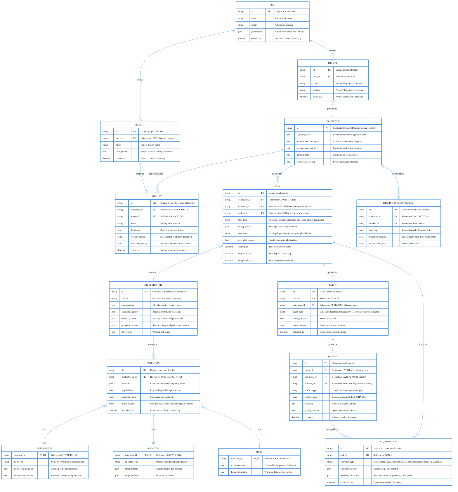
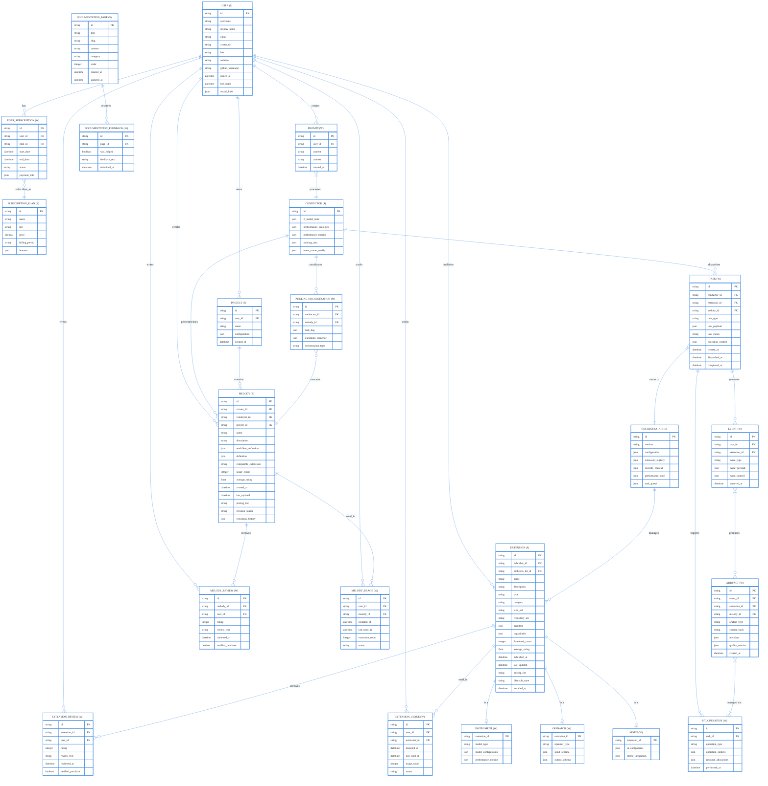

# ERD

# Symphony Entity Relationship Diagram (ERD)

> Purpose: This document defines the data model and relationships for Symphony IDE, covering both the editor runtime and the official website/marketplace.
> 

## Legend

- **(S)** = Singleton entity (one instance per system)
- **(W)** = Weak entity (depends on another entity)
- **PK** = Primary Key
- **FK** = Foreign Key

---

## 1. Editor Core: User Interaction & Orchestration

**Description**: This diagram shows how users interact with Symphony’s core editor features, including project management, AI orchestration via the Conductor, and the extension ecosystem managed by Orchestra Kit.

**Key Relationships**:

- **USER → PROJECT**: One user can own multiple projects
- **USER → PROMPT**: Users create natural language prompts
- **PROMPT → CONDUCTOR**: Conductor processes prompts and orchestrates tasks
- **CONDUCTOR → MELODY**: Conductor generates or uses melodies (workflows)
- **CONDUCTOR → TASK**: Conductor dispatches tasks to extensions
- **ORCHESTRA_KIT → EXTENSION**: Orchestra Kit manages all extensions
- **EXTENSION → {INSTRUMENT, OPERATOR, MOTIF}**: Extensions are specialized into three types
- **TASK → EVENT**: Tasks generate events during execution
- **EVENT → ARTIFACT**: Events produce artifacts (code, docs, etc.)
- **TASK → PIT_OPERATION**: Tasks trigger high-performance Pit operations

---

## 2. Website & Marketplace: User Accounts & Extension Discovery

**Description**: This diagram models the Symphony website, including user accounts, subscriptions, the extension marketplace (Orchestra Kit/Grand Stage), the melody store (Polyphony Store), reviews, and documentation.

```mermaid
%%{init: {
  'theme':'base',
  'themeVariables': {
    'primaryColor':'#f8f9fa',
    'primaryTextColor':'#212529',
    'primaryBorderColor':'#4a90e2',
    'lineColor':'#4a90e2',
    'secondaryColor':'#ffffff',
    'tertiaryColor':'#e8f4f8',
    'background':'#ffffff',
    'mainBkg':'#ffffff',
    'secondBkg':'#f0f7ff',
    'border1':'#4a90e2',
    'border2':'#6fa8dc',
    'fontSize':'13px',
    'fontFamily':'Inter, -apple-system, system-ui, sans-serif'
  }
}}%%
erDiagram
    %% ===== USER & PROFILE =====
    USER {
        string id PK "Unique user identifier"
        string username "Unique username"
        string display_name "Public display name"
        string email "User email address"
        string avatar_url "Profile picture URL"
        string bio "User biography"
        string website "Personal website URL"
        string github_username "GitHub username for integration"
        datetime joined_at "Account creation timestamp"
        datetime last_login "Last login timestamp"
        json social_links "Social media links"
    }

    %% ===== SUBSCRIPTION & PAYMENT =====
    SUBSCRIPTION_PLAN {
        string id PK "Unique plan identifier"
        string name "Plan name (Free, Pro, Enterprise)"
        string tier "free|pro|enterprise"
        decimal price "Monthly/yearly price"
        string billing_period "monthly|yearly"
        json features "Feature flags and limits"
    }

    USER_SUBSCRIPTION {
        string id PK "Unique subscription identifier"
        string user_id FK "References USER.id"
        string plan_id FK "References SUBSCRIPTION_PLAN.id"
        datetime start_date "Subscription start date"
        datetime end_date "Subscription end date"
        string status "active|cancelled|expired"
        json payment_info "Payment method and history"
    }

    %% ===== EXTENSIONS (from Orchestra Kit/Grand Stage) =====
    EXTENSION {
        string id PK "Unique extension identifier"
        string publisher_id FK "References USER.id (publisher)"
        string name "Extension display name"
        string description "Extension description"
        string type "instrument|operator|motif"
        string category "Extension category (ai, git, ui, etc)"
        string icon_url "Extension icon URL"
        string repository_url "Source code repository URL"
        json manifest "Extension manifest (Symphony.toml)"
        integer download_count "Total download count"
        float average_rating "Average user rating (0-5)"
        datetime published_at "Initial publication timestamp"
        datetime last_updated "Last update timestamp"
        string pricing_tier "free|premium|enterprise"
    }

    EXTENSION_REVIEW {
        string id PK "Unique review identifier"
        string extension_id FK "References EXTENSION.id"
        string user_id FK "References USER.id (reviewer)"
        integer rating "Rating (1-5 stars)"
        string review_text "Review text content"
        datetime reviewed_at "Review submission timestamp"
        boolean verified_purchase "True if user purchased/installed extension"
    }

    %% ===== MELODIES (from Polyphony Store) =====
    MELODY {
        string id PK "Unique melody identifier"
        string creator_id FK "References USER.id (creator)"
        string name "Melody display name"
        string description "Melody description"
        json workflow_definition "DAG workflow definition"
        string[] compatible_extensions "List of compatible extension IDs"
        integer usage_count "Total usage count"
        float average_rating "Average user rating (0-5)"
        datetime created_at "Melody creation timestamp"
        datetime last_updated "Last update timestamp"
        string pricing_tier "free|premium|enterprise"
    }

    MELODY_REVIEW {
        string id PK "Unique review identifier"
        string melody_id FK "References MELODY.id"
        string user_id FK "References USER.id (reviewer)"
        integer rating "Rating (1-5 stars)"
        string review_text "Review text content"
        datetime reviewed_at "Review submission timestamp"
        boolean verified_purchase "True if user purchased/used melody"
    }

    %% ===== USAGE TRACKING =====
    EXTENSION_USAGE {
        string id PK "Unique usage record identifier"
        string user_id FK "References USER.id"
        string extension_id FK "References EXTENSION.id"
        datetime installed_at "Extension installation timestamp"
        datetime last_used_at "Last usage timestamp"
        integer usage_count "Total usage count"
        string status "installed|uninstalled"
    }

    MELODY_USAGE {
        string id PK "Unique usage record identifier"
        string user_id FK "References USER.id"
        string melody_id FK "References MELODY.id"
        datetime installed_at "Melody installation timestamp"
        datetime last_used_at "Last execution timestamp"
        integer execution_count "Total execution count"
        string status "active|archived"
    }

    %% ===== DOCUMENTATION =====
    DOCUMENTATION_PAGE {
        string id PK "Unique page identifier"
        string title "Page title"
        string slug "URL slug"
        string content "Markdown content"
        string category "Documentation category"
        integer order "Display order within category"
        datetime created_at "Page creation timestamp"
        datetime updated_at "Last update timestamp"
    }

    DOCUMENTATION_FEEDBACK {
        string id PK "Unique feedback identifier"
        string page_id FK "References DOCUMENTATION_PAGE.id"
        boolean was_helpful "True if page was helpful"
        string feedback_text "User feedback text"
        datetime submitted_at "Feedback submission timestamp"
    }

    %% ===== RELATIONSHIPS =====
    USER ||--o{ USER_SUBSCRIPTION : has
    USER_SUBSCRIPTION }o--|| SUBSCRIPTION_PLAN : subscribes_to
    USER ||--o{ EXTENSION : publishes
    USER ||--o{ EXTENSION_REVIEW : writes
    EXTENSION ||--o{ EXTENSION_REVIEW : receives
    USER ||--o{ MELODY : creates
    USER ||--o{ MELODY_REVIEW : writes
    MELODY ||--o{ MELODY_REVIEW : receives
    DOCUMENTATION_PAGE ||--o{ DOCUMENTATION_FEEDBACK : receives
    USER ||--o{ EXTENSION_USAGE : tracks
    EXTENSION ||--o{ EXTENSION_USAGE : used_in
    USER ||--o{ MELODY_USAGE : tracks
    MELODY ||--o{ MELODY_USAGE : used_in
```

**Key Relationships**: 

- **USER → SUBSCRIPTION**: Users subscribe to plans (Free, Pro, Enterprise)
- **USER → EXTENSION**: Users publish extensions to the marketplace
- **USER → MELODY**: Users create and share melodies
- **USER → REVIEWS**: Users write reviews for extensions and melodies
- **USER → USAGE**: System tracks extension and melody usage per user
- **DOCUMENTATION → FEEDBACK**: Users provide feedback on documentation

---

## 3. Unified Model: Complete Symphony Ecosystem

**Description**: This  diagram combines both the editor runtime and the website/marketplace, showing how all entities relate across the entire Symphony ecosystem.

**Key Insights**:

- **(S)** entities are singletons or shared across the system
- **(W)** entities are weak and depend on other entities
- The model supports both local editor operations and cloud marketplace features
- Extension types (Instrument, Operator, Motif) use table inheritance pattern
- The Pit operations are tracked separately for performance monitoring