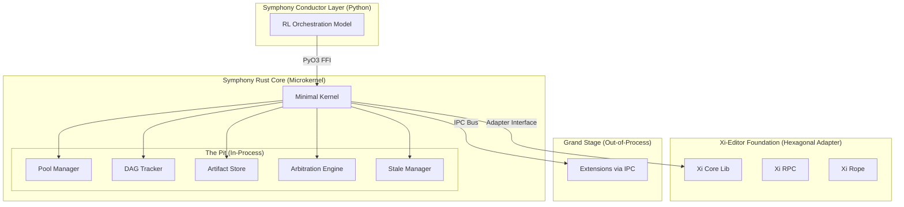
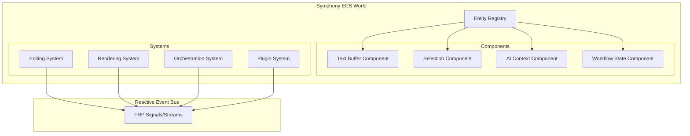

# Feasibility

## Executive Summary

This report analyzes architecture patterns for Symphony's backend implementation under two scenarios:

1. **Minimal Refactoring**: Preserve xi-editor as-is, build Symphony layer on top
2. **Extensive Refactoring**: Modify xi-editor internals to better serve Symphony's needs

> [!IMPORTANT]
Recommendation: Symphony should adopt a Microkernel + Hexagonal hybrid with Data-Oriented hotspots, using the Minimal Refactoring approach for xi-editor integration. This aligns with existing methodology documentation and leverages xi-editor's proven foundation.
> 

---

## Part 1: Requirements Mapping

### Symphony's Core Requirements (from Methodology Docs)

| Requirement | Source Doc | Implementation Need |
| --- | --- | --- |
| **Microkernel Architecture** | The Kernels, The Conductor | Minimal core, plugin-based extensions |
| **In-Process Pit** (~100ns operations) | The In-Process, The Pit | Pool Manager, DAG Tracker, Artifact Store, Arbitration, Stale Manager |
| **Out-of-Process Extensions** (~0.5ms IPC) | The Out-of-Process, The Grand Stage | Instruments, Operators, Motifs sandboxed |
| **Python Conductor** | The Conductor | PyO3 FFI bridge for RL orchestration |
| **DAG Workflow Execution** | The Melody, The Orchestration | 10K-node workflows, checkpointing |
| **Content-Addressable Artifacts** | The Pit (Artifact Store) | Versioning, quality scoring, search |
| **Extension Manifest System** | The Orchestra Kit | Sandboxing, permissions, lifecycle |

### Xi-Editor's Capabilities (from [features.md](http://features.md/))

| Capability | Status | Symphony Relevance |
| --- | --- | --- |
| **Rope Data Structure** | ✅ Complete | Foundation for text editing |
| **JSON-RPC Communication** | ✅ Complete | Frontend↔Backend protocol |
| **Plugin System** | ✅ Complete | Out-of-process isolation |
| **LSP Integration** | ✅ Complete | Language intelligence |
| **CRDT Undo/Redo** | ✅ Complete | Collaborative editing potential |
| **Async-First Design** | ✅ Complete | <16ms operation targets |
| **Syntax Highlighting** | ✅ Complete | Syntect/TextMate grammars |

---

## Part 2: Architecture Pattern Analysis

### Scenario A: Minimal Xi-Editor Refactoring

**Constraint**: Xi-editor packages used as-is; Symphony builds AIDE layer on top without modifying core xi crates.

### Recommended Architecture: **Microkernel + Hexagonal Hybrid**



### Pattern Alignment Matrix

| Pattern | Alignment | Use in Symphony |
| --- | --- | --- |
| **Microkernel** (Option 11) | ⭐⭐⭐⭐⭐ | Core architecture per methodology |
| **Hexagonal/Ports-Adapters** (Option 9) | ⭐⭐⭐⭐⭐ | Xi-editor as an "adapter", clean domain boundaries |
| **Data-Oriented Design** (Option 10) | ⭐⭐⭐⭐ | Pit components for 50-100ns operations |
| **Actor-Service Model** (Option 5) | ⭐⭐⭐ | Extension IPC resembles actor messaging |
| **Streaming Pipeline DAG** (Option 8) | ⭐⭐⭐⭐ | DAG Tracker for Melody execution |
| **CQRS** (Option 13) | ⭐⭐⭐ | Artifact Store read/write separation |
| **ECS** (Option 1) | ⭐⭐ | Alternative for extensions, not core |

### Feasibility Assessment

| Aspect | Rating | Notes |
| --- | --- | --- |
| **Technical Feasibility** | ✅ High | Xi-editor's existing plugin system supports out-of-process extensions; JSON-RPC aligns with IPC Bus |
| **Performance Targets** | ✅ Achievable | Pit runs in-process for 100ns ops; xi-editor already meets <16ms target |
| **Development Effort** | ✅ Moderate | Clear layer separation; no xi-editor modifications needed |
| **Risk** | ⚠️ Low-Medium | Some glue code for xi-editor↔Conductor; PyO3 bridge complexity |

### Implementation Path

1. **Hexagonal Adapter for Xi-Editor**
    
    ```rust
    // ports/text_editing.rs
    pub trait TextEditingPort {
        fn insert(&mut self, pos: usize, text: &str) -> Result<()>;
        fn delete(&mut self, range: Range<usize>) -> Result<()>;
        fn get_rope(&self) -> &Rope;
    }
    
    // adapters/xi_adapter.rs
    impl TextEditingPort for XiCoreAdapter {
        // Wrap xi-core-lib calls
    }
    
    ```
    
2. **In-Process Pit Components** (Data-Oriented)
    
    ```rust
    // Shared memory, lock-free, cache-aligned structures
    #[repr(align(64))]
    pub struct PoolManagerState {
        models: AtomicModelTable,
        metrics: PerformanceCounters,
    }
    
    ```
    
3. **IPC Bus for Extensions** (Actor-like messaging)
    
    ```rust
    pub struct IPCBus {
        extensions: HashMap<ExtensionId, UnixSocket>,
        router: MessageRouter,
    }
    
    ```
    

---

### Scenario B: Extensive Xi-Editor Refactoring

**Constraint**: Xi-editor can be significantly modified to better integrate with Symphony's needs.

### Recommended Architecture: **ECS + Reactive Hybrid**



### Pattern Alignment Matrix

| Pattern | Alignment | Use in Symphony |
| --- | --- | --- |
| **ECS** (Option 1) | ⭐⭐⭐⭐⭐ | Unified entity model for buffers, AI models, workflows |
| **Signals/FRP** (Option 2) | ⭐⭐⭐⭐ | Reactive state propagation across components |
| **Data-Oriented Design** (Option 10) | ⭐⭐⭐⭐⭐ | Maximum cache efficiency |
| **CRDT/OT** (Option 7) | ⭐⭐⭐⭐ | Leverage xi-editor's existing CRDT foundation |
| **Reactive Architecture** (Option 14) | ⭐⭐⭐⭐ | Non-blocking, resilient systems |

### Feasibility Assessment

| Aspect | Rating | Notes |
| --- | --- | --- |
| **Technical Feasibility** | ⚠️ Medium | Requires rewriting xi-editor internals into ECS; major architectural change |
| **Performance Targets** | ✅ Excellent | ECS provides optimal cache locality; Zed-level performance |
| **Development Effort** | ❌ High | 6-12 months to rewrite; xi-editor expertise needed |
| **Risk** | ⚠️ High | Reinventing proven components; losing battle-tested xi-editor stability |

### Required Xi-Editor Changes

1. **Convert Rope to ECS Component**
    - Buffer becomes entity ID + RopeComponent
    - Selections become SelectionComponent per entity
2. **Replace Plugin System with ECS Systems**
    - Plugins become systems operating on component queries
    - Lose process isolation (different security model)
3. **FRP Event Propagation**
    - Replace JSON-RPC with reactive streams
    - Frontend subscribes to state signals

---

## Part 3: Comparative Analysis

### Decision Matrix

| Criteria | Scenario A (Minimal) | Scenario B (Extensive) |
| --- | --- | --- |
| **Alignment with Methodology** | ⭐⭐⭐⭐⭐ Perfect | ⭐⭐⭐ Partial |
| **Development Time** | 3-6 months | 12-18 months |
| **Performance Ceiling** | 95% of theoretical max | 100% optimized |
| **Risk Level** | Low | High |
| **Maintainability** | Good (layer separation) | Complex (monolithic ECS) |
| **Extension Sandboxing** | ✅ Natural (out-of-process) | ⚠️ Requires WASM sandbox |
| **Python Integration** | ✅ PyO3 FFI | ✅ PyO3 FFI |
| **Xi-Editor Knowledge** | Minimal needed | Deep expertise required |

### Trade-Off Summary

```
Scenario A (Microkernel + Hexagonal):
  ✅ Preserves proven xi-editor foundation
  ✅ Natural fit for out-of-process extensions
  ✅ Matches methodology's microkernel recommendation
  ✅ Lower risk, faster delivery
  ⚠️ ~5% performance overhead from adapter layer
  ⚠️ Less flexible for future radical changes

Scenario B (ECS + Reactive):
  ✅ Maximum theoretical performance (Zed-level)
  ✅ Unified data model for everything
  ✅ Enables tight AI-editor integration
  ❌ High risk, long timeline
  ❌ Loses xi-editor's battle-tested stability
  ❌ Sandboxing requires WASM or custom solution
  ❌ Contradicts existing methodology (microkernel)

```

---

## Part 4: Architecture Option Suitability Summary

| Option | Minimal Refactoring | Extensive Refactoring |
| --- | --- | --- |
| 1. ECS | ⚪ Future consideration | ⭐⭐⭐⭐⭐ Primary |
| 2. Signals/FRP | ⭐⭐ UI layer only | ⭐⭐⭐⭐ Core pattern |
| 3. Service-Oriented + Event-Driven | ⭐⭐⭐ IPC Bus design | ⭐⭐ Less relevant |
| 4. Actor + Event Sourcing | ⭐⭐⭐ Extension model | ⭐⭐ Complexity |
| 5. Actor-Service | ⭐⭐⭐ Extension model | ⭐⭐ |
| 6. Layered | ⭐⭐ Too simple | ⭐ Not recommended |
| 7. CRDT/OT | ⭐⭐⭐ Xi-editor provides | ⭐⭐⭐⭐ Enhance |
| 8. Streaming DAG | ⭐⭐⭐⭐ DAG Tracker | ⭐⭐⭐⭐ DAG Tracker |
| 9. Hexagonal | ⭐⭐⭐⭐⭐ Adapter layer | ⭐⭐ Less needed |
| 10. Data-Oriented | ⭐⭐⭐⭐ Pit hotspots | ⭐⭐⭐⭐⭐ Everything |
| 11. Microkernel | ⭐⭐⭐⭐⭐ Core choice | ⭐⭐⭐ Partial |
| 12. Space-Based | ⭐ Not applicable | ⭐ Not applicable |
| 13. CQRS | ⭐⭐⭐ Artifact Store | ⭐⭐⭐ Artifact Store |
| 14. Reactive | ⭐⭐⭐ UI/Events | ⭐⭐⭐⭐ Core pattern |
| 15. Serverless | ⭐ Not applicable | ⭐ Not applicable |

---