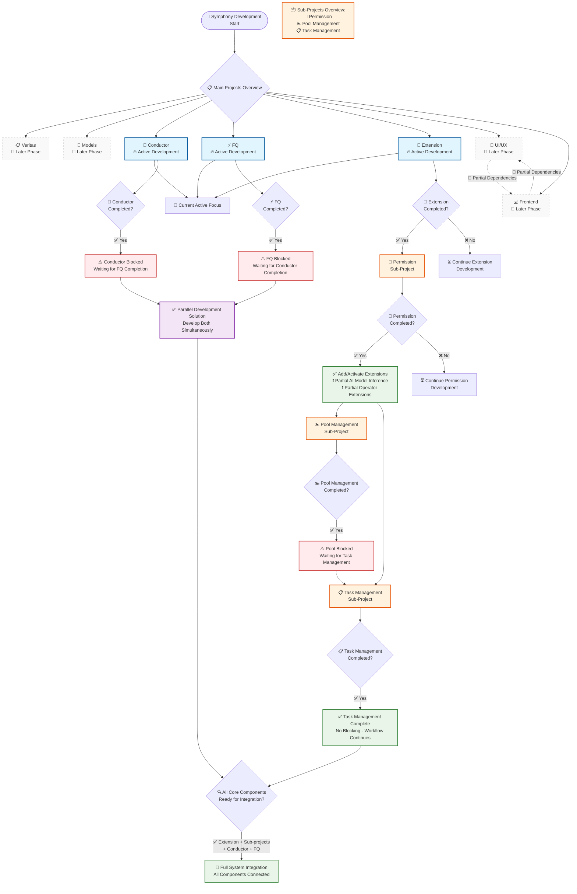

# Flow

<aside>
💡

Mermaid Diagram

</aside>

## 🔧 Projects Overview

### Main Projects:

- **Veritas**
- **Models**
- **Conductor**
- **FQ**
- **Extension**
- **UI/UX**
- **Frontend**

### Sub-Projects:

- **Pool Management**
- **Task Management**
- **Permission**

---

## ⏳ Development Flow

- Most projects are being developed **in parallel**, with the **exception of `UI/UX` and `Frontend`**, which have partial dependencies on each other.
- Some projects are scheduled for **later phases of development**:
    - **Veritas**
    - **Models**

By temporarily **excluding `Veritas`, `Models`, `UI/UX`, and `Frontend`**, the active focus shifts to:

- **Conductor**
- **FQ**
- **Extension**

---

## 🔁 Extension Development Path

If **`Extension`** is completed:

- A new sub-project **`Permission`** is unlocked.

### ➤ If `Permission` is completed:

- ✅ Ability to add and activate working extensions.
- ✅ Partial support for AI model inference.
- ✅ Partial development of Operator Extensions (e.g., *Image Optimization Ops*).

This leads to the opening of:

- **Pool Management**
- **Task Management**

### ➤ If `Pool Management` is completed:

- ⚠️ Progress is **blocked** until `Task Management` is also completed.

### ➤ If `Task Management` is completed:

- ✅ No blocking — workflow continues smoothly.

---

## 🔄 Conductor ↔ FQ Dependency

If **`Conductor`** is completed:

- ⚠️ **Blocked** until **`FQ`** is completed.

If **`FQ`** is completed:

- ⚠️ **Blocked** until **`Conductor`** is completed.

**✅ Solution:** Develop **`Conductor`** and **`FQ`** **in parallel** to eliminate mutual blocking.

---

## 🔗 Final Integration

Once the following are completed:

- `Extension` and its dependent sub-projects
- `Conductor`
- `FQ`

**→ You will be ready to begin full com**