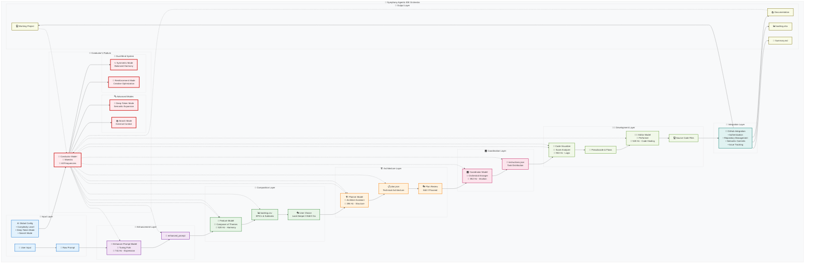

# Relationships

[model_relationships.mermaid](model_relationships.mermaid)

```mermaid
%%{init: {'theme': 'default', 'themeVariables': { 'fontSize': '16px', 'fontFamily': 'Arial', 'primaryTextColor': '#000', 'lineColor': '#555', 'nodeBorder': '2px', 'clusterBkg': '#f8f9fa', 'clusterBorder': '#ddd', 'edgeLabelBackground': '#fff', 'primaryColor': '#eaf2ff', 'nodePadding': 15, 'nodeSpacing': 50, 'rankSpacing': 100 }}}%%
graph TB
    subgraph "🎼 Symphony Agentic IDE Orchestra"
        
        subgraph "🎹 Input Layer"
            User[👤 User Input]
            RawPrompt[💬 Raw Prompt]
            Config[⚙️ Global Config<br/>• Complexity Level<br/>• Deep Token Mode<br/>• Search Mode]
        end
        
        subgraph "🎤 Enhancement Layer"
            Enhancer[🎤 Enhancer-Prompt Model<br/>🎯 Tuning Fork<br/>🎼 741 Hz - Expression]
            EnhancedPrompt[📝 enhanced_prompt]
        end
        
        subgraph "🎼 Composition Layer"  
            Feature[🎼 Feature Model<br/>🎯 Composer of Themes<br/>🎼 528 Hz - Harmony]
            Backlog[📊 backlog.csv<br/>EPICs & Subtasks]
            UserInteraction[🎭 User Choice<br/>Look Deeper ‖ Edit ‖ Go]
        end
        
        subgraph "🏗️ Architecture Layer"
            Planner[🏗️ Planner Model<br/>🎯 Architect Assistant<br/>🎼 396 Hz - Structure]
            Plan[📋 plan.json<br/>Technical Architecture]
            PlanChoice[🎭 Plan Review<br/>Edit ‖  Proceed]
        end
        
        subgraph "🎛️ Coordination Layer"
            Coordinator[🎛️ Coordinator Model<br/>🎯 Orchestral Arranger<br/>🎼 852 Hz - Intuition]
            Instructions[📝 instructions.json<br/>Task Distribution]
        end
        
        subgraph "🧑‍💻 Development Layer"
            CodeVis[🧮 Code-Visualizer<br/>🎯 Score Analyzer<br/>🎼 963 Hz - Logic]
            Editor[🧑‍💻 Editor Model<br/>🎯 Performer<br/>🎼 528 Hz - Code Healing]
            Pseudocode[📐 Pseudocode & Flows]
            SourceCode[💻 Source Code Files]
        end
        
        subgraph "🎩 Conductor's Podium"
            Conductor[🎩 Conductor Model<br/>🎯 Maestro<br/>🎼 All Frequencies]
            
            subgraph "🧠 Dual Mind System"
                Symmetric[🌀 Symmetric Mode<br/>Balanced Harmony]
                Reinforcement[🧭 Reinforcement Mode<br/>Creative Optimization]
            end
            
            subgraph "🔍 Advanced Modes"
                DeepToken[🔮 Deep Token Mode<br/>Semantic Expansion]
                SearchMode[📚 Search Mode<br/>External Context]
            end
        end
        
        subgraph "🔐 Integration Layer"
            GitHub[🔐 GitHub Integration<br/>• Authentication<br/>• Repository Management<br/>• Semantic Commits<br/>• Issue Tracking]
        end
        
        subgraph "🎯 Output Layer"
            WorkingProject[💻 Working Project]
            Documentation[📚 Documentation]
            BacklogXLSX[📊 backlog.xlsx]
            SummaryMD[📝 Summary.md]
        end
    end
    
    %% Flow Connections
    User --> RawPrompt
    RawPrompt --> Enhancer
    Config --> Conductor
    
    Enhancer --> EnhancedPrompt
    EnhancedPrompt --> Feature
    Feature --> Backlog
    Backlog --> UserInteraction
    UserInteraction --> Planner
    
    Planner --> Plan
    Plan --> PlanChoice
    PlanChoice --> Coordinator
    
    Coordinator --> Instructions
    Instructions --> CodeVis
    CodeVis --> Pseudocode
    Pseudocode --> Editor
    Editor --> SourceCode
    
    SourceCode --> GitHub
    GitHub --> WorkingProject
    GitHub --> Documentation
    GitHub --> BacklogXLSX
    GitHub --> SummaryMD
    
    %% Conductor Orchestration
    Conductor -.-> Enhancer
    Conductor -.-> EnhancedPrompt
    Conductor -.-> Feature
    Conductor -.-> Backlog
    Conductor -.-> Planner
    Conductor -.-> Plan
    Conductor -.-> Coordinator
    Conductor -.-> Instructions
    Conductor -.-> CodeVis
    Conductor -.-> Editor
    
    %% Conductor Modes
    Conductor --> Symmetric
    Conductor --> Reinforcement
    Conductor --> DeepToken
    Conductor --> SearchMode
    
    %% Feedback Loops
    WorkingProject -.-> Conductor
    Documentation -.-> Conductor
    
    %% Non-linear Flow Indicators
    Conductor -.-> Feature
    Conductor -.-> Planner
    Conductor -.-> CodeVis
    
    %% Styling
    classDef inputClass fill:#e3f2fd,stroke:#1976d2,stroke-width:2px
    classDef enhanceClass fill:#f3e5f5,stroke:#7b1fa2,stroke-width:2px
    classDef composeClass fill:#e8f5e8,stroke:#388e3c,stroke-width:2px
    classDef archClass fill:#fff3e0,stroke:#f57c00,stroke-width:2px
    classDef coordClass fill:#fce4ec,stroke:#c2185b,stroke-width:2px
    classDef devClass fill:#f1f8e9,stroke:#689f38,stroke-width:2px
    classDef conductorClass fill:#ffebee,stroke:#d32f2f,stroke-width:4px
    classDef integClass fill:#e0f2f1,stroke:#00796b,stroke-width:2px
    classDef outputClass fill:#f9fbe7,stroke:#827717,stroke-width:2px
    
    class User,RawPrompt,Config inputClass
    class Enhancer,EnhancedPrompt enhanceClass
    class Feature,Backlog,UserInteraction composeClass
    class Planner,Plan,PlanChoice archClass
    class Coordinator,Instructions coordClass
    class CodeVis,Editor,Pseudocode,SourceCode devClass
    class Conductor,Symmetric,Reinforcement,DeepToken,SearchMode conductorClass
    class GitHub integClass
    class WorkingProject,Documentation,BacklogXLSX,SummaryMD outputClass

```