# Sequence

This document provides detailed sequence diagrams covering all major workflows in Symphony IDE, showing interactions between actors, components, and systems.

---

## 1. Developer Workflow: Execute Melody (AI-Driven)

**Overview**: This sequence demonstrates the complete lifecycle of executing a workflow (Melody) in Symphony IDE, from prompt submission to artifact retrieval. It showcases both AI-driven (Maestro Mode) and manual workflow selection paths.

**Key Participants**:
- **Developer**: The user interacting with Symphony IDE
- **Conductor**: AI orchestration engine using reinforcement learning to generate and optimize workflows
- **The Pit**: High-performance in-process execution layer handling task dispatch and resource management
- **Pool Manager**: Manages Player extension lifecycle (Instruments, Operators, Motifs) with 50-100ns allocation times
- **DAG Tracker**: Executes workflow graphs with parallel task execution
- **Artifact Store**: Content-addressable storage for generated outputs with quality scoring

**Player Policy**: Extensions configured as “Players” can participate in Melodies. This includes:
- 🎻 **Instruments**: AI/ML model extensions
- ⚙️ **Operators**: Workflow utility extensions
- 🧩 **Motifs**: UI/UX enhancement extensions

**Workflow Modes**:
1. **Maestro Mode (RL)**: Conductor automatically analyzes context and generates an optimal workflow DAG based on the prompt
2. **Manual Mode**: User browses and selects a pre-existing Melody from the Polyphony Store

**Performance Characteristics**:
- Player allocation: 50-100ns (cache hit)
- Parallel DAG execution for independent tasks
- Content-addressable storage with automatic deduplication
- Real-time progress updates via WebSocket to UI

```mermaid
%%{init: {'theme':'base', 'themeVariables': { 'actorBkg':'#e0f2fe', 'actorBorder':'#4a90e2', 'actorTextColor':'#1f2937', 'actorLineColor':'#6b7280', 'signalColor':'#1f2937', 'signalTextColor':'#1f2937', 'labelBoxBkgColor':'#f9fafb', 'labelBoxBorderColor':'#d1d5db', 'labelTextColor':'#1f2937', 'loopTextColor':'#1f2937', 'noteBorderColor':'#4a90e2', 'noteBkgColor':'#f0f9ff', 'noteTextColor':'#1f2937', 'activationBorderColor':'#4a90e2', 'activationBkgColor':'#e0f2fe', 'sequenceNumberColor':'#ffffff'}}}%%
sequenceDiagram
    actor Dev as Developer
    participant UI as Frontend UI
    participant Core as Core (Rust)
    participant Conductor as 🎩 Conductor (Python RL)
    participant Pit as The Pit (In-Process)
    participant PoolMgr as Pool Manager
    participant DAG as DAG Tracker
    participant Artifact as Artifact Store

    Dev->>UI: Write Prompt
    UI->>Core: JSON-RPC: submitPrompt()
    Core->>Conductor: Process Prompt

    alt Maestro Mode (RL)
        Conductor->>Conductor: Analyze Context
        Conductor->>Conductor: Generate Melody (DAG)
        Conductor-->>Core: Melody Generated
    else Manual Mode
        Core-->>UI: Request Melody Selection
        UI-->>Dev: Show Melody Browser
        Dev->>UI: Select Melody
        UI->>Core: Selected Melody ID
    end

    Core->>Conductor: Orchestrate Tasks
    Conductor->>Pit: Dispatch Task Batch

    Pit->>PoolMgr: Allocate Player Extension
    PoolMgr->>PoolMgr: Check Cache (50-100ns)
    alt Player Ready
        PoolMgr-->>Pit: Player Handle
    else Player Not Loaded
        PoolMgr->>PoolMgr: Load & Warm Player
        PoolMgr-->>Pit: Player Handle
    end

    Pit->>DAG: Execute Workflow
    DAG->>DAG: Topological Sort
    DAG->>DAG: Parallel Execution

    loop For Each Task Node
        DAG->>PoolMgr: Execute Task
        PoolMgr->>PoolMgr: Run Player Extension
        PoolMgr-->>DAG: Task Result
        DAG->>Artifact: Store Result
        Artifact->>Artifact: Content-Addressable Storage
        Artifact->>Artifact: Quality Scoring
        Artifact-->>DAG: Artifact ID
    end

    DAG-->>Pit: Workflow Complete
    Pit-->>Conductor: Execution Results
    Conductor->>Conductor: Calculate Rewards (RL)
    Conductor-->>Core: Task Completed
    Core-->>UI: Update Status
    UI-->>Dev: Show Results

    Dev->>UI: View Artifacts
    UI->>Core: getArtifacts()
    Core->>Artifact: Retrieve Artifacts
    Artifact-->>Core: Artifact Data
    Core-->>UI: Artifact List
    UI-->>Dev: Display Artifacts
```

---

## 2. Extension Creator Workflow: Build & Publish Extension

**Overview**: This sequence illustrates the complete extension development lifecycle using the Carets CLI toolchain, from project scaffolding to marketplace publication.

**Key Participants**:
- **Extension Creator**: Developer building a new extension (Instrument, Operator, or Motif)
- **Carets CLI**: Command-line interface for extension development (`carets new`, `carets test`, `carets publish`)
- **Extension SDK**: Provides templates, manifest management, and scaffolding tools
- **Testing Framework**: Automated unit and integration testing suite
- **Security Module**: Cryptographic signing and verification of extension packages
- **Orchestra Kit Registry**: Central registry for extension metadata and version management
- **Grand Stage**: Public marketplace for extension discovery and distribution

**Development Workflow**:
1. **Scaffolding**: `carets new` generates project structure with Symphony.toml manifest
2. **Development**: Creator implements extension logic following SDK patterns
3. **Testing**: Automated test suite validates functionality and integration
4. **Validation**: Manifest validation, dependency checking, semantic versioning verification
5. **Security**: Cryptographic signing ensures package integrity
6. **Publication**: Package uploaded to marketplace with virus scanning and metadata indexing
7. **Analytics**: Creator monitors downloads, ratings, and user reviews

**Extension Types**:
- 🎻 **Instrument**: AI/ML model extensions
- ⚙️ **Operator**: Workflow utility extensions
- 🧩 **Motif**: UI/UX enhancement extensions

```mermaid
sequenceDiagram
    actor Creator as Extension Creator
    participant CLI as Carets CLI
    participant SDK as Extension SDK
    participant Testing as Testing Framework
    participant Registry as Orchestra Kit Registry
    participant Marketplace as Grand Stage
    participant Security as Security Module

    Creator->>CLI: carets new my-instrument
    CLI->>SDK: Generate Template
    SDK->>SDK: Create Manifest (Symphony.toml)
    SDK->>SDK: Scaffold Code Structure
    SDK-->>CLI: Template Created
    CLI-->>Creator: Project Ready

    Creator->>Creator: Develop Extension Code

    Creator->>CLI: carets test
    CLI->>Testing: Run Test Suite
    Testing->>Testing: Unit Tests
    Testing->>Testing: Integration Tests
    Testing-->>CLI: Test Results
    CLI-->>Creator: All Tests Passed ✓

    Creator->>CLI: carets publish
    CLI->>SDK: Validate Manifest
    SDK->>SDK: Check Dependencies
    SDK->>SDK: Verify Semantic Version
    SDK-->>CLI: Validation OK

    CLI->>Security: Sign Extension
    Security->>Security: Generate Signature
    Security-->>CLI: Signed Package

    CLI->>Registry: Register Extension
    Registry->>Registry: Check Name Conflict
    Registry->>Registry: Store Metadata
    Registry-->>CLI: Registered

    CLI->>Marketplace: Upload Package
    Marketplace->>Marketplace: Virus Scan
    Marketplace->>Marketplace: Store Binary
    Marketplace-->>CLI: Published

    CLI-->>Creator: Extension Published Successfully

    Creator->>Marketplace: Monitor Analytics
    Marketplace-->>Creator: Downloads, Ratings, Reviews
```

---

## 3. Developer Workflow: Install & Use Extension

**Overview**: This sequence details the extension installation process and runtime execution, including the Chambering lifecycle state machine that manages extension states from installation to activation.

**Key Participants**:
- **Developer**: User installing and using extensions
- **Grand Stage**: Extension marketplace providing discovery and download services
- **Kit Installer**: Handles package download, signature verification, and dependency resolution
- **Kit Lifecycle**: Manages the Chambering state machine for extension lifecycle
- **Kit Security**: Enforces capability-based permissions and sandboxing
- **Loaded Extension**: The active extension instance ready for execution

**Chambering State Machine**:
Extensions transition through well-defined states:
1. **Installed**: Package extracted to disk, metadata registered
2. **Loading**: Extension binary being loaded into memory
3. **Loaded**: Code loaded, ready for initialization
4. **Activated**: Extension initialized, resources allocated
5. **Running**: Actively executing and responding to requests

**Security Model**:
- **Signature Verification**: Cryptographic validation of package authenticity
- **Dependency Resolution**: Automatic download of missing dependencies
- **Capability-Based Permissions**: Fine-grained access control (file system, network, IPC)
- **Runtime Enforcement**: Security checks on every API call

**Installation Flow**:
1. User browses marketplace and selects extension
2. Package downloaded and signature verified
3. Dependencies resolved and installed if missing
4. Extension loaded through Chambering state machine
5. Security permissions validated before activation
6. Extension ready for use with enforced capabilities

---

## 4. Conductor Workflow: Generate Melody from Prompt

**Overview**: This sequence showcases the Conductor’s AI-powered workflow generation capabilities, demonstrating how reinforcement learning transforms natural language prompts into executable workflow DAGs.

**Key Participants**:
- **Conductor**: AI orchestration engine with embedded Python RL model
- **RL Model**: PyTorch/TensorFlow-based reinforcement learning model for workflow optimization
- **Melody Engine**: Workflow DAG generator creating nodes, dependencies, and resource allocations
- **Orchestration Bridge**: Interface between Rust infrastructure and Python RL model (~0.01ms overhead)
- **Polyphony Store**: Repository for saving and sharing workflow templates

**AI-Driven Generation Process**:
1. **Intent Parsing**: Natural language understanding to extract user goals
2. **Context Analysis**: Examines project state, available extensions, and historical patterns
3. **State Encoding**: Converts context into RL model input representation
4. **Action Prediction**: RL model outputs probability distribution over possible workflow structures
5. **DAG Construction**: Melody Engine creates workflow graph with:
- Task nodes (extension invocations)
- Dependency edges (data flow)
- Resource allocations (CPU, memory, GPU)
- Execution constraints (timeouts, retries)
6. **Optimization**: Predicts execution time and optimizes for efficiency
7. **Preview**: User reviews generated workflow before execution

**Reinforcement Learning Loop**:
- **State**: Current project context and prompt
- **Action**: Generated workflow structure
- **Reward**: Execution success, quality metrics, user feedback
- **Policy Update**: Model weights adjusted via backpropagation

**Benefits**:
- Learns optimal workflows from experience
- Adapts to user preferences and coding patterns
- Reduces manual workflow composition effort
- Improves over time with more executions

```mermaid
sequenceDiagram
    actor Dev as Developer
    participant UI as Frontend UI
    participant Core as Core (Rust)
    participant Conductor as 🎩 Conductor (Python RL)
    participant Bridge as Orchestration Bridge
    participant RL as RL Model (PyTorch)
    participant MelodyEngine as Melody Engine
    participant Polyphony as Polyphony Store

    Dev->>UI: Write Complex Prompt
    UI->>Core: submitPrompt(text)
    Core->>Conductor: Process Prompt

    Conductor->>Conductor: Parse Intent
    Conductor->>Conductor: Extract Context
    Conductor->>Conductor: Analyze Project State

    Conductor->>RL: Get Action Probabilities
    RL->>RL: Encode State
    RL->>RL: Forward Pass
    RL-->>Conductor: Action Distribution

    Conductor->>MelodyEngine: Generate Workflow DAG
    MelodyEngine->>MelodyEngine: Create Nodes
    MelodyEngine->>MelodyEngine: Define Dependencies
    MelodyEngine->>MelodyEngine: Assign Resources
    MelodyEngine-->>Conductor: Melody DAG

    Conductor->>Conductor: Optimize Workflow
    Conductor->>Conductor: Predict Execution Time

    Conductor-->>Core: Generated Melody
    Core-->>UI: Show Melody Preview
    UI-->>Dev: Display Workflow Graph

    Dev->>UI: Approve & Execute
    UI->>Core: executeMelody(id)
    Core->>Conductor: Start Execution

    Conductor->>Bridge: Dispatch Tasks
    Bridge->>Bridge: Calculate Rewards
    Bridge-->>Conductor: Execution Metrics

    Conductor->>RL: Update Model
    RL->>RL: Backpropagation
    RL->>RL: Update Weights
    RL-->>Conductor: Model Updated

    Note over Conductor,RL: Reinforcement Learning:<br/>State → Action → Reward<br/>→ Policy Update

    opt Save Melody
        Dev->>UI: Save as Template
        UI->>Core: saveMelody()
        Core->>Polyphony: Store Melody
        Polyphony-->>Core: Saved
        Core-->>UI: Melody Saved
    end
```

---

## 5. Harmony Board: Real-Time Monitoring

**Overview**: This sequence demonstrates the Harmony Board’s real-time workflow visualization and monitoring capabilities, providing developers with live insights into task execution, performance metrics, and error diagnostics.

**Key Participants**:
- **Harmony Board UI**: Visual dashboard for workflow monitoring and debugging
- **DAG Tracker**: Workflow execution engine emitting real-time progress events
- **Metrics Module**: Performance data collection (timestamps, durations, resource usage)
- **Logging Service**: Structured JSON logging with distributed tracing support

**Real-Time Features**:
1. **WebSocket Connection**: Low-latency bidirectional communication for live updates
2. **Progress Tracking**: Node-by-node execution status with visual indicators
3. **Performance Metrics**: Real-time display of:
- Task execution times
- Resource utilization (CPU, memory, GPU)
- Throughput and latency statistics
- Percentile distributions (p50, p99)
4. **Error Handling**: Immediate notification of failures with:
- Failed node highlighting
- Stack trace inspection
- Log entry retrieval
- Retry/debug options

**Visualization Capabilities**:
- **Workflow Graph**: Interactive DAG visualization with node states
- **Execution Timeline**: Gantt-chart style view of parallel execution
- **Metrics Dashboard**: Real-time charts and statistics
- **Log Viewer**: Structured log browsing with filtering and search

**Developer Benefits**:
- Immediate visibility into workflow execution
- Quick identification of bottlenecks and failures
- Performance optimization insights
- Debugging support with full context

**Event Types**:
- `taskProgress`: Node execution updates
- `taskError`: Failure notifications
- `workflowComplete`: Execution completion with summary
- `metricsUpdate`: Performance data streams

---

## 6. Manual Melody Creation: Harmony Board Drag & Drop

**Overview**: This sequence illustrates the visual workflow composition experience in Harmony Board, enabling developers and creators to build custom Melodies through an intuitive drag-and-drop interface with real-time validation.

**Key Participants**:
- **Developer/Creator**: User designing a custom workflow
- **Harmony Board UI**: Visual canvas for workflow composition (n8n-style interface)
- **Melody Engine**: Workflow serialization and metadata generation
- **Orchestra Kit Registry**: Source of available extension nodes (Instruments, Operators, Motifs)
- **Workflow Validator**: Real-time validation engine checking:
- DAG structure (no cycles)
- Type safety (input/output compatibility)
- Resource constraints
- Dependency resolution
- **Polyphony Store**: Repository for saving and publishing Melodies

**Composition Workflow**:
1. **Node Palette Loading**: Display available extensions categorized by type
2. **Visual Composition**:
- Drag nodes onto canvas
- Draw edges to create dependencies
- Configure node parameters (inputs, timeouts, resources)
- Arrange layout for clarity
3. **Real-Time Validation**:
- Type checking on connections (e.g., string output → string input)
- Cycle detection (DAG requirement)
- Resource constraint validation
- Immediate error feedback with visual highlighting
4. **Workflow Serialization**:
- Convert visual graph to executable DAG format
- Generate metadata (complexity score, estimated runtime)
- Create reusable template
5. **Storage & Publishing**:
- Save to local Polyphony Store
- Optional: Publish to public marketplace
- Enable team sharing and collaboration

**Validation Features**:
- **Type Safety**: Ensures data type compatibility between connected nodes
- **Cycle Detection**: Prevents infinite loops in workflow graph
- **Resource Validation**: Checks memory, CPU, GPU requirements are feasible
- **Dependency Resolution**: Verifies all required extensions are available

**Publishing Options**:
- **Private**: Save for personal use
- **Team**: Share within organization
- **Public**: Publish to Polyphony Store marketplace

```mermaid
sequenceDiagram
    actor User as Developer/Creator
    participant UI as Harmony Board UI
    participant Core as Core (Rust)
    participant MelodyEngine as Melody Engine
    participant Registry as Orchestra Kit Registry
    participant Polyphony as Polyphony Store
    participant Validator as Workflow Validator

    User->>UI: Open Harmony Board (Creation Mode)
    UI->>Core: getAvailableNodes()
    Core->>Registry: List Player Extensions
    Registry-->>Core: 🎻 Instruments, ⚙️ Operators, 🧩 Motifs
    Core-->>UI: Node Palette (Player Extensions)
    UI-->>User: Display Available Player Nodes

    User->>UI: Drag Instrument Node (🎻 AI/ML)
    UI->>UI: Add Node to Canvas
    User->>UI: Drag Operator Node (⚙️ Utility)
    UI->>UI: Add Node to Canvas
    User->>UI: Drag Motif Node (🧩 UI/UX)
    UI->>UI: Add Node to Canvas

    User->>UI: Connect Nodes (Draw Edge)
    UI->>UI: Create Dependency Link
    UI->>UI: Validate Connection Types

    alt Invalid Connection
        UI-->>User: Error: Type Mismatch
        User->>UI: Fix Connection
    end

    User->>UI: Configure Node Parameters
    UI->>UI: Show Node Settings Panel
    User->>UI: Set Input Values
    User->>UI: Set Resource Limits
    User->>UI: Set Timeout
    UI->>UI: Update Node Config

    User->>UI: Add More Nodes & Connections
    UI->>UI: Build Workflow Graph

    User->>UI: Validate Workflow
    UI->>Core: validateMelody(graph)
    Core->>Validator: Check DAG Structure
    Validator->>Validator: Detect Cycles
    Validator->>Validator: Check Type Safety
    Validator->>Validator: Verify Resource Constraints

    alt Validation Failed
        Validator-->>Core: Errors Found
        Core-->>UI: Validation Errors
        UI-->>User: Highlight Issues
        User->>UI: Fix Issues
        User->>UI: Revalidate
    else Validation Passed
        Validator-->>Core: Valid DAG
        Core-->>UI: Workflow Valid ✓
    end

    User->>UI: Save Melody
    UI->>Core: saveMelody(name, description, graph)
    Core->>MelodyEngine: Create Melody
    MelodyEngine->>MelodyEngine: Serialize DAG
    MelodyEngine->>MelodyEngine: Generate Metadata
    MelodyEngine->>MelodyEngine: Calculate Complexity Score
    MelodyEngine-->>Core: Melody Created

    Core->>Polyphony: Store Melody
    Polyphony->>Polyphony: Save to Database
    Polyphony->>Polyphony: Index for Search
    Polyphony-->>Core: Melody Saved

    Core-->>UI: Save Successful
    UI-->>User: Melody Saved ✓

    opt Publish to Polyphony Store
        User->>UI: Publish Melody
        UI->>Core: publishMelody(id)
        Core->>Polyphony: Set Public Visibility
        Polyphony->>Polyphony: Add to Marketplace
        Polyphony-->>Core: Published
        Core-->>UI: Published Successfully
        UI-->>User: Melody Now Public
    end

    opt Execute Melody
        User->>UI: Run Melody
        UI->>Core: executeMelody(id)
        Note over Core: Continues to Diagram #1<br/>(Execute Melody workflow)
    end

    Note over User,Polyphony: Manual Creation Features:<br/>- Drag & Drop Interface<br/>- Visual Node Connection<br/>- Real-time Validation<br/>- Type Safety Checking<br/>- Save & Publish
```

---

## 7. The Pit: High-Performance Task Execution

**Overview**: This sequence reveals the inner workings of The Pit, Symphony’s high-performance in-process execution layer, demonstrating how it achieves 50-100ns latency through intelligent resource management, parallel execution, and content-addressable storage.

**Key Participants**:
- **The Pit Core**: Central coordinator for in-process task execution
- **Pool Manager**: Player extension lifecycle manager with predictive pre-warming (manages Instruments, Operators, Motifs)
- **DAG Tracker**: Parallel workflow execution engine with topological sorting
- **Arbitration Engine**: Resource conflict resolution with fairness policies
- **Artifact Store**: Content-addressable storage with deduplication (20-40% savings)
- **Stale Manager**: Artifact lifecycle management across storage tiers

**Performance Architecture**:
1. **Resource Allocation**:
- Arbitration Engine resolves conflicts between concurrent tasks
- Fairness policies ensure equitable resource distribution
- Fast-path allocation for non-conflicting requests

1. **Player Extension Management**:
    - **Cache Hit (50-100ns)**: Player extension already loaded and warm
    - **Cache Miss**: Predictive pre-warming based on usage patterns
    - **State Machine**: Unloaded → Loading → Warming → Ready → Active
    - **>80% Prediction Accuracy**: Anticipates Player needs before requests
    - **Supports All Extension Types**: Instruments (AI/ML), Operators (utilities), Motifs (UI/UX)
2. **Parallel Execution**:
    - Topological sort identifies independent tasks
    - Concurrent execution of parallel DAG nodes
    - Supports 10,000+ node workflows
    - Checkpoint progress for fault tolerance
3. **Artifact Management**:
    - **Content-Addressable Storage**: SHA-256 hashing for deduplication
    - **Quality Scoring**: Automatic evaluation of generated outputs
    - **Tantivy Indexing**: Full-text search across artifacts
    - **Storage Tiers**:
        - 1-7 days: SSD (fast access)
        - 8-30 days: HDD (balanced)
        - 30+ days: Cloud (archival)

**Performance Targets**:
- Pool allocation: 50-100ns (cache hit)
- DAG execution: 10,000-node workflows
- Artifact store: 1-5ms write, 0.5-2ms read
- Deduplication savings: 20-40%

**Optimization Techniques**:
- Predictive pre-warming reduces cold start latency
- Content-addressable storage eliminates redundant storage
- Parallel execution maximizes CPU utilization
- Tiered storage balances performance and cost

---

## 8. IPC Communication: Cross-Process Messaging

**Overview**: This sequence details Symphony’s inter-process communication (IPC) infrastructure, which enables secure, low-latency messaging between the Rust core and out-of-process extensions with 0.1-0.3ms latency.

**Key Participants**:
- **Extension Process**: Out-of-process extension (UFE - User-Facing Extension)
- **IPC Transport**: Platform-specific communication layer
- **IPC Protocol**: Message framing and serialization
- **IPC Security**: Authentication, authorization, and rate limiting
- **IPC Bus**: Central message router and queue manager
- **Core Process**: Main Symphony Rust backend

**Communication Stack**:

1. **Transport Layer** (Platform-Specific):
    - **Unix/Linux/macOS**: Unix Domain Sockets
    - **Windows**: Named Pipes
    - **Shared Memory**: Future optimization for large payloads
2. **Protocol Layer**:
    - **Serialization**: MessagePack (binary, compact) or bincode (Rust-native)
    - **Framing**: Length-prefixed messages with headers
    - **Message Types**: Request, Response, Event, Stream
3. **Security Layer**:
    - **Process Authentication**: Verify sender process ID
    - **Rate Limiting**: Prevent DoS attacks from misbehaving extensions
    - **Message Validation**: Schema checking and sanitization
    - **Authorization**: Capability-based permission enforcement
4. **Bus Layer**:
    - **Routing**: Destination lookup and message forwarding
    - **Queueing**: Buffering for load management
    - **Multiplexing**: Multiple concurrent conversations

**Message Flow**:
1. Extension serializes message using MessagePack
2. Transport wraps in platform-specific IPC mechanism
3. Protocol adds framing (length prefix, headers)
4. Security validates sender and checks permissions
5. Bus routes message to destination process
6. Core processes request and generates response
7. Response follows reverse path back to extension

**Performance Characteristics**:
- **Latency**: 0.1-0.3ms round-trip
- **Throughput**: Thousands of messages per second
- **Overhead**: Minimal compared to HTTP/gRPC
- **Reliability**: Automatic reconnection and retry

**Security Features**:
- Process-level isolation
- Capability-based access control
- Rate limiting per extension
- Message validation and sanitization

---

## 9. Bootstrap Sequence: System Initialization

**Overview**: This sequence documents Symphony’s phased initialization process, ensuring all components start in the correct order with proper dependency management, health checking, and rollback capabilities on failure.

**Key Participants**:
- **Bootstrap Core**: Orchestrates the entire initialization sequence
- **Phase Manager**: Manages stage-gate process with parallel initialization within phases
- **Health Checker**: Post-initialization validation with readiness probes
- **Types Package**: Zero-cost type abstractions shared across all 46 packages
- **Config Manager**: Hierarchical configuration with hot-reload support
- **IPC Bus**: Inter-process communication backbone
- **The Pit**: High-performance in-process execution layer (5 components)
- **Conductor**: Python RL model with PyO3 bindings
- **Frontend UI**: React application with WebSocket connection

**Phased Initialization Strategy**:

**Phase 1: Foundation** (Sequential)
- **Types System**: Register core types, zero-cost abstractions
- **Configuration**: Parse TOML/JSON/YAML, hierarchical merge, enable hot-reload
- **Rationale**: These are dependencies for all other components

**Phase 2: IPC** (Sequential)
- **Message Bus**: Setup transport layer (Unix sockets/Named pipes)
- **Security**: Initialize authentication and rate limiting
- **Process Lifecycle**: Start process manager
- **Rationale**: Required for inter-component communication

**Phase 3: The Pit** (Parallel)
All 5 Pit components initialize concurrently:
- **Pool Manager**: Setup AI model cache
- **DAG Tracker**: Initialize execution engine
- **Artifact Store**: Setup Tantivy index
- **Arbitration Engine**: Initialize resource manager
- **Stale Manager**: Setup lifecycle timers
- **Rationale**: Independent components can start in parallel for faster boot

**Phase 4: Conductor** (Sequential)
- **Python Bridge**: Load PyO3 bindings (~0.01ms overhead)
- **RL Model**: Initialize PyTorch/TensorFlow model
- **Trained Weights**: Load pre-trained parameters
- **Rationale**: Depends on Pit for task execution

**Phase 5: Health Check & UI** (Sequential)
- **Health Validation**: Verify all components operational
- **Readiness Probes**: Check component availability
- **Frontend Start**: Launch React app, establish WebSocket
- **Rationale**: Final validation before user interaction

**Error Handling**:
- **Rollback on Failure**: Any phase failure triggers cleanup and graceful shutdown
- **Detailed Logging**: Structured logs for debugging initialization issues
- **Retry Logic**: Configurable retry attempts for transient failures

**Performance**:
- **Cold Start**: ~500ms-1s (typical)
- **Parallel Phase 3**: Reduces boot time by 40-60%
- **Hot Reload**: Config changes without full restart

```mermaid
sequenceDiagram
    participant Main as Main Process
    participant Bootstrap as Bootstrap Core
    participant Phase as Phase Manager
    participant Health as Health Checker
    participant Types as Types Package
    participant Config as Config Manager
    participant IPC as IPC Bus
    participant Pit as The Pit
    participant Conductor as 🎩 Conductor
    participant UI as Frontend UI

    Main->>Bootstrap: Initialize System
    Bootstrap->>Phase: Start Phase 1: Foundation

    Phase->>Types: Load Type System
    Types->>Types: Register Core Types
    Types->>Types: Zero-Cost Abstractions
    Types-->>Phase: Types Ready

    Phase->>Config: Load Configuration
    Config->>Config: Parse TOML/JSON/YAML
    Config->>Config: Hierarchical Merge
    Config->>Config: Enable Hot-Reload
    Config-->>Phase: Config Ready

    Phase-->>Bootstrap: Phase 1 Complete ✓

    Bootstrap->>Phase: Start Phase 2: IPC
    Phase->>IPC: Initialize Message Bus
    IPC->>IPC: Setup Transport Layer
    IPC->>IPC: Initialize Security
    IPC->>IPC: Start Process Lifecycle Manager
    IPC-->>Phase: IPC Ready

    Phase-->>Bootstrap: Phase 2 Complete ✓

    Bootstrap->>Phase: Start Phase 3: The Pit

    par Parallel Pit Initialization
        Phase->>Pit: Initialize Pool Manager
        Pit->>Pit: Setup Model Cache
        Pit-->>Phase: Pool Manager Ready
    and
        Phase->>Pit: Initialize DAG Tracker
        Pit->>Pit: Setup Execution Engine
        Pit-->>Phase: DAG Tracker Ready
    and
        Phase->>Pit: Initialize Artifact Store
        Pit->>Pit: Setup Tantivy Index
        Pit-->>Phase: Artifact Store Ready
    and
        Phase->>Pit: Initialize Arbitration Engine
        Pit-->>Phase: Arbitration Ready
    and
        Phase->>Pit: Initialize Stale Manager
        Pit-->>Phase: Stale Manager Ready
    end

    Phase-->>Bootstrap: Phase 3 Complete ✓

    Bootstrap->>Phase: Start Phase 4: Conductor
    Phase->>Conductor: Initialize Python Bridge
    Conductor->>Conductor: Load PyO3 Bindings (~0.01ms)
    Conductor->>Conductor: Initialize RL Model
    Conductor->>Conductor: Load Trained Weights
    Conductor-->>Phase: Conductor Ready

    Phase-->>Bootstrap: Phase 4 Complete ✓

    Bootstrap->>Health: Run Health Checks
    Health->>Health: Validate All Components
    Health->>Health: Check Readiness Probes

    alt Health Check Failed
        Health-->>Bootstrap: Failure Detected
        Bootstrap->>Bootstrap: Rollback Initialization
        Bootstrap-->>Main: Initialization Failed ✗
    else Health Check Passed
        Health-->>Bootstrap: All Systems Operational

        Bootstrap->>UI: Start Frontend
        UI->>UI: Load React App
        UI->>UI: Connect WebSocket
        UI-->>Bootstrap: UI Ready

        Bootstrap-->>Main: System Ready ✓
        Main->>Main: Enter Main Loop
    end

    Note over Bootstrap,Conductor: Phased Initialization:<br/>1. Types → Config<br/>2. IPC<br/>3. The Pit (parallel)<br/>4. Conductor<br/>5. Health Check
```

---

## Key Architectural Patterns

### Performance Characteristics

- **Pool Manager**: 50-100ns allocation (cache hit), >80% prediction accuracy
- **DAG Tracker**: 10,000-node workflows, parallel execution
- **Artifact Store**: 1-5ms store, 0.5-2ms retrieve, 20-40% dedup savings
- **IPC Bus**: 0.1-0.3ms message latency
- **Conductor Bridge**: ~0.01ms PyO3 overhead

### Execution Models

- **In-Process (The Pit)**: 50-100ns latency, 1M+ ops/sec
- **Out-of-Process (UFE)**: 0.1-0.5ms latency, isolated processes
- **Python Conductor**: 0.5-2ms latency, RL orchestration

### State Machines

- **Extension Lifecycle (Chambering)**: Installed → Loading → Loaded → Activated → Running → Paused → Error
- **Model Lifecycle**: Unloaded → Loading → Warming → Ready → Active
- **Artifact Lifecycle**: 1-7 days SSD → 8-30 days HDD → 30+ days Cloud

---