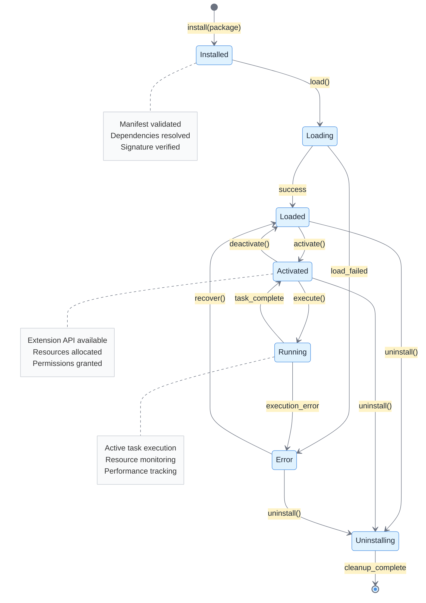
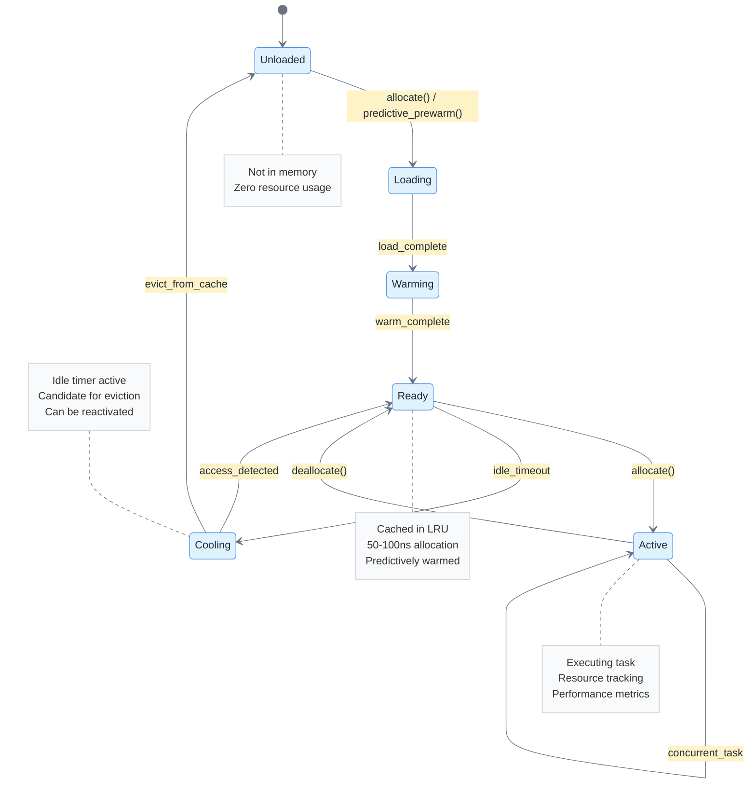
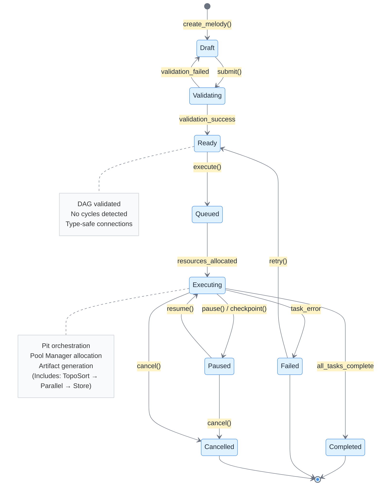
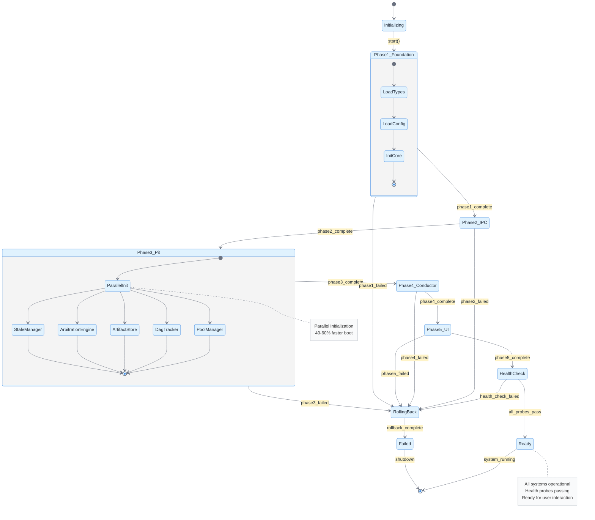
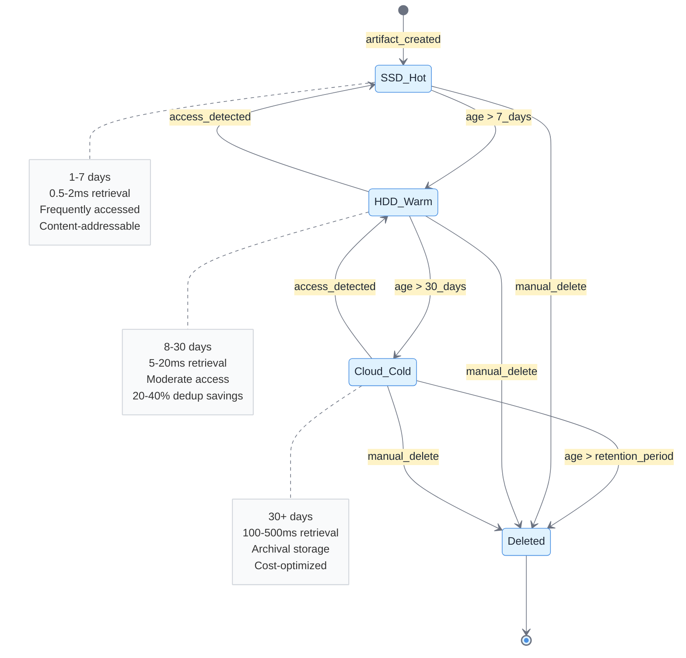
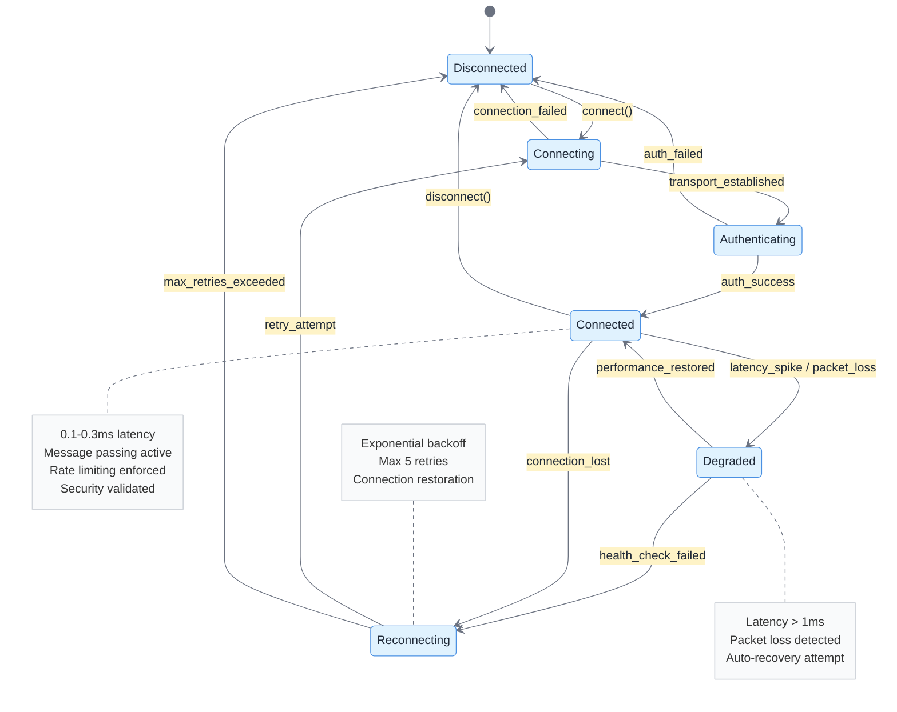
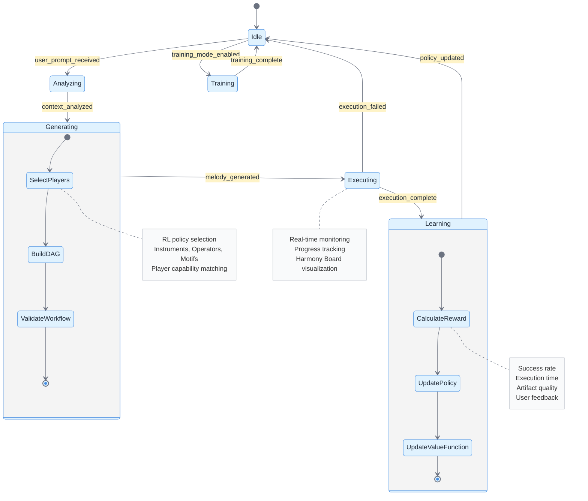
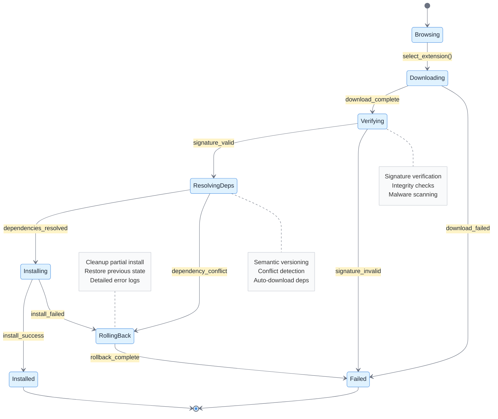
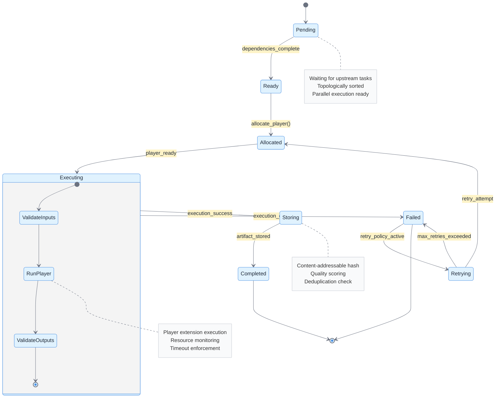
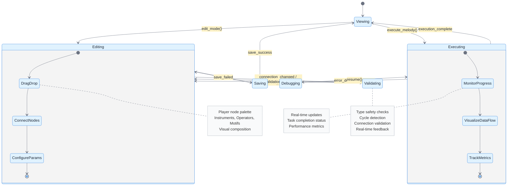

# State

This document contains state diagrams for all major state machines in the Symphony IDE system, organized by architectural component.

---

## 1. Extension Lifecycle - Chambering State Machine

**Overview**: The Chambering state machine manages the complete lifecycle of extensions from installation through runtime execution. This is a core component of the Orchestra Kit’s LifecycleManager.

**Key States**:
- **Installed**: Extension package is on disk, manifest validated
- **Loading**: Extension code is being loaded into memory
- **Loaded**: Extension is in memory but not yet activated
- **Activated**: Extension’s `activate()` method has been called successfully
- **Running**: Extension is actively executing tasks
- **Error**: Extension encountered a fatal error
- **Uninstalling**: Extension is being removed from the system

**Transitions**:
- Installation triggers Loading
- Successful load moves to Loaded
- User/system activation moves to Activated
- Task execution moves to Running
- Errors can occur from any state
- Deactivation returns to Loaded
- Uninstallation can occur from Installed, Loaded, or Activated states

---

## 2. Player Extension State Machine (Pool Manager)

**Overview**: The Pool Manager maintains Player extensions (Instruments, Operators, Motifs) in various states to achieve 50-100ns allocation times through predictive pre-warming.

**Key States**:
- **Unloaded**: Extension not in memory
- **Loading**: Extension binary being loaded
- **Warming**: Extension initializing resources (models, caches, etc.)
- **Ready**: Extension warm and cached, ready for instant allocation
- **Active**: Extension currently executing a task
- **Cooling**: Extension idle, preparing for potential unload

**Performance Characteristics**:
- **Unloaded → Ready**: 100-500ms (cold start)
- **Ready → Active**: 50-100ns (cache hit)
- **Predictive Pre-warming**: >80% accuracy

---

## 3. Melody Execution Workflow State Machine

**Overview**: This state machine tracks the execution lifecycle of a Melody (workflow) from creation through completion, including error handling and checkpointing.

**Key States**:
- **Draft**: Melody being composed in Harmony Board
- **Validating**: DAG validation, cycle detection, type checking
- **Ready**: Validated and ready for execution
- **Queued**: Waiting for Conductor/Pit resources
- **Executing**: Active DAG execution with parallel tasks
- **Paused**: Execution suspended (user request or checkpoint)
- **Completed**: All tasks finished successfully
- **Failed**: Execution failed with errors
- **Cancelled**: User-initiated cancellation

**Execution Modes**:
- **Maestro Mode (RL)**: Conductor generates workflow
- **Manual Mode**: User selects pre-built Melody

---

## 4. Bootstrap System - Phased Initialization State Machine

**Overview**: The Bootstrap system initializes Symphony IDE through five sequential phases with parallel execution within each phase and rollback capability on failure.

**Key Phases**:
1. **Foundation**: Types, Config, Core initialization
2. **IPC**: Message bus, transport, security setup
3. **Pit**: Pool Manager, DAG Tracker, Artifact Store, Arbitration Engine, Stale Manager
4. **Conductor**: Python RL model, PyO3 bindings, orchestration bridge
5. **UI**: Frontend launch, WebSocket connection, health checks

**Performance**:
- **Cold Start**: 500ms-1s
- **Parallel Phase Execution**: 40-60% faster
- **Rollback**: Automatic on any phase failure

---

## 5. Artifact Lifecycle State Machine (Stale Manager)

**Overview**: The Stale Manager transitions artifacts through storage tiers based on age and access patterns to optimize storage costs and performance.

**Storage Tiers**:
- **SSD (1-7 days)**: Hot storage, fastest access (0.5-2ms retrieval)
- **HDD (8-30 days)**: Warm storage, moderate access (5-20ms retrieval)
- **Cloud (30+ days)**: Cold storage, archival (100-500ms retrieval)
- **Deleted**: Permanently removed after retention period

**Deduplication**: 20-40% storage savings through content-addressable hashing

---

## 6. IPC Connection State Machine

**Overview**: Manages inter-process communication connections between Symphony core and extensions/processes with automatic reconnection and health monitoring.

**Key States**:
- **Disconnected**: No active connection
- **Connecting**: Establishing transport (Unix socket/Named pipe)
- **Authenticating**: Process authentication and capability verification
- **Connected**: Active connection, message passing enabled
- **Degraded**: Connection issues, reduced performance
- **Reconnecting**: Attempting to restore connection

**Performance**:
- **Message Latency**: 0.1-0.3ms target
- **Reconnection**: Exponential backoff with max 5 retries
- **Health Checks**: Every 5 seconds

---

## 7. Conductor Mode State Machine

**Overview**: The Conductor operates in different modes for workflow generation, execution, and reinforcement learning training.

**Key Modes**:
- **Idle**: Waiting for user prompt or training data
- **Analyzing**: Processing user prompt and project context
- **Generating**: Creating Melody DAG using RL model
- **Executing**: Monitoring workflow execution
- **Learning**: Calculating rewards and updating RL policy
- **Training**: Offline batch training on historical data

**RL Components**:
- **Policy Network**: Selects Player extensions and workflow structure
- **Value Function**: Estimates workflow quality
- **Reward Calculation**: Based on execution success, speed, quality

---

## 8. Extension Installation State Machine

**Overview**: Manages the installation process for extensions from the Marketplace, including dependency resolution, signature verification, and rollback capability.

**Key States**:
- **Browsing**: User browsing Marketplace
- **Downloading**: Fetching extension package
- **Verifying**: Signature and integrity checks
- **ResolvingDeps**: Dependency resolution
- **Installing**: Writing to disk and registering
- **Installed**: Successfully installed
- **RollingBack**: Reverting failed installation
- **Failed**: Installation failed

---

## 9. DAG Task Execution State Machine

**Overview**: Individual task node execution within a Melody’s DAG, managed by the DAG Tracker.

**Key States**:
- **Pending**: Task waiting for dependencies
- **Ready**: Dependencies satisfied, ready to execute
- **Allocated**: Player extension allocated from Pool Manager
- **Executing**: Task actively running
- **Storing**: Storing output artifacts
- **Completed**: Task finished successfully
- **Failed**: Task execution failed
- **Retrying**: Attempting retry after failure

**Parallel Execution**: Multiple tasks can execute concurrently if dependencies allow

---

## 10. Harmony Board Canvas State Machine

**Overview**: The visual workflow designer’s canvas state for user interaction during Melody creation.

**Key States**:
- **Viewing**: Read-only visualization of existing Melody
- **Editing**: User actively modifying workflow
- **Validating**: Real-time validation of connections
- **Saving**: Persisting changes to Polyphony Store
- **Executing**: Monitoring live execution
- **Debugging**: Inspecting execution state and errors

---

## Summary

The Symphony IDE state diagrams cover **10 major state machines** across all architectural layers:

1. **Extension Lifecycle (Chambering)** - Complete extension lifecycle from installation to execution
2. **Player Extension (Pool Manager)** - High-performance state management with 50-100ns allocation
3. **Melody Execution Workflow** - Workflow execution from creation to completion
4. **Bootstrap System** - Phased initialization with rollback capability
5. **Artifact Lifecycle (Stale Manager)** - Storage tier transitions for cost optimization
6. **IPC Connection** - Inter-process communication with auto-reconnection
7. **Conductor Mode** - RL-based workflow generation and learning
8. **Extension Installation** - Marketplace installation with dependency resolution
9. **DAG Task Execution** - Individual task execution within workflows
10. **Harmony Board Canvas** - Visual designer interaction states

Each state machine includes:
- **Clear state definitions** with entry/exit conditions
- **Transition triggers** and events
- **Error handling** and recovery paths
- **Performance characteristics** where applicable
- **Nested states** for complex workflows
- **Detailed notes** explaining key behaviors

These state diagrams provide a complete view of Symphony IDE’s dynamic behavior and state management across all system components.