# The Conductor

> The microkernel maestro that orchestrates the symphony of intelligent development
> 

---

## 🎯 Core Identity

**Icon**: 🎩 [Top Hat – The elegant maestro conducting the full performance]

**Architecture**: 🧠 **Microkernel Design** – Minimal, powerful core that manages everything else as extensions

**Training Ground**: 🎮 **Function Quest Game (FQG)** – Where models become callable functions in logic puzzles

**Frequency**: *963 Hz* – Crown chakra activation, universal consciousness, divine creation

---

## 🗂️ Microkernel Architecture Philosophy

*The Conductor operates on a **microkernel principle***

- Core is implemented in **Python**, leveraging AI libraries (e.g., Gem, PyTorch, TensorFlow) to power its Reinforcement Learning (RL) model, trained via Function Quest Game (FQG). Infrastructure and other extensions are built in **Rust** to ensure high performance and memory safety, integrating seamlessly with the Python core via a robust extension API.
- it's the minimal but powerful core that keeps everything running smoothly ⬇️

### 🔧 **What the Core Does** (**Minimal**)

- **Model Lifecycle Management**: Starts, stops, and monitors all other models
- **Orchestration Logic**: Decides what happens when and why
- **State Tracking**: Knows where everything is in the development process
- **Communication Protocols**: Ensures models can talk to each other

### 🧩 **What Runs as Extensions** (Everything Else)

- **All Symphony Models**: Enhancement, planning, coding models run independently
- **Failure Recovery Strategies**: Each model has its own adaptive failure handling
- **Artifact Processing**: Data transformation and validation steps
- **Output Generation**: File creation, formatting, and delivery

### 🎯 **Why This Matters**

- **🔄 Replaceability**: Any model can be swapped out without breaking the system
- **🛡️ Isolation**: If one model fails, it doesn't crash everything else
- **📈 Scalability**: New models can be added without rewriting the core
- **🧪 Testability**: Each component can be tested independently

---

## 🗂️ Conductor's Trusted Orchestra

The Conductor's intelligent orchestration operates atop a robust
infrastructure layer implemented as **Infrastructure as Extension (IaE)**

- five privileged Rust extensions that are always registered as **Players**
by default.

The Conductor also orchestrates User-Faced Extensions that have successfully
registered as **Players** - authorized performers committed to governance
policies in exchange for intelligent coordination and optimization.

*Learn more about Player registration and governance at → [The Player](The%20Player%20294461aa27058067ac8ec0bdfda7a4ff.md)* 

```mermaid
graph TB
    subgraph "🎩 Conductor Core (Python)"
        C[RL Orchestration Engine]
        C -->|orchestration commands| PM
        C -->|workflow queries| DT
        C -->|artifact operations| AS
        C -->|conflict resolution| AR
        C -->|cleanup requests| SM
    end

    subgraph "🎭 The Pit - IaE Infrastructure (Rust)"
        PM[🦀 Pool Manager Extension]
        DT[📊 DAG Tracker Extension]
        AS[📦 Artifact Store Extension]
        AR[⚖️ Arbitration Extension]
        SM[🧹 Stale Manager Extension]
    end

    style C fill:#bbdefb,stroke:#1976d2,stroke-width:3px
    style PM fill:#e3f2fd,stroke:#1976d2,stroke-width:2px
    style DT fill:#e8f5e9,stroke:#388e3c,stroke-width:2px
    style AS fill:#fff3e0,stroke:#f57c00,stroke-width:2px
    style AR fill:#fce4ec,stroke:#c2185b,stroke-width:2px
    style SM fill:#e0f2f1,stroke:#00796b,stroke-width:2px

```

### 🔧 The Pit's Dependency Matrix

| Conductor Capability | Infrastructure Dependencies | Purpose |
| --- | --- | --- |
| **Model Activation** | 🦀 Pool Manager + ⚖️ Arbitration | Intelligent resource allocation and conflict resolution |
| **Workflow Execution** | 📊 DAG Tracker + 📦 Artifact Store | Dependency management and state persistence |
| **Failure Recovery** | 🧹 Stale Manager + 📊 DAG Tracker | System cleanup and workflow reconstruction |
| **Performance Optimization** | 🦀 Pool Manager + 🧹 Stale Manager | **Training data preservation & storage lifecycle management** - retains melody artifacts for model training, archives to cloud, and only deletes when storage limits require |
| **Quality Assurance** | 📦 Artifact Store + ⚖️ Arbitration | Artifact validation and quality-based routing |

### 🎯 Why *"The Pit"* Matters for the Conductor

**🛡️ Reliability Through Isolation**

- Infrastructure failures don't crash the Conductor's RL core
- Each extension can be updated independently
- Graceful degradation when individual components are unavailable

**🔧 Operational Flexibility**

- Infrastructure can be customized for different deployment scenarios
- Enterprise extensions can replace or enhance core infrastructure
- The Conductor remains focused on orchestration intelligence

**🌍 Platform Consistency**

- Uses the same extension system provided to community developers
- Demonstrates Symphony's extension capabilities at infrastructure scale
- Provides reference implementation for high-performance extensions

*Learn more at → [The Pit](The%20Pit%20282461aa2705805581afc348c0e4913f.md)* 

---

## 🕹️ Extension Lifecycle: The Chambering Flow

> 🎼 The Conductor's elegant choreography for summoning, wielding, and releasing extensions
> 

The **Chambering Flow** is the Conductor's deterministic, RL-optimized lifecycle for managing extensions—like loading kernel modules in a microkernel OS, but with AI-driven finesse. This process ensures **isolation**, **transparency**, and **traceability**, treating extensions (The Pit and UFE) as orchestrated resources summoned on-demand to perform in Symphony's intelligent workflows.

### 🎬 Lifecycle Steps

1. **📢 Requesting**
    
    The Conductor signals the **Orchestra Kit** to summon an extension based on orchestration needs (e.g., a Melody for UI or Artifact Store for data persistence).
    
2. **📜 Registration**
    
    The extension declares its **capabilities** (via manifest, e.g., `provides_artifact_storage`) and **requirements** (e.g., memory, compute), registering with the Conductor's Python core.
    
3. **🚀 Activation**
    
    The Conductor activates the extension with context—artifacts, state, or RL-driven parameters from Function Quest.
    
4. **🎭 Usage**
    
    The Conductor invokes the extension for its task (e.g., storing artifacts, generating code). The **DAG Tracker** monitors progress, ensuring no direct extension-to-extension calls.
    
5. **📚 Return & Unloading**
    
    The extension returns results to the Conductor, which coordinates cleanup via the **Stale Manager**. Graceful release prevents resource leaks.
    
6. **📊 State Update**
    
    The Conductor updates global state, logs metrics, and feeds performance data into the RL model for **Function Quest** adaptation, refining future orchestrations.
    

### 🎻 Example: Melody → Artifact Store

Consider a **Melody extension** (UFE) needing to store a workflow artifact:

1. **🎵 Melody** sends: "Store this artifact" to the Conductor.
2. **🎩 Conductor** routes the request to **The Pit's Artifact Store** (*IaE's Rust extension*).
3. **📦 Artifact Store** processes and confirms success.
4. **🎩 Conductor** relays the result back to Melody.

This flow enforces the Conductor's role as the **sole communication hub**, ensuring no direct calls between extensions, preserving hierarchy, and enabling RL-driven optimization.

**Note on Players**: For extensions registered as Players, this Chambering
Flow includes additional Conductor policy and conditions verification.
Standard extensions use the core flow without Conductor coordination.

*See [The Player](The%20Player%20294461aa27058067ac8ec0bdfda7a4ff.md)  for Player-specific lifecycle details.*

---

## 🎮 Function Quest Foundation

The Conductor isn't just inspired by Function Quest – **it IS the Function Quest Maestro (FQM)**:

### 🎲 **How It Works**

- **🎻 Symphony Models** = **Functions** in the game
- **📄 Outputs** (something.txt, something2.csv, etc.) = **Return Values**
- **🎼 Orchestration** = **Function Call Sequences**
- **🏆 Project Success** = **Winning the Level**

### 🎯 **Training Process**

1. **🎮 Play Function Quest**: Learn logical reasoning on puzzle levels
2. **📊 Track Performance**: Monitor success rates and efficiency
3. **🧠 Reinforcement Learning**: Improve strategies through trial and error
4. **🚀 Deploy to Symphony**: Apply learned orchestration skills to real projects

### 💡 **Why This Approach?**

- **Logic First**: Builds rock-solid reasoning before handling real complexity
- **Measurable Progress**: Clear success/failure metrics in each level
- **Safe Learning**: Mistakes in games don't break real projects
- **Scalable Training**: Can create infinite variations of orchestration challenges

---

## 🎼 Orchestration & Melody System

The Conductor's orchestration capabilities extend beyond basic extension management into sophisticated workflow composition through **Melodies** - visual workflow builders that let users create complex AI-driven processes.

For  details on:

- **Melody Creation & Composition**
- **Visual Workflow Design (Harmony Board)**
- **Dynamic Orchestration Strategies**
- **Artifact Flow Management**
- **Failure Handling & Recovery**
- **Performance Optimization**

*To learn more about Orchestration at → [The Orchestration](The%20Orchestration%2024f461aa270580e1ae03f77404471f7b.md)* 

*To learn more about Melody at → [The Melody](The%20Melody%2028a461aa27058099998fd7a101cb450d.md)* 

---

## 🧠 Learning & Adaptation System

### 📊 **Performance Tracking**

The Conductor learns from every project:

**🎯 Success Metrics**:

- **Completion Rate**: How often projects finish successfully
- **Efficiency**: Minimum function calls needed vs. actual calls used
- **Quality Scores**: How good are the final outputs
- **Recovery Success**: How well does failure handling work

### 📈 **Adaptive Improvement**

**🔄 Strategy Evolution**:

- **Pattern Recognition**: Identifies what works best for different project types
- **Optimization**: Learns to skip unnecessary steps
- **Robustness**: Gets better at handling edge cases and failures
- **Personalization**: Adapts to user preferences and coding styles

### 🎮 **Continuous Function Quest Training**

Even after deployment, the Conductor keeps improving through Function Quest:

- **New Challenges**: Tests against increasingly complex orchestration puzzles
- **Edge Case Training**: Practices handling unusual scenarios
- **Performance Benchmarking**: Compares against previous versions

---

## 🎵 Real-World Symphony Orchestration

### 🚀 **From Game to Production**

The transition from Function Quest training to real Symphony orchestration:

**🎮 In Function Quest**:

- `find_key()` → `'rusty_key'`
- `use_key('rusty_key')` → `'Success!'`
- `open_door()` → `'The door opens!'`

**🎼 In Symphony**:

- `enhance_prompt(user_input)` → `enhanced_prompt.txt`
- `extract_features(enhanced_prompt)` → `backlog.csv`
- `generate_code(instructions)` → `source_files/`

*Learn more about Function Quest Game [FQG] at → [Function Quest](Function%20Quest%2023b461aa2705809c9d29d617bc71d877.md)* 

---

*The Conductor transforms the complex art of software orchestration into a learnable, measurable skill through Function Quest training, then applies this mastery to create beautiful symphonies of intelligent development.*