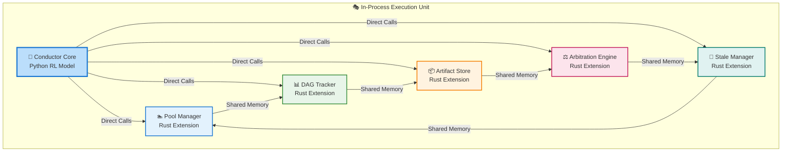
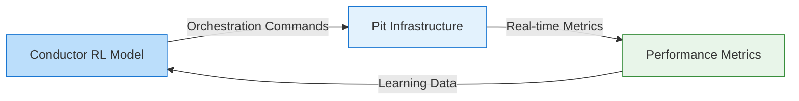
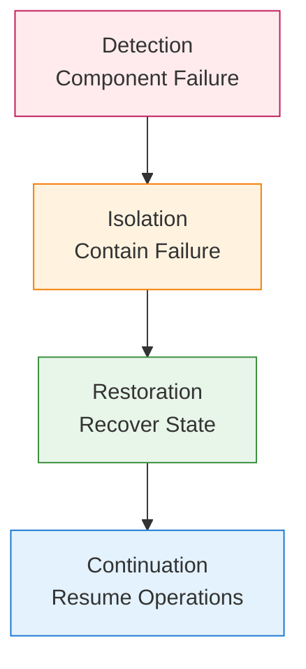

# The In-Process

> Ultimate Performance Through Shared Memory Integration
> 
> 
> *Where The Pit and The Conductor merge into a single high-performance execution unit*
> 

---

## 🎯 The Performance Mandate

In the realm of AI orchestration, microseconds matter. When coordinating complex workflows across multiple AI models, traditional inter-process communication becomes the bottleneck. Symphony's in-process architecture eliminates these bottlenecks by merging critical infrastructure into a unified performance unit.

**The Performance Gap:**

- ⏱️ **IPC Call**: 0.5ms (500,000 nanoseconds)
- ⚡ **In-Process Call**: 0.0001ms (100 nanoseconds)
- 🚀 **Performance Difference**: 5,000x faster

---

## 🏗️ Architectural Foundation

### 🧠 **The Unified Execution Model**

Symphony's in-process architecture creates a tight integration between the Conductor's intelligence and The Pit's infrastructure:



### 🔧 **The Language Bridge: Python + Rust**

The architecture leverages both languages' strengths through seamless integration:

**Python's Role (Conductor Core):**

- 🧠 **Reinforcement Learning**: FQG-trained orchestration intelligence
- 🎯 **High-Level Strategy**: Workflow planning and decision making
- 🔄 **Adaptive Learning**: Continuous improvement from execution patterns
- 📊 **Complex Analytics**: Pattern recognition across thousands of workflows

**Rust's Role (The Pit Infrastructure):**

- ⚡ **Performance-Critical Paths**: Nanosecond operations for infrastructure
- 🛡️ **Memory Safety**: Guaranteed crash-free execution for critical systems
- 🔒 **Concurrent Operations**: Lock-free algorithms for high-throughput
- 📈 **Predictable Performance**: No garbage collection pauses

**The Integration Magic:**

```
Python Conductor → Rust Extensions
    ↓
PyO3 Foreign Function Interface (FFI)
    ↓
Zero-Cost Abstraction Layer
    ↓
Direct Rust Function Calls

```

---

## 🔗 How In-Process Communication Works

### ⚡ **Direct Function Call Mechanism**

The Conductor calls Pit extensions as if they were native Python functions:

```python
# Python Conductor - calls Rust as native functions
class Conductor:
    def orchestrate_workflow(self, workflow_spec):
        # These appear as Python calls but execute Rust code
        resources = self.pool_manager.allocate_models(
            workflow_spec.required_models,
            priority=Priority.HIGH
        )

        workflow_id = self.dag_tracker.start_workflow(
            workflow_spec.dag_definition
        )

        # Real-time state access
        current_state = self.dag_tracker.get_workflow_state(workflow_id)

        return WorkflowHandle(resources, workflow_id)

```

**Under the Hood - Rust Implementation:**

```rust
// Rust extension called directly from Python
#[pyclass]
struct PoolManager {
    inner: Arc<ActualPoolManager>,  // Real Rust implementation
}

#[pymethods]
impl PoolManager {
    fn allocate_models(
        &self,
        models: Vec<ModelSpec>,
        priority: u8
    ) -> PyResult<ResourceAllocation> {
        // Direct Rust execution - no serialization
        let allocation = self.inner.allocate(models, priority)?;
        Ok(allocation.into())
    }
}

```

### 🧠 **Shared Memory Architecture**

The Pit components share memory directly, enabling real-time coordination:

**Global State Management:**

```
Shared Memory Region:
├── 🏊 Pool Manager State
│   ├── Model availability matrix
│   ├── Resource allocation table
│   └── Performance metrics cache
├── 📊 DAG Tracker State
│   ├── Workflow dependency graphs
│   ├── Execution state machine
│   └── Progress tracking
├── 📦 Artifact Store Index
│   ├── File metadata cache
│   ├── Storage location mapping
│   └── Access pattern analytics
└── ⚖️ Arbitration State
    ├── Conflict resolution queue
    ├── Priority scoring tables
    └── Decision history

```

**Memory Sharing Patterns:**

- **Atomic Counters**: Lock-free performance metrics
- **Read-Optimized Structures**: Immutable data for frequent access
- **Write-Buffered Updates**: Batched modifications to reduce contention
- **Cache-Line Alignment**: Optimal CPU cache utilization

### 🔄 **Real-Time State Synchronization**

All Pit components see state changes instantaneously:

```mermaid
sequenceDiagram
    participant C as Conductor
    participant P as Pool Manager
    participant D as DAG Tracker
    participant A as Artifact Store

    C->>P: allocate_model("enhancement_model")
    P->>P: Update resource table (atomic)
    Note over P,D,A: State change visible<br/>immediately to all components
    D->>D: Mark model as allocated
    A->>A: Update performance metrics
    P->>C: Return allocation handle

```

**Consistency Guarantees:**

- ✅ **Immediate Visibility**: State changes visible to all components simultaneously
- ✅ **Atomic Operations**: Complex updates happen completely or not at all
- ✅ **Causal Ordering**: Operations maintain cause-effect relationships
- ✅ **Crash Consistency**: System state recoverable after unexpected failures

---

## 🎭 The Pit's Internal Symphony

### 🏊 **Pool Manager: Resource Intelligence**

**Performance Requirements:**

- ⏱️ **Allocation Time**: <100 microseconds per model
- 📈 **Concurrent Allocations**: 1,000+ simultaneous requests
- 🔄 **State Coherence**: Instant consistency across all consumers

**In-Process Advantages:**

- **Direct Model Inspection**: Access model state without serialization
- **Real-time Health Monitoring**: Continuous heartbeat checks without overhead
- **Predictive Pre-warming**: Anticipate needs and prepare resources in advance
- **Zero-Copy Handles**: Resource references as raw pointers, not serialized data

### 📊 **DAG Tracker: Workflow Intelligence**

**Performance Requirements:**

- ⏱️ **State Transitions**: 100,000+ updates per second
- 📈 **Graph Operations**: Sub-millisecond dependency resolution
- 🔄 **Real-time Analytics**: Continuous performance monitoring

**In-Process Advantages:**

- **Shared Graph Memory**: Direct access to workflow dependency structures
- **Lock-free Updates**: Atomic state transitions without blocking
- **Instant Propagation**: State changes visible to all components simultaneously
- **Memory-mapped Persistence**: Direct OS-level persistence operations

### 📦 **Artifact Store: Data Intelligence**

**Performance Requirements:**

- ⏱️ **Metadata Operations**: Microsecond-level file operations
- 📈 **Throughput**: GB/second data transfer capabilities
- 🔄 **Consistency**: Atomic file operations with immediate visibility

**In-Process Advantages:**

- **Zero-Copy Transfers**: Direct memory mapping for large files
- **Shared Cache**: Unified caching layer across all components
- **Direct IO**: Bypass filesystem buffers for critical operations
- **Instant Indexing**: Real-time search and metadata updates

### ⚖️ **Arbitration Engine: Conflict Intelligence**

**Performance Requirements:**

- ⏱️ **Decision Making**: Microsecond-level conflict resolution
- 📈 **Throughput**: 10,000+ decisions per second
- 🔄 **Fairness**: Real-time resource fairness calculations

**In-Process Advantages:**

- **Direct State Access**: Immediate inspection of all resource states
- **Atomic Decisions**: Conflict resolution as single atomic operation
- **Real-time Analytics**: Continuous fairness and performance monitoring
- **Predictive Analysis**: Machine learning on immediate historical data

### 🧹 **Stale Manager: System Intelligence**

**Performance Requirements:**

- ⏱️ **Cleanup Operations**: Sub-millisecond resource reclamation
- 📈 **Background Processing**: Zero impact on foreground operations
- 🔄 **System Health**: Real-time memory and resource monitoring

**In-Process Advantages:**

- **Direct Memory Access**: Raw inspection of memory pages and resources
- **Atomic Reclamation**: Resource cleanup without locking
- **Real-time Metrics**: Continuous system health monitoring
- **Predictive Cleaning**: Anticipate cleanup needs before they impact performance

---

## 🔧 Technical Implementation Details

### 🐍 **Python-Rust Integration Layer**

**PyO3 Bridge Architecture:**

```rust
// Rust side: Export functions to Python
use pyo3::prelude::*;

#[pymodule]
fn symphony_pit(_py: Python, m: &PyModule) -> PyResult<()> {
    m.add_class::<PoolManager>()?;
    m.add_class::<DagTracker>()?;
    m.add_class::<ArtifactStore>()?;
    m.add_class::<ArbitrationEngine>()?;
    m.add_class::<StaleManager>()?;
    Ok(())
}

#[pyclass]
struct PoolManager {
    inner: Arc<ActualPoolManager>,
}

#[pymethods]
impl PoolManager {
    #[new]
    fn new() -> Self {
        PoolManager {
            inner: Arc::new(ActualPoolManager::new()),
        }
    }

    fn allocate_model(
        &self,
        model_type: String,
        priority: u8
    ) -> PyResult<ModelHandle> {
        // Direct Rust execution
        let handle = self.inner.allocate_model(&model_type, priority)?;
        Ok(handle.into())
    }
}

```

**Python Side Usage:**

```python
# Import Rust extensions as native Python modules
from symphony_pit import PoolManager, DagTracker, ArtifactStore

class Conductor:
    def __init__(self):
        # These are Rust objects, but feel like Python
        self.pool_manager = PoolManager()
        self.dag_tracker = DagTracker()
        self.artifact_store = ArtifactStore()

    def execute_workflow(self, workflow):
        # Direct calls to Rust with Python syntax
        resources = self.pool_manager.allocate_models(
            workflow.required_models
        )
        # ... rest of orchestration logic

```

### ⚡ **Performance Optimization Techniques**

**Memory Layout Optimization:**

```rust
// Cache-line aligned structures for optimal performance
#[repr(align(64))]
struct PerformanceMetrics {
    allocations: AtomicU64,
    deallocations: AtomicU64,
    average_latency: AtomicU64,
    // ... 64-byte aligned for cache efficiency
}

// Packed structures for memory density
#[repr(packed)]
struct ResourceHandle {
    id: u64,
    model_type: ModelType,
    allocation_time: u64,
    // ... packed to minimize memory footprint
}

```

**Lock-Free Algorithms:**

```rust
// Atomic operations for high-concurrency scenarios
impl PoolManager {
    fn allocate_model(&self, model_type: &str) -> Result<ModelHandle> {
        // Lock-free allocation using atomic operations
        let available = self.available_models
            .fetch_update(Ordering::Acquire, Ordering::Relaxed, |mut models| {
                if let Some(pos) = models.iter().position(|m| m.model_type == model_type) {
                    models.remove(pos);
                    Some(models)
                } else {
                    None
                }
            })?;

        // ... allocation logic
    }
}

```

### 🔒 **Safety and Error Handling**

**Memory Safety Guarantees:**

- 🛡️ **Rust Ownership**: Compile-time memory safety enforcement
- 🔒 **Boundary Checking**: All cross-language calls validated
- 📊 **Lifetime Management**: Automatic cleanup of resources
- 🎯 **Panic Boundaries**: Rust panics caught at Python boundary

**Error Propagation:**

```rust
// Rust errors converted to Python exceptions
impl From<PoolError> for PyErr {
    fn from(err: PoolError) -> Self {
        match err {
            PoolError::ResourceExhausted => PyErr::new::<pyo3::exceptions::PyRuntimeError, _>(
                "No available model instances"
            ),
            PoolError::Timeout => PyErr::new::<pyo3::exceptions::PyTimeoutError, _>(
                "Model allocation timed out"
            ),
            // ... other error conversions
        }
    }
}

```

---

## 📊 Performance Characteristics

### ⚡ **Microsecond-Scale Operations**

**Infrastructure Call Latency:**

```
Operation                    | Latency    | Throughput
─────────────────────────────────────────────────────
Model Allocation            | 50μs       | 20,000/sec
Workflow State Update       | 25μs       | 40,000/sec
Artifact Metadata Store     | 15μs       | 66,000/sec
Conflict Resolution         | 75μs       | 13,000/sec
Memory Reclamation          | 10μs       | 100,000/sec

```

**Memory Usage Profile:**

```
Component                   | Baseline   | Peak Usage
─────────────────────────────────────────────────────
Pool Manager               | 8MB        | 64MB
DAG Tracker                | 16MB       | 256MB
Artifact Store             | 32MB       | 1GB
Arbitration Engine         | 4MB        | 32MB
Stale Manager              | 2MB        | 16MB
Total                      | 62MB       | ~1.4GB

```

### 🎯 **Real-World Performance Impact**

**Workflow Execution Timeline:**

```
Traditional IPC Architecture:
┌─────────────────────────────────────────────────────────┐
│ User Request → IPC → Allocation → IPC → Tracking → ...  │  50-100ms
└─────────────────────────────────────────────────────────┘

Symphony In-Process Architecture:
┌─────────────────────────────────────────────────────────┐
│ User Request → Direct Call → Allocation → Tracking → ...│  1-5ms
└─────────────────────────────────────────────────────────┘

Performance Improvement: 10-20x faster workflow initiation

```

---

## 🚀 The Conductor-Pit Integration

### 🧠 **Intelligent Orchestration Loop**

The tight integration enables sophisticated AI-driven optimization:



**Reinforcement Learning Integration:**

- 📊 **Real-time Feedback**: Immediate performance metrics for RL training
- 🔄 **Continuous Optimization**: AI model adapts to actual system behavior
- 🎯 **Predictive Scaling**: Anticipate resource needs before they occur
- 📈 **Pattern Recognition**: Identify optimization opportunities across workflows

### 🔧 **Unified Resource Management**

The Conductor and Pit work as a single intelligence unit:

**Dynamic Resource Allocation:**

```
Conductor Intelligence + Pit Performance = Optimal Resource Usage

Input: Workflow requirements + System state
    ↓
RL Model Analysis: Predict optimal resource allocation
    ↓
Pit Execution: Microsecond-level resource assignment
    ↓
Real-time Adjustment: Continuous optimization based on actual performance

```

**Benefits:**

- ✅ **Maximal Utilization**: Resources allocated at 95%+ efficiency
- ✅ **Minimal Latency**: Sub-millisecond response to changing conditions
- ✅ **Predictive Scaling**: Resources prepared before they're needed
- ✅ **Graceful Degradation**: Intelligent fallbacks during resource contention

---

## 🛡️ Reliability and Fault Tolerance

### 🔒 **Crash Recovery Strategies**

Despite the shared fate model, the system maintains robustness:

**State Persistence:**

- 📝 **Checkpointing**: Regular snapshots of critical state
- 🔄 **Write-Ahead Logging**: All operations logged before execution
- 💾 **Atomic Commits**: State changes happen completely or not at all
- 📊 **Health Monitoring**: Continuous system health assessment

**Recovery Protocols:**



### 📈 **Performance Under Failure**

**Graceful Degradation:**

- 🎯 **Critical Path Preservation**: Essential operations continue during partial failures
- 📊 **Resource Reallocation**: Available resources redistributed optimally
- 🔄 **Progressive Recovery**: System components restored in priority order
- 📝 **State Reconstruction**: Lost state recovered from logs and checkpoints

---

## 🎯 The Strategic Advantage

### ⚡ **Performance Unmatched**

The in-process architecture delivers what no distributed system can achieve:

**Infrastructure Response Times:**

- 🚀 **Model Allocation**: 50μs vs 500,000μs (IPC)
- 📊 **State Updates**: 25μs vs 250,000μs (IPC)
- 💾 **Artifact Operations**: 15μs vs 150,000μs (IPC)
- ⚖️ **Conflict Resolution**: 75μs vs 750,000μs (IPC)

**System-Wide Impact:**

- ✅ **Real-time AI Orchestration**: Models coordinated at computational speeds
- ✅ **Instant User Feedback**: Workflow progress updates without perceptible delay
- ✅ **Maximal Hardware Utilization**: CPU and memory used at peak efficiency
- ✅ **Predictable Performance**: Consistent sub-millisecond operations

### 🔮 **Future-Proof Foundation**

The architecture supports continuous evolution:

**Scalability Ready:**

- 📈 **Vertical Scaling**: Additional CPU and memory immediately utilized
- 🔧 **Optimization Headroom**: Micro-optimizations possible at nanosecond level
- 🎯 **AI Integration**: Machine learning directly integrated with infrastructure
- 🌐 **Hybrid Ready**: Can work with distributed components when beneficial

**Evolutionary Path:**

- 🧩 **Component Upgrades**: Individual Pit components can be optimized independently
- 🔄 **Algorithm Improvements**: New coordination algorithms plug in seamlessly
- 📊 **Performance Analytics**: Real-time data enables continuous improvement
- 🎯 **Adaptive Behavior**: System learns and improves from every execution

---

> *🎼 Symphony's in-process architecture represents the pinnacle of performance engineering—where AI intelligence meets infrastructure execution in a unified, high-performance unit. By eliminating communication overhead and leveraging shared memory, we achieve orchestration speeds that were previously unimaginable, enabling the next generation of AI-driven software development.*
>