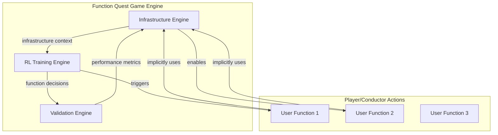

# The Infrastructure-Aware Evolution

> Training Conductors Who Understand Architectural Foundations
> 
> 
> *Where game mechanics mirror production reality through automated infrastructure orchestration*
> 

---

## 💡 The Brilliant Insight

**Infrastructure should be implicit, not explicit**. Instead of training the Conductor to manually call infrastructure functions, we can build the infrastructure awareness directly into the game engine.

## 🎯 The New Approach: Automated Infrastructure Orchestration

### 🔄 **Before & After Comparison**

**Old Model (Problematic):**

```
Conductor must explicitly manage everything:
allocate_resources() → enhance_prompt() → track_progress() →
store_artifact() → generate_code() → release_resources()

RL Model Burden: Must learn both business logic AND infrastructure

```

**New Model (Your Solution):**

```
Conductor focuses on business logic:
enhance_prompt() → generate_code()

Game Engine automatically handles infrastructure:
[auto_allocate] → enhance_prompt() → [auto_track] →
[auto_store] → generate_code() → [auto_release]

```

---

## 🏗️ How Automated Infrastructure Works

### 🎮 **The Enhanced FQ Game Engine**



### 🔧 **Infrastructure Automation Layers**

### **1. Pre-Function Infrastructure**

**Automated Before Every Function Call:**

- 🏊 **Resource Allocation**: Pool Manager automatically provisions required resources
- 📊 **State Preparation**: DAG Tracker establishes execution context
- 🔒 **Access Control**: Arbitration Engine verifies permissions
- 📦 **Input Validation**: Artifact Store validates input artifacts

### **2. Post-Function Infrastructure**

**Automated After Every Function Call:**

- 💾 **Result Storage**: Artifact Store automatically persists outputs
- 📈 **Progress Tracking**: DAG Tracker updates workflow state
- 🧹 **Cleanup Operations**: Stale Manager releases temporary resources
- 📊 **Performance Logging**: Metrics collected for RL training

### **3. Inter-Function Infrastructure**

**Automated Between Function Calls:**

- 🔄 **State Synchronization**: Ensures consistent view across all Pit components
- ⚡ **Resource Optimization**: Pool Manager rebalances based on upcoming needs
- 🛡️ **Error Preparedness**: Arbitration Engine prepares fallback strategies
- 📋 **Dependency Resolution**: DAG Tracker validates next-step readiness

---

## 🎮 Implementing Infrastructure-Aware FQ

### 🎯 **Enhanced Game Mechanics**

### **Infrastructure as Game Physics**

Instead of explicit infrastructure functions, infrastructure becomes the **game world physics** that enable user operations:

```
Traditional Game:
Player must explicitly "apply_gravity()" before "jump()"

Infrastructure-Aware Game:
Gravity is always active - player just calls "jump()"

```

### **Resource Awareness Through Game State**

```rust
struct GameState {
    // Explicit game state (what player sees)
    player_inventory: Vec<Item>,
    current_location: Location,
    puzzle_progress: u32,

    // Implicit infrastructure state (hidden from player)
    infrastructure: InfrastructureState,
    resource_pools: ResourcePools,
    workflow_dag: WorkflowDAG,
}

struct InfrastructureState {
    pool_manager: AutoPoolManager,      // Automatic resource allocation
    dag_tracker: AutoDAGTracker,        // Automatic progress tracking
    artifact_store: AutoArtifactStore,  // Automatic storage
    arbitration: AutoArbitration,       // Automatic conflict resolution
    stale_manager: AutoStaleManager,    // Automatic cleanup
}

```

### 📚 **Teaching Infrastructure Concepts Implicitly**

### **Level Design Strategy**

**Level 1-5: Basic Operations**

- Player learns function sequencing
- Infrastructure works automatically in background
- **Teaching**: "Some functions require prepared environments"

**Level 6-10: Resource Awareness**

- Game shows resource usage indicators
- Player sees consequences of resource exhaustion
- **Teaching**: "Operations consume background resources"

**Level 11-15: Optimization Patterns**

- Player discovers that certain sequences use resources more efficiently
- Infrastructure provides "efficiency bonuses" for good patterns
- **Teaching**: "Thoughtful sequencing improves system performance"

**Level 16-20: Advanced Orchestration**

- Complex multi-resource scenarios
- Infrastructure provides hints for optimal resource usage
- **Teaching**: "System awareness enables superior outcomes"

### **Performance Scoring with Infrastructure Awareness**

```rust
struct PerformanceScore {
    base_score: f32,           // Traditional puzzle solving
    efficiency_bonus: f32,     // Resource usage efficiency
    stability_bonus: f32,      // System stability maintained
    optimization_bonus: f32,   // Infrastructure-aware optimizations
}

```

---

## 🧠 What the Conductor Actually Learns

### 🎯 **Implicit Infrastructure Understanding**

The RL model learns to make decisions that work well with the automated infrastructure, without needing to explicitly manage it:

**Learns Through Consequences:**

- ❌ **Inefficient sequences**: High resource usage, slow performance
- ✅ **Efficient sequences**: Low resource usage, fast performance
- 💥 **Unstable sequences**: Infrastructure warnings, recovery penalties
- 🏆 **Optimal sequences**: Infrastructure bonuses, smooth operation

### 🔄 **The Training Feedback Loop**

```
Player Action: enhance_prompt() → generate_code()
    ↓
Infrastructure Automation:
  - Auto-allocate GPT-4 instance
  - Auto-track workflow progress
  - Auto-store enhanced prompt
  - Auto-validate code generation readiness
    ↓
Performance Feedback:
  - Fast execution → Efficiency bonus
  - Low resource usage → Optimization bonus
  - Stable operation → Stability bonus
    ↓
RL Model Update:
  - Reinforces this sequence pattern
  - Learns infrastructure-aware decision making

```

### 🎭 **Real Infrastructure, Hidden Complexity**

```rust
// What the Conductor sees in FQ:
fn solve_puzzle() {
    find_key() → unlock_door() → open_door()
}

// What actually happens:
fn solve_puzzle() {
    // Before find_key():
    infrastructure.auto_allocate("key_finding_resources")
    infrastructure.auto_track("key_search_phase")

    find_key()  // Player action

    // After find_key():
    infrastructure.auto_store("found_key")
    infrastructure.auto_prepare("door_unlocking")

    unlock_door()  // Player action

    // After unlock_door():
    infrastructure.auto_verify("door_status")
    infrastructure.auto_optimize("next_operations")

    open_door()  // Player action
}

```

---

## 🚀 Implementation Strategy

### 🏗️ **Enhanced FQ Game Engine**

```rust
struct InfrastructureAwareEngine {
    pit: AutomatedPit,           // The Pit automation layer
    rl_model: RLModel,           // Traditional RL model
    infra_tracker: InfraTracker, // Tracks infrastructure usage
    score_calculator: ScoreCalc, // Infrastructure-aware scoring
}

impl InfrastructureAwareEngine {
    fn execute_player_action(&mut self, action: PlayerAction) {
        // 1. Pre-action infrastructure setup
        self.pit.prepare_for_action(&action);

        // 2. Execute player action
        let result = action.execute();

        // 3. Post-action infrastructure processing
        self.pit.process_action_result(&action, &result);

        // 4. Update RL model with infrastructure context
        self.update_rl_model(&action, &result);
    }
}

```

### 📊 **Infrastructure-Aware Training Data**

```rust
struct TrainingExample {
    input_state: GameState,
    player_action: PlayerAction,
    outcome: GameOutcome,

    // NEW: Infrastructure context
    infrastructure_context: InfraContext,
    resource_usage: ResourceMetrics,
    efficiency_score: EfficiencyScore,
}

struct InfraContext {
    pre_action_state: InfraState,
    post_action_state: InfraState,
    infrastructure_operations: Vec<InfraOp>,
}

```

### 🎯 **Gradual Infrastructure Exposure**

**Training Phase 1: Totally Hidden**

- Infrastructure completely automated
- RL model learns basic function sequencing
- Performance hints about resource usage

**Training Phase 2: Partially Visible**

- Resource indicators shown
- Efficiency scores emphasized
- RL model learns to optimize resource usage

**Training Phase 3: Fully Aware**

- Infrastructure state affects puzzle solutions
- RL model develops true system awareness
- Ready for production complexity

---

## 🎵 The Beautiful Result

### 🏆 **A Properly Trained Conductor**

The RL model emerges from training with:

1. **Implicit Infrastructure Understanding**: Knows which sequences work well with system resources
2. **Efficiency Optimization**: Naturally gravitates toward resource-efficient patterns
3. **System Stability Awareness**: Avoids patterns that stress infrastructure
4. **Production-Ready Mindset**: Thinks in terms of system outcomes, not just function outputs

### 🔄 **Seamless Production Transition**

```
Function Quest Training:
enhance_prompt() → generate_code()  [with auto-infrastructure]

Symphony Production:
enhance_prompt() → generate_code()  [with real Pit infrastructure]

The Conductor's mental model is identical!

```

### ⚡ **Performance Benefits**

- 🚀 **Faster Training**: RL model focuses on business logic, not infrastructure
- 🎯 **Better Decisions**: Learns infrastructure-aware optimization naturally
- 🔧 **Simpler Game Design**: No need to teach explicit infrastructure calls
- 🏗️ **Architectural Alignment**: Training directly mirrors production architecture

---

## 🌟 The Ultimate Vision

Your insight transforms Function Quest from a **puzzle game with infrastructure** into an **infrastructure-aware puzzle game**. The distinction is profound:

**Before**: "Here are some infrastructure functions you must call"
**After**: "The game world has infrastructure physics that affect your decisions"

This approach produces Conductors who intuitively understand that:

- 🏗️ **Systems have foundations** that enable operations
- 🔄 **Resources flow** through well-orchestrated sequences
- ⚡ **Efficiency emerges** from system-aware decisions
- 🛡️ **Stability requires** thoughtful operation patterns

---

> *The Conductor learns to **dance with the infrastructure** rather than **command the infrastructure**—exactly the mindset needed for elegant AI orchestration.*
>