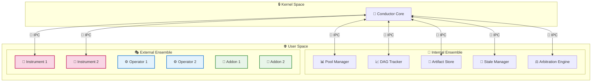
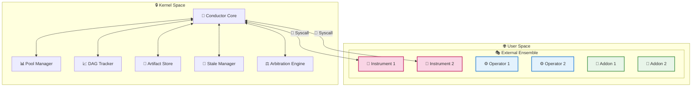
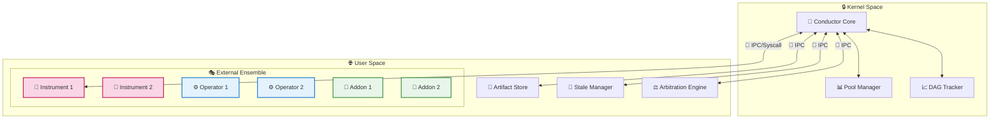
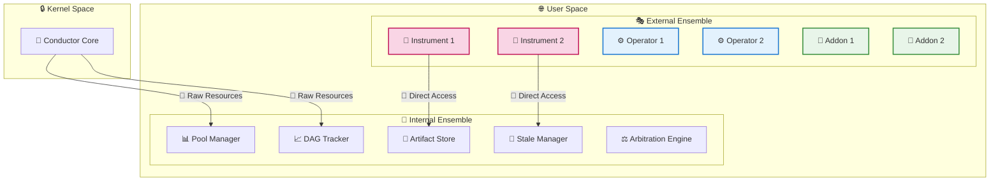
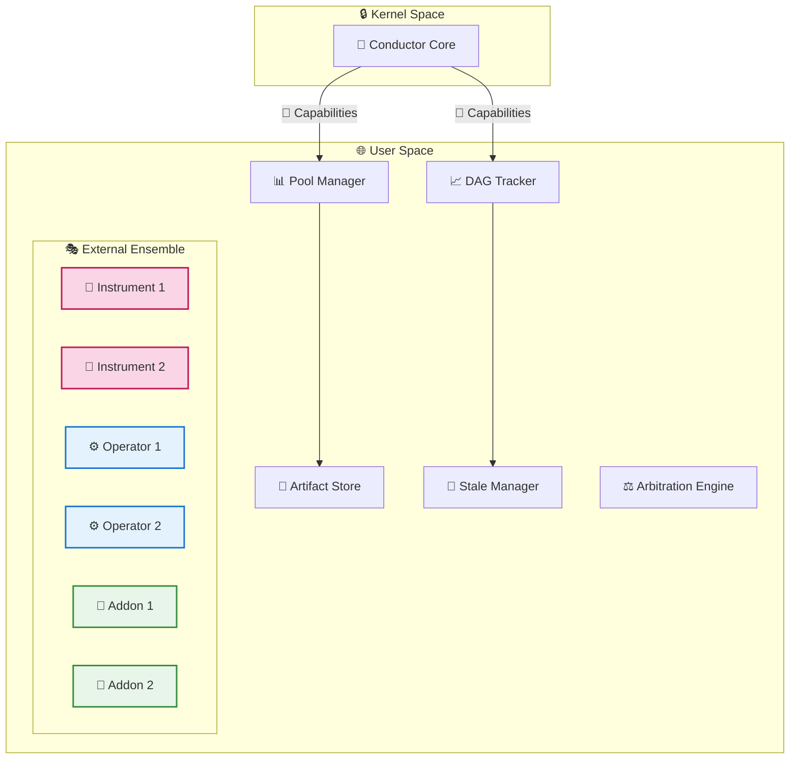

# The Kernels

> 🏗️ Architecture Design Patterns for Symphony's Core
> 
> 
> *Exploring the **five** fundamental approaches to organizing Symphony's intelligent orchestration system*
> 

---

## 🎯 Understanding Kernel Architectures

In Symphony's world, the **kernel architecture** determines how the **Conductor Core** interacts with the various components of the system. Just like operating system kernels, different approaches offer distinct trade-offs between performance, security, modularity, and complexity.

The choice of kernel architecture fundamentally shapes how **AI agents**, **workflow management**, and Assembling **systems [Extension system]** collaborate to create your development symphony.

---

## 🏛️ The Five Architecture Patterns

### 1. 🎯 **Microkernel Architecture** *(Recommended)*

> Minimal core, maximum modularity
> 

**🌟 Key Characteristics:**

- **🎯 Ultra-minimal kernel** - Only the Conductor Core runs in privileged space
- **🔒 Maximum isolation** - All components operate in protected user space
- **📡 IPC-based communication** - Clean, secure message passing between components
- **🔧 Hot-swappable components** - Replace or upgrade any part without system restart

**✅ Advantages:**

- **🛡️ Exceptional reliability** - Component failures don't crash the entire system
- **🔄 Easy maintenance** - Update individual components independently
- **🎨 Ultimate flexibility** - Unlimited customization through extensions
- **🔍 Clear debugging** - Isolated components make troubleshooting straightforward

**⚠️ Trade-offs:**

- **📞 IPC overhead** - Communication between components has small performance cost
- **🏗️ Complex architecture** - More moving parts to coordinate and manage

***🎯 Perfect for:** Production environments where stability, modularity, and extensibility are paramount.*

---

### 2. 🏔️ **Monolithic Kernel Architecture**

> Everything together, maximum performance
> 

**🌟 Key Characteristics:**

- **🏰 Large,  kernel** - All critical components run in kernel space
- **⚡ Direct function calls** - No IPC overhead for core operations
- **🔧 Syscall interface** - External components access kernel services via system calls
- **🎯 Centralized control** - Single point of orchestration and management

**✅ Advantages:**

- **🚀 Maximum performance** - No IPC overhead between core components
- **🎯 Simplified debugging** - Centralized execution makes tracking easier
- **📐 Straightforward design** - Fewer architectural layers to understand

**⚠️ Trade-offs:**

- **💥 Single failure domain** - One component crash can bring down the entire system
- **🔒 Rigid structure** - Difficult to swap or upgrade individual components
- **📈 Resource intensive** - All core components loaded even if unused

***🎯 Perfect for:** High-performance scenarios where maximum speed is critical and stability risks are acceptable.*

---

### 3. ⚖️ **Hybrid Kernel Architecture**

> Best of both worlds, balanced approach
> 

**🌟 Key Characteristics:**

- **⚡ Performance-critical components in kernel** - Hot path operations get direct access
- **🛡️ Security-sensitive components in user space** - Less trusted operations are isolated
- **🔀 Mixed communication patterns** - Both direct calls and IPC where appropriate
- **📊 Intelligent component placement** - Strategic decision about what goes where

**✅ Advantages:**

- **⚖️ Balanced performance** - Fast core operations with secure extensions
- **🎨 Selective modularity** - Critical parts stable, flexible parts swappable
- **🔧 Pragmatic approach** - Real-world trade-offs based on actual usage patterns

**⚠️ Trade-offs:**

- **🤔 Complex decisions** - Requires careful analysis of what belongs where
- **🔀 Mixed paradigms** - Developers must understand multiple communication patterns

***🎯 Perfect for:** Organizations that need both performance and flexibility, with clear performance bottlenecks identified.*

---

### 4. 🔬 **Exokernel Architecture**

> Raw power, unlimited freedom
> 

**🌟 Key Characteristics:**

- **🔧 Minimal kernel duties** - Only handles raw resource allocation
- **🎯 Direct component interaction** - Extensions communicate directly with each other
- **🆓 No enforced workflows** - Components define their own interaction patterns
- **🏗️ Build-your-own abstraction** - Maximum flexibility for specialized use cases

**✅ Advantages:**

- **🚀 Ultimate performance** - No kernel interference in component interactions
- **🎨 Unlimited customization** - Components can implement any communication pattern
- **🔬 Research-friendly** - Perfect for experimental AI architectures

**⚠️ Trade-offs:**

- **😵 Chaotic potential** - No guardrails can lead to unpredictable behavior
- **🤯 Complex development** - Developers must implement their own coordination
- **🐛 Difficult debugging** - No centralized monitoring or control

***🎯 Perfect for:** Research environments, experimental AI systems, and scenarios where maximum performance and flexibility outweigh stability concerns.*

---

### 5. ⚛️ **Nanokernel Architecture**

> Capability-based minimalism
> 

**🌟 Key Characteristics:**

- **🎫 Capability-based security** - Kernel only grants specific permissions
- **🔬 Minimal orchestration** - Components self-organize with granted capabilities
- **🏗️ User-space coordination** - All workflow logic happens outside the kernel
- **🛡️ Fine-grained permissions** - Precise control over what each component can do

**✅ Advantages:**

- **🔒 Exceptional security** - Components can only do what they're explicitly allowed
- **⚡ Minimal kernel overhead** - Tiny kernel footprint
- **🎯 Flexible coordination** - Components can implement custom workflows

**⚠️ Trade-offs:**

- **🤔 Complex capability management** - Difficult to design and maintain permission systems
- **📚 Steep learning curve** - Developers must understand capability-based programming
- **🧩 Coordination complexity** - No built-in workflow management

***🎯 Perfect for:** Security-critical environments where fine-grained access control is essential.*

---

## 🎭 Component Categories Explained

### 🎼 Internal Ensemble *(The Core Musicians)*

**Always trusted, performance-critical components:**

- **📊 Pool Manager** - Resource allocation and AI model lifecycle management
- **📈 DAG Tracker** - Workflow execution monitoring and dependency resolution
- **💾 Artifact Store** - Secure storage and retrieval of workflow artifacts
- **🧹 Stale Manager** - System cleanup and optimization tasks
- **⚖️ Arbitration Engine** - Intelligent conflict resolution and decision making

### 🎭 External Ensemble *(The Creative Performers)*

**Community-driven, sandboxed extensions:**

- **🎻 Instruments** - AI/ML models and intelligent processing units
- **⚙️ Operators** - Utility functions and data processing tools
- **🧩 Addons (Motifs)** - UI components and IDE enhancements

---

## 🔄 Communication Patterns

### 📡 **IPC (Inter-Process Communication)**

- **🔒 Secure** - Components isolated from each other
- **📊 Monitored** - All communication logged and trackable
- **🛡️ Sandboxed** - Failed components can't affect others

### ⚡ **Direct Function Calls**

- **🚀 Fast** - No communication overhead
- **🎯 Simple** - Straightforward programming model
- **⚠️ Risky** - Crashes can propagate between components

### 🔧 **Syscalls**

- **🏛️ Controlled** - Kernel mediates all external access
- **📋 Auditable** - Complete log of component requests
- **⚖️ Balanced** - Good performance with reasonable isolation

### 🎫 **Capabilities**

- **🔒 Secure** - Fine-grained permission control
- **🔬 Flexible** - Components define their own interaction patterns
- **🤔 Complex** - Requires sophisticated permission management

---

## 🎵 The Symphony Advantage

Regardless of kernel architecture choice, Symphony's design principles ensure:

- **🎨 Extensibility** - Rich ecosystem of community extensions
- **🔒 Security** - Sandboxed execution with controlled permissions
- **⚡ Performance** - Optimized for AI workflow orchestration
- **🎯 Reliability** - Battle-tested patterns adapted for modern development
- **🌟 Innovation** - Architecture that evolves with AI capabilities

---

## 🎯 **Symphony's Conductor Model Decision**

> ⚠️ Important Clarification: This document describes the Conductor's behavioral model — how the Python RL orchestrator operates conceptually. It does NOT prescribe the Rust backend's software architecture pattern (e.g., Actor-Service, ECS, Hexagonal, etc.). The backend implementation architecture is a separate design decision.
> 

After extensive research and testing across various development scenarios, **Symphony's Conductor officially adopts Microkernel-like behavior** as its operational model. This decision reflects our core philosophy: **"Minimal Core, Maximum Potential."**

### 🔬 **What This Means**

The **Conductor** (Python RL orchestration model) behaves like a microkernel:

| Concept | Microkernel Analogy | Symphony Implementation |
| --- | --- | --- |
| **Minimal Kernel** | Only essential services in kernel | Conductor = minimal orchestration + RL logic only |
| **User Space Services** | Most functionality runs outside kernel | Extensions (Pit + Grand Stage) do the real work |
| **IPC Communication** | Kernel↔Services via message passing | Conductor↔Extensions via defined protocols |
| **Hot-Swappable** | Services can be replaced at runtime | Extensions can be loaded/unloaded dynamically |

### 🎯 **Why Microkernel-like Behavior**

This behavioral model aligns with Symphony's vision:

- **🛡️ Reliability First** - Extensions can fail without crashing the Conductor
- **🚀 Innovation Speed** - New AI models/extensions deploy without Conductor changes
- **🌐 Community Growth** - Clean isolation enables safe third-party extensions
- **🔮 Future-Proof** - Conductor remains stable while extensions evolve rapidly

### ⚙️ **What This Does NOT Decide**

The following remain **open design decisions** for the Rust backend:

- **Software Architecture Pattern**: Actor-Service, ECS, Hexagonal, CQRS, etc.
- **Xi-editor Integration**: How to structure adapters/bridges
- **The Pit Implementation**: Internal data structures and concurrency model
- **IPC Bus Design**: Binary protocols, serialization formats

These decisions should be made based on:

- Performance requirements (50-100ns for Pit operations)
- Developer ergonomics
- Xi-editor's existing architecture
- Extensibility needs

---

***Symphony's Conductor: Microkernel-inspired orchestration, with backend architecture yet to be defined.***