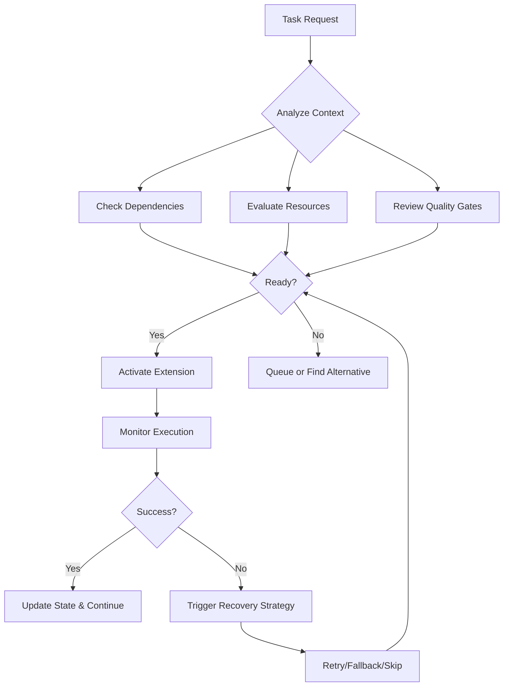

# The Orchestration

# The Orchestration

> *Where intelligent coordination transforms isolated extensions into harmonious symphonies*
> 

---

## 🎯 What is Orchestration?

**Orchestration** in Symphony is the art and science of coordinating multiple extensions, managing their interactions, and ensuring they work together seamlessly to accomplish complex development tasks.

Think of it as conducting a symphony orchestra: each musician (extension) is talented individually, but the conductor (Symphony's Conductor Core) ensures they play together in perfect harmony, at the right time, with the right intensity.

### 🎪 Players: Orchestrated Extensions

Not all extensions participate in Conductor orchestration. **Players** are
extensions that have registered with the Conductor Core to actively collaborate
in workflows under defined policies and governance frameworks.

*For comprehensive details on Player registration, requirements, benefits, and
lifecycle management, see → [The Player](The%20Player%20294461aa27058067ac8ec0bdfda7a4ff.md)* 

**Core Philosophy:**

> "Individual talent creates notes. Intelligent orchestration creates music."
> 

---

## 🎼 The Two Faces of Orchestration

Symphony provides orchestration at two distinct levels:

### 🎩 **Automatic Orchestration** - *The Conductor's Intelligence*

The Conductor Core handles:

- **Extension Lifecycle Management**: Loading, activating, and unloading extensions
- **Resource Allocation**: Ensuring models have what they need when they need it
- **Failure Recovery**: Gracefully handling errors and finding alternative paths
- **Performance Optimization**: Learning from patterns to improve efficiency

*This is the invisible orchestration - you don't see it, but you feel its impact.*

### 🎨 **Manual Orchestration** - *Melody Creation*

Users create explicit workflows called **Melodies** through:

- **Visual Workflow Design**: Drag-and-drop composition interface
- **Extension Configuration**: Set parameters and connections
- **Task Assignment**: Define what each extension should do
- **Flow Control**: Specify execution order and conditions

*This is the visible orchestration - you design the performance.*

*Learn more at → [The Melody](The%20Melody%2028a461aa27058099998fd7a101cb450d.md)* 

---

## 🎛️ Orchestration Components

### 🎯 **Model Activation Intelligence**

The Conductor doesn't just follow scripts – it makes smart decisions:

**📊 Activation Factors**:

- **Current State**: What's already been done?
- **Quality Metrics**: How good are the current outputs?
- **Dependencies**: What needs to happen before what?
- **Resource Availability**: What models are ready to work?

**🧠 Decision Process**:



---

## 🛠️ Adaptive Failure Handling

When things go wrong, the Conductor has multiple strategies:

### 🔄 **Retry Strategies**

**1. Simple Retry**

- Try the same model again with different parameters
- Useful for transient failures (network issues, temporary resource constraints)

**2. Fallback Models**

- Switch to a backup model that can do similar work
- Example: If GPT-4 fails, try Claude or a local model

**3. Reverse Reconstruction**

- Generate missing early outputs from later results
- Example: If feature extraction fails but code exists, reverse-engineer features

**4. Graceful Skip**

- Continue without the failed component if possible
- Mark the gap for manual review later

### 🎯 **Strategy Selection Based On**:

| Factor | Impact on Strategy |
| --- | --- |
| **Model Importance** | Critical components get more retry attempts |
| **Alternative Availability** | More options = more aggressive recovery |
| **Risk Tolerance** | Project settings influence skip decisions |
| **Cost Constraints** | Budget limits affect fallback choices |
| **Time Pressure** | Deadlines influence retry vs. skip decisions |

---

## 📊 Artifact Flow Management

The Conductor manages the chain of outputs between models:

```
artifact_1 → artifact_2 → artifact_3 → ...
     🎻              🎻            🎻
   Model A        Model B       Model C

```

### 🔍 **Flow Intelligence**

**Quality Checks**:

- Validates each output meets standards before passing it on
- Uses The Pit's Artifact Store for quality scoring
- Can trigger re-generation if quality is insufficient

**Compatibility**:

- Ensures outputs work with the next model's expectations
- Performs automatic format conversions when needed
- Validates schema compliance

**Harmony**:

- Maintains consistency across the entire chain
- Detects and resolves conflicts between artifacts
- Ensures semantic coherence throughout the workflow

---

## 🌊 Orchestration Flow Types

### 📈 **Standard Sequential**

```
A → B → C → D

```

Most common pattern for linear workflows:

1. Enhance prompt
2. Extract features
3. Generate code
4. Create documentation

### 🌿 **Branching Logic**

```
    ┌─→ B → C
A ──┤
    └─→ D → E

```

Conditional paths based on:

- **Content Analysis**: Different flows for different project types
- **Quality Gates**: Alternative paths if quality is insufficient
- **User Preferences**: Personalized workflow variations

### ⏪ **Reverse Reconstruction**

```
Missing A ← Generate from B ← C (already exists)

```

When early steps fail but later artifacts exist:

- Analyze existing output
- Infer what the input must have been
- Generate missing intermediate steps

### ⚡ **Parallel Execution**

```
    B ← A → C
    ↓       ↓
    D → E ← F

```

Concurrent operations when:

- No dependencies between steps
- Independent data processing
- Resource availability permits
- Time efficiency is crucial

---

## 🎨 The Harmony Board

The **Harmony Board** is Symphony's visual interface for designing and debugging orchestration workflows.

### 🖼️ **Interface Components**

**Node Canvas**:

- Visual representation of extensions as nodes
- Connection lines showing data flow
- Color coding for node states (idle, active, error, complete)

**Extension Palette**:

- Drag-and-drop library of available extensions
- Categorized by type (Instruments, Operators, Addons)
- Search and filter capabilities

**Properties Panel**:

- Configure selected node parameters
- Set input/output mappings
- Define execution conditions

**Execution Timeline**:

- Real-time visualization of workflow progress
- Historical execution view
- Performance metrics display

### 🎯 **Design Features**

**Visual Flow Creation**:

```
[User Input] → [Enhancement] → [Feature Extraction]
                                       ↓
                                [Code Generation] → [Output]

```

**Live Preview**:

- See artifacts as they're created
- Monitor quality scores in real-time
- Identify bottlenecks visually

**Debug Mode**:

- Step through execution one node at a time
- Inspect intermediate artifacts
- Test alternative paths

---

## 🔄 Dynamic Orchestration Capabilities

### 🧠 **Adaptive Path Selection**

The Conductor can dynamically adjust workflow paths based on runtime conditions:

**Context-Aware Routing**:

```python
if artifact_quality > 0.8:
    route_to_fast_track()
elif artifact_quality > 0.5:
    route_to_enhancement_loop()
else:
    route_to_manual_review()

```

**Resource-Based Decisions**:

- Switch to lighter models if resources are constrained
- Parallelize when capacity is available
- Queue when busy, prioritize when urgent

**Learning-Based Optimization**:

- Identify frequently used paths
- Optimize common patterns
- Suggest workflow improvements

---

## 📈 Performance Optimization

### ⚡ **Execution Efficiency**

**Lazy Loading**:

- Extensions load only when needed
- Reduces memory footprint
- Faster startup times

**Predictive Preloading**:

- The Pit's Pool Manager anticipates needs
- Pre-warms models based on workflow patterns
- Minimizes wait times during execution

**Parallel Optimization**:

- Automatically identifies parallelizable steps
- Distributes work across available resources
- Maintains dependency constraints

### 💰 **Cost Optimization**

**Model Selection**:

- Chooses appropriate model tier for task complexity
- Balances quality vs. cost for each step
- Tracks spending against budgets

**Resource Sharing**:

- Reuses loaded models across steps
- Shares common computations
- Minimizes redundant processing

**Quality Thresholds**:

- Uses cheaper models when quality permits
- Escalates to premium models only when needed
- Learns optimal quality/cost balance

---

***The Orchestration: Where intelligent coordination transforms chaos into harmony, and extensions become greater than the sum of their parts.*** 🎼