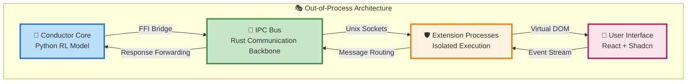
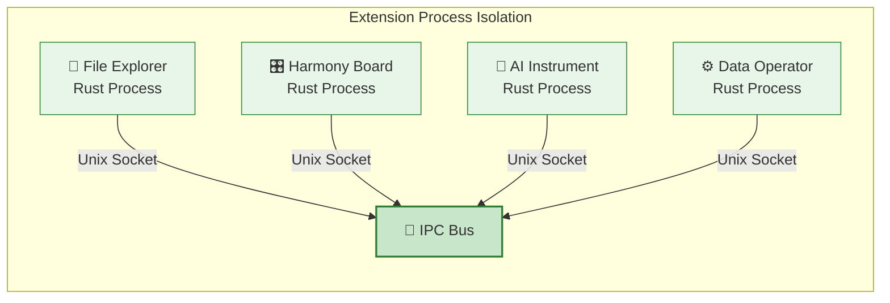
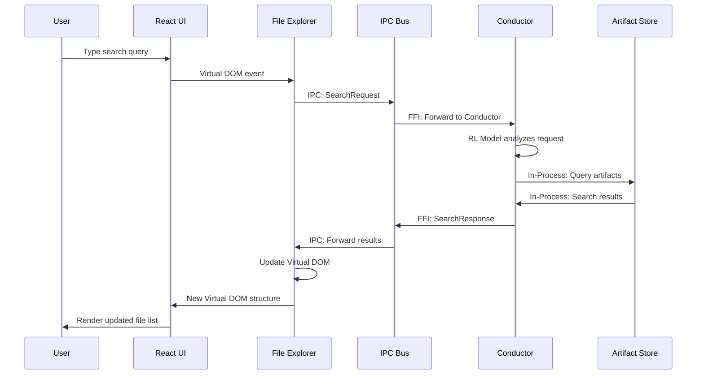

# The Out-of-Process

> Isolated Intelligence, Unified Experience
> 
> 
> *Where user-facing extensions operate in safety while maintaining seamless integration with Symphony's core intelligence*
> 

---

## 🎯 The Out-of-Process Philosophy

Symphony's out-of-process architecture represents a fundamental commitment to **stability without compromise**. While The Pit operates at raw performance speeds, user-facing extensions enjoy the safety of process isolation while maintaining the responsiveness users expect.

**The Core Principle**: User interactions should never crash the intelligent core, and intelligent operations should never degrade the user experience.

---

## 🏗️ The Four-Layer Architecture

Symphony's out-of-process design employs a sophisticated four-layer architecture that seamlessly bridges Python intelligence with Rust performance and React user interfaces:



### 🎩 **Layer 1: The Conductor Core** - Python Intelligence

**The Brain of Symphony**: The Conductor operates as a Python-based Reinforcement Learning model, trained through Function Quest Game to master orchestration logic.

**Core Responsibilities:**

- 🧠 **Intelligent Orchestration**: Makes strategic decisions about workflow execution
- 📊 **RL Model Processing**: Uses trained models to optimize extension coordination
- 🔄 **State Management**: Maintains global awareness of all extension states
- 🎯 **Adaptive Learning**: Improves orchestration strategies through continuous feedback

**Technical Foundation:**

- **Language**: Python 3.11+ with type hints
- **AI Framework**: PyTorch/TensorFlow for RL model execution
- **Async Runtime**: Asyncio for non-blocking operation
- **Training Ground**: Function Quest Game for orchestration skill development

### 🔗 **Layer 2: The IPC Bus** - Rust Communication Backbone

**The Nervous System**: A high-performance, hardcoded Rust crate that manages all inter-process communication with zero-copy efficiency.

**Architecture Overview:**

```
symphony_ipc_bus/
├── Cargo.toml                 # Hardcoded Rust dependency
├── src/
│   ├── lib.rs                 # Core bus implementation
│   ├── ffi_bridge.rs          # Python ↔ Rust FFI layer
│   ├── transport/
│   │   ├── unix_socket.rs     # Linux/macOS optimization
│   │   ├── named_pipes.rs     # Windows optimization
│   │   └── shared_memory.rs   # High-frequency data
│   ├── protocol/
│   │   ├── message_format.rs  # Binary serialization
│   │   └── schema_validation.rs
│   └── manager/
│       ├── process_manager.rs # Extension lifecycle
│       └── routing_engine.rs  # Smart message routing

```

**Key Capabilities:**

- ⚡ **Zero-Copy Messaging**: Shared memory for high-frequency data
- 🔄 **Connection Pooling**: Reusable connections to avoid setup overhead
- 📊 **Intelligent Batching**: Groups messages to minimize system calls
- 🛡️ **Fault Tolerance**: Automatic reconnection and failure recovery
- 📈 **Load Balancing**: Distributes messages across extension instances

### 🛡️ **Layer 3: Extension Processes** - Isolated Execution

**The Specialized Workforce**: Each user-facing extension runs in its own isolated process, providing crash protection and resource containment.

**Process Architecture:**



**Isolation Benefits:**

- 💥 **Crash Containment**: Extension failures don't affect Conductor or other extensions
- 💾 **Memory Safety**: Memory leaks contained within process boundaries
- 🔧 **Independent Updates**: Extensions can be updated without system restart
- 📊 **Resource Control**: CPU and memory limits enforced per process
- 🎯 **Security Sandboxing**: Malicious code cannot access core system

### 🎨 **Layer 4: User Interface** - React Experience Layer

**The User-Facing Presentation**: A modern React interface with Shadcn components that renders Virtual DOM structures generated by Rust extensions.

**UI Architecture:**

- **Framework**: React 18+ with TypeScript
- **Component Library**: Shadcn UI for consistent design
- **State Management**: Zustand for lightweight state
- **Virtual DOM**: Custom renderer for Rust-generated UI structures
- **Real-time Updates**: WebSocket connection to Harmony Board extension

---

## 🔧 Technical Implementation Deep Dive

### 🎩 **Conductor Core & FFI Bridge**

**Python-to-Rust Communication**: The Conductor interacts with the IPC Bus through a carefully designed Foreign Function Interface.

**FFI Architecture:**

```python
# Python Conductor using Rust IPC Bus via FFI
import symphony_ipc  # Python wrapper around Rust crate

# symphony_ipc  
class IPCBus():
	def spawn_extension():
	...
	

class Conductor:
    def __init__(self):
        # Initialize Rust IPC bus via FFI
        self.ipc_bus = symphony_ipc.IPCBus()

    async def start_extension(self, extension_id: str) -> bool:
        """Start an extension process via IPC bus"""
        return await self.ipc_bus.spawn_extension(extension_id)

    async def send_to_extension(self, extension_id: str,
                              message_type: str,
                              payload: dict) -> dict:
        """Send message to extension via IPC bus"""
        response = await self.ipc_bus.send_message(
            extension_id, message_type, payload
        )
        return response

    async def handle_extension_event(self, event: ExtensionEvent):
        """Process events from extensions"""
        # RL model makes orchestration decisions
        decision = self.rl_model.decide_next_action(event)
        await self.execute_orchestration_decision(decision)

```

**FFI Performance Characteristics:**

- ⏱️ **Call Overhead**: ~0.01ms per FFI call
- 📈 **Throughput**: 50,000+ calls/second
- 🔄 **Memory**: Shared between Python and Rust
- 🛡️ **Safety**: Rust memory safety with Python exception handling

### 🔗 **IPC Bus Internal Architecture**

**Hardcoded Rust Communication Engine**: The IPC bus implements multiple transport strategies optimized for different message patterns.

**Transport Strategy Matrix:**

| Message Type | Transport | Latency | Use Case |
| --- | --- | --- | --- |
| **Control Messages** | Unix Sockets | 0.1-0.3ms | Extension lifecycle, simple commands |
| **High-Frequency Data** | Shared Memory | 0.01-0.05ms | Real-time UI updates, sensor data |
| **Large Payloads** | Memory-mapped Files | 0.5-2ms | File transfers, model weights |
| **Broadcast Events** | Pub/Sub Multiplexing | 0.2-0.5ms | System-wide notifications |

**Message Routing Intelligence:**

```rust
impl IPCBus {
    pub async fn route_message(&self, message: IPCMessage) -> Result<IPCMessage> {
        // Smart routing based on message characteristics
        let route = self.routing_engine.select_route(&message);

        match route {
            Route::Direct => self.direct_send(message).await,
            Route::Batched => self.batch_send(message).await,
            Route::Prioritized => self.priority_send(message).await,
            Route::Broadcast => self.broadcast_send(message).await,
        }
    }

    async fn direct_send(&self, message: IPCMessage) -> Result<IPCMessage> {
        // Immediate send for high-priority messages
        let endpoint = self.get_endpoint(&message.target).await?;
        endpoint.send_immediate(message).await
    }

    async fn batch_send(&self, message: IPCMessage) -> Result<IPCMessage> {
        // Batch with other messages to reduce system calls
        self.batcher.add_message(message).await;
        self.batcher.flush().await
    }
}

```

### 🛡️ **Extension Process Management**

**Isolated Execution Environment**: Each extension runs in a carefully managed process with resource controls and lifecycle management.

**Process Manager Implementation:**

```rust
pub struct ExtensionProcessManager {
    processes: HashMap<String, ManagedProcess>,
    resource_limits: ResourceQuotas,
    health_monitor: HealthMonitor,
    restart_policy: RestartPolicy,
}

impl ExtensionProcessManager {
    pub async fn spawn_extension(&mut self, manifest: &ExtensionManifest) -> Result<ProcessHandle> {
        // Create isolated process with resource limits
        let process = ManagedProcess::new()
            .with_memory_limit(manifest.memory_limit_mb)
            .with_cpu_limit(manifest.cpu_limit_percent)
            .with_restart_policy(&manifest.restart_policy)
            .spawn(&manifest.executable_path)
            .await?;

        // Monitor process health
        self.health_monitor.watch_process(process.id()).await;

        self.processes.insert(manifest.id.clone(), process);
        Ok(ProcessHandle::new(manifest.id.clone()))
    }

    pub async fn handle_process_crash(&mut self, process_id: &str) -> Result<()> {
        log::warn!("Extension {} crashed, applying restart policy", process_id);

        match self.restart_policy.for_extension(process_id) {
            RestartPolicy::Immediate => self.restart_extension(process_id).await,
            RestartPolicy::Backoff => self.restart_with_backoff(process_id).await,
            RestartPolicy::Manual => self.notify_administrator(process_id).await,
        }
    }
}

```

**Extension Lifecycle States:**

```
CREATED → STARTING → RUNNING → HEALTHY →
    (optional: UPDATING) →
    STOPPING → TERMINATED
    ↓
    CRASHED → (auto-restart based on policy)

```

### 🎨 **Virtual DOM & UI Integration**

**Rust-to-React UI Bridge**: Extensions describe their user interfaces using Virtual DOM structures that React efficiently renders.

**Virtual DOM Architecture:**

```rust
#[derive(Serialize, Deserialize)]
pub struct VirtualNode {
    pub id: String,
    pub component_type: ComponentType,
    pub props: HashMap<String, PropValue>,
    pub children: Vec<VirtualNode>,
    pub event_handlers: Vec<EventHandler>,
}

impl VirtualNode {
    pub fn to_react_element(&self) -> Result<JsValue> {
        // Serialize to JSON for React consumption
        serde_json::to_string(self)
            .map(|json| JsValue::from_str(&json))
            .map_err(|e| Error::SerializationError(e))
    }
}

```

**React Virtual DOM Renderer:**

```tsx
// React component that renders Rust-generated Virtual DOM
export function RustUIRenderer({ virtualTree, onEvent }: RustUIRendererProps) {
    return (
        <VirtualNodeRenderer
            node={virtualTree}
            onEvent={onEvent}
        />
    );
}

function VirtualNodeRenderer({ node, onEvent }: VirtualNodeRendererProps) {
    const component = COMPONENT_REGISTRY[node.componentType];

    if (!component) {
        console.warn(`Unknown component: ${node.componentType}`);
        return null;
    }

    return React.createElement(component, {
        ...node.props,
        key: node.id,
        onEvent: (eventData: any) => onEvent(node.id, eventData)
    }, node.children.map(child =>
        <VirtualNodeRenderer
            key={child.id}
            node={child}
            onEvent={onEvent}
        />
    ));
}

```

---

## 🔄 Complete Communication Flow

### 🎼 **End-to-End User Interaction**

**Scenario**: User requests file search through File Explorer extension



### ⚡ **Performance Characteristics**

**Out-of-Process Operation Timings:**

| Operation | Latency | Throughput | Notes |
| --- | --- | --- | --- |
| **UI Event → Extension** | 0.2-0.5ms | 20,000/sec | Virtual DOM event handling |
| **Extension → IPC Bus** | 0.1-0.3ms | 50,000/sec | Local socket communication |
| **IPC Bus → Conductor** | 0.01-0.05ms | 100,000/sec | FFI call optimization |
| **Conductor Decision** | 0.5-2ms | 10,000/sec | RL model processing |
| **Virtual DOM Update** | 1-5ms | 5,000/sec | React rendering cycle |

**Resource Isolation Benefits:**

- 💾 **Memory Safety**: 4GB model in AI extension doesn't affect 200MB Conductor
- 🔥 **Crash Recovery**: File explorer crash recovered in <100ms
- 📊 **Performance Isolation**: Heavy computation doesn't block UI interactions
- 🛡️ **Security**: Malicious extension cannot access sensitive conductor memory

---

## 🚀 Benefits & Strategic Advantages

### 🛡️ **Stability & Reliability**

**Crash Resilience:**

- ✅ **Isolated Failures**: Extension crashes don't propagate
- ✅ **Graceful Degradation**: System maintains partial functionality
- ✅ **Auto-Recovery**: Crashed extensions automatically restart
- ✅ **State Preservation**: User work preserved during extension recovery

**Memory Safety:**

- ✅ **Leak Containment**: Memory leaks limited to extension process
- ✅ **Resource Limits**: Enforced memory and CPU quotas
- ✅ **Clean Shutdown**: OS-guaranteed resource cleanup
- ✅ **Predictable Performance**: Consistent memory usage patterns

### 🔧 **Development & Maintenance**

**Team Productivity:**

- ✅ **Independent Development**: Teams work on extensions independently
- ✅ **Technology Freedom**: Extensions can use different Rust versions
- ✅ **Rapid Iteration**: Extensions can be updated without full redeployment
- ✅ **Simplified Testing**: Extensions tested in isolation

**Operational Excellence:**

- ✅ **Hot Swapping**: Extensions can be replaced while system runs
- ✅ **A/B Testing**: Multiple extension versions can run simultaneously
- ✅ **Performance Profiling**: Individual extension performance monitoring
- ✅ **Debugging Simplicity**: Extension debugging without system disruption

### 🎯 **User Experience**

**Responsive Interactions:**

- ✅ **Non-blocking UI**: Heavy computations don't freeze interface
- ✅ **Progressive Loading**: Extensions load on-demand, not at startup
- ✅ **Smooth Animations**: 60fps maintained during background processing
- ✅ **Instant Feedback**: UI responses within human perception limits

**Reliable Operation:**

- ✅ **Continuous Availability**: System remains usable during extension issues
- ✅ **Data Integrity**: User work preserved across extension restarts
- ✅ **Predictable Behavior**: Consistent performance under varying loads
- ✅ **Professional Experience**: Enterprise-grade stability and reliability

---

## 🔮 The Future of Out-of-Process Architecture

### 🚀 **Evolutionary Trajectory**

**Intelligent Process Placement:**

- 🧠 **AI-Driven Optimization**: RL model learns optimal extension placement
- 📊 **Dynamic Resource Allocation**: Automatic scaling based on workload
- 🌐 **Hybrid Deployment**: Local and cloud extensions working in concert
- 🔄 **Predictive Loading**: Extensions pre-loaded based on usage patterns

**Advanced Isolation Techniques:**

- 🛡️ **WASM Sandboxing**: WebAssembly for maximum security isolation
- 🔒 **Hardware Enclaves**: CPU-level security for sensitive operations
- 📦 **Container Integration**: Docker-like isolation for complex extensions
- 🌍 **Edge Computing**: Distributed extension execution

### 🌟 **The Symphony Vision**

Symphony's out-of-process architecture represents more than just technical implementation—it embodies a philosophy where **intelligence and interface coexist in harmonious isolation**. By separating the raw computational power of AI orchestration from the stable, responsive user experience, we create an environment where both can excel without compromise.

> In Symphony, out-of-process isn't just an implementation detail—it's a commitment to building development tools that are as reliable as they are powerful, as stable as they are intelligent, and as responsive as they are sophisticated. 🎼
>