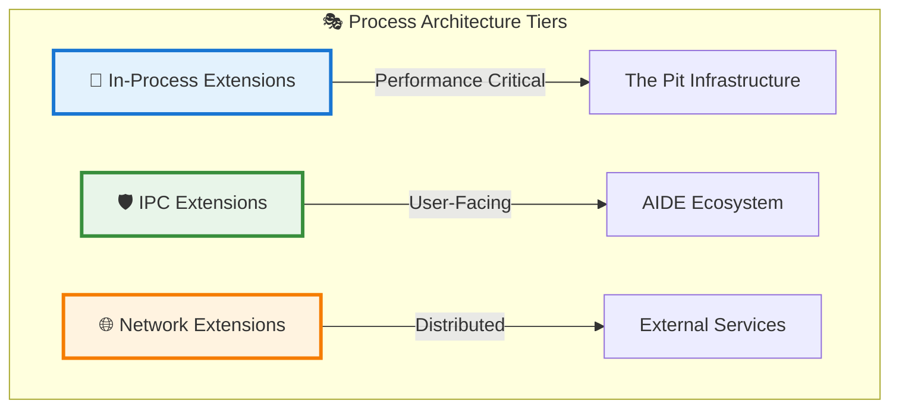
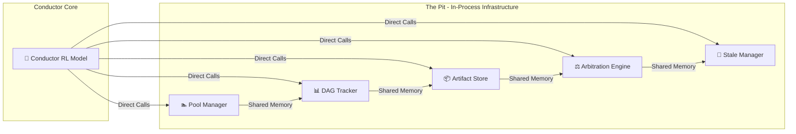
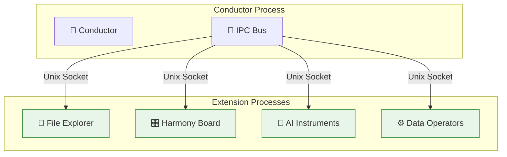
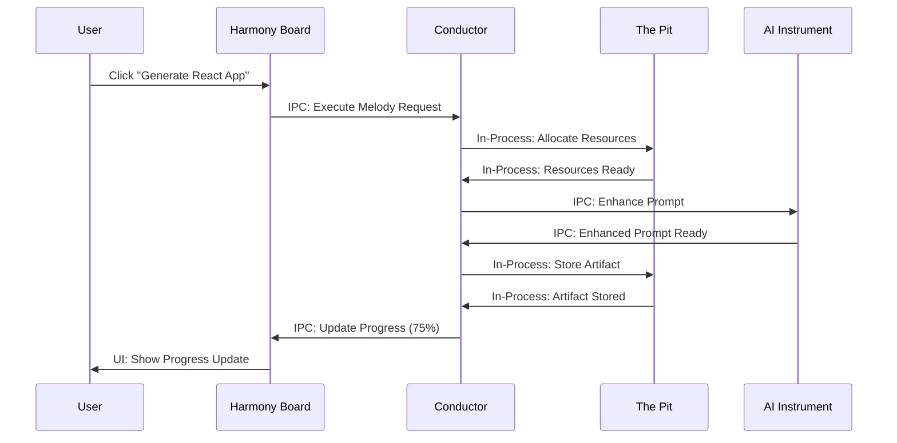

# The Process

> Orchestrating Intelligence Across Process Boundaries
> 
> 
> *Where strategic isolation meets performance optimization in Symphony's extension architecture*
> 
> > *References…*
> > 
> > 
> > [The In-Process](The%20In-Process%20282461aa270580b0a944e953d5d20da9.md)
> > 
> > [**The Out-of-Process**](The%20Out-of-Process%20282461aa270580baa6e6d8a7794cd176.md)
> > 

---

## 🎯 The Architectural Imperative

Symphony faces a fundamental challenge: how to balance **raw performance** with **system stability** in an environment where both are non-negotiable. The solution lies in a sophisticated process architecture that strategically places components where they belong—not where they're convenient.

**The Core Dilemma:**

- 🚀 **Performance Demands**: Infrastructure operations require nanosecond response times
- 🛡️ **Stability Requirements**: User-facing extensions must not crash the core system
- 🎯 **Resource Management**: Memory-intensive operations need isolation
- 🔧 **Development Flexibility**: Teams need independent deployment cycles

---

## 🏗️ The Three-Tier Process Architecture

Symphony employs a strategic three-tier approach to process management, each tier optimized for specific operational characteristics:



### 🧠 **Tier 1: In-Process Extensions** - The Performance Core

**Icon**: ⚡ [Lightning Bolt — Ultimate speed and integration]

**Characteristics:**

- **Shared Memory Space**: Direct access to Conductor's memory
- **Zero Serialization**: Raw data structure passing
- **Synchronous Execution**: Immediate, blocking operations
- **Shared Fate**: Crashes propagate to host process

**Performance Profile:**

- ⏱️ **Latency**: 10-100 nanoseconds per call
- 📈 **Throughput**: 1,000,000+ operations/second
- 💾 **Memory**: Shared heap, minimal overhead
- 🔧 **Complexity**: Simple function calls

### 🛡️ **Tier 2: IPC Extensions** - The Balanced Middle Ground

**Icon**: 🎯 [Bullseye — Perfect balance of performance and safety]

**Characteristics:**

- **Process Isolation**: Separate memory spaces, independent lifecycles
- **Structured Serialization**: Protocol-based message passing
- **Asynchronous Communication**: Non-blocking operations
- **Independent Failure**: Crashes contained to extension process

**Performance Profile:**

- ⏱️ **Latency**: 0.1-0.5 milliseconds per call
- 📈 **Throughput**: 10,000-100,000 operations/second
- 💾 **Memory**: Separate address spaces, moderate overhead
- 🔧 **Complexity**: Message routing and process management

### ~~🌐 **Tier 3: Network Extensions** - The Distributed Frontier *[Deprecated]*~~

**Icon**: 🌍 [Globe — Worldwide connectivity and distribution]

**Characteristics:**

- **Network Isolation**: Separate machines, geographic distribution
- **Heavy Serialization**: Protocol buffers, JSON over wire
- **Eventual Consistency**: Network latency and reliability factors
- **Complete Isolation**: Failures never affect local system

**Performance Profile:**

- ⏱️ **Latency**: 10-1000 milliseconds per call
- 📈 **Throughput**: 1,000-10,000 operations/second
- 💾 **Memory**: Remote allocation, significant overhead
- 🔧 **Complexity**: Network management, service discovery

---

## 🎭 The Pit: Why In-Process is Non-Negotiable

### 🏗️ **The Infrastructure Performance Mandate**

The Pit represents Symphony's operational backbone—five infrastructure extensions that cannot tolerate any communication overhead. These components form a tightly-coupled performance unit where every nanosecond matters.

**Why In-Process is Mandatory for The Pit:**



### ⚡ **The Performance Imperative**

**Microsecond-Scale Operations:**

- **Model Allocation**: Pool Manager must allocate AI models in <100μs
- **State Transitions**: DAG Tracker handles 100,000+ workflow updates/second
- **Artifact Storage**: Artifact Store manages GB-sized files with zero-copy operations
- **Conflict Resolution**: Arbitration Engine resolves resource disputes in real-time
- **Memory Reclamation**: Stale Manager cleans resources without observable latency

**Shared Memory Requirements:**

- 🧠 **Direct Memory Access**: Infrastructure components inspect each other's state directly
- 🔄 **Lock-Free Algorithms**: Atomic operations require shared memory primitives
- 📊 **Real-time Metrics**: Performance counters accessed without serialization
- 💾 **Zero-Copy Data**: Large artifacts and model weights passed as raw pointers

### 🔧 **How In-Process Communication Works**

**Direct Function Calls:**

```
Conductor → Pool Manager: allocate_model("gpt4", priority=HIGH)
    ↓
Direct Rust function call: 50 nanoseconds
    ↓
Immediate response: ModelHandle { id: "model_123", status: READY }

```

**Shared Memory Patterns:**

- **Global State**: Workflow graphs, resource tables, artifact metadata
- **Atomic Counters**: Performance metrics, resource usage, queue depths
- **Memory Pools**: Pre-allocated buffers for high-frequency operations
- **Lock-Free Queues**: Inter-component messaging without blocking

**Synchronization Strategy:**

- 🎯 **Read-Optimized**: Most operations are lock-free reads
- 🔄 **Write Batching**: Infrequent writes batched and coordinated
- ⚡ **Memory Ordering**: Precise control over instruction reordering
- 🛡️ **Data Races**: Compile-time prevention through Rust's ownership

### 🚀 **The Consequence of In-Process Design**

**Performance Gains:**

- ✅ **Sub-millisecond Orchestration**: Entire workflow decisions in <1ms
- ✅ **Zero Serialization Overhead**: Raw data structures passed directly
- ✅ **Instant Consistency**: All components see state changes simultaneously
- ✅ **Maximal Throughput**: Limited only by CPU speed, not communication

**Architectural Trade-offs:**

- ❌ **Shared Fate**: Any Pit component crash takes down the Conductor
- ❌ **Memory Coupling**: Memory leaks in one component affect all
- ❌ **Update Coordination**: All components must be updated simultaneously
- ❌ **Debugging Complexity**: Stack traces span multiple components

---

## 🌟 User-Facing Extensions: The IPC Advantage

### 🎯 **The Isolation Imperative**

While The Pit demands ultimate performance, user-facing extensions prioritize stability, safety, and independent evolution. IPC provides the perfect balance for the AIDE ecosystem.

**Why IPC is Ideal for User Extensions:**



### 🛡️ **The Safety Benefits**

**Crash Isolation:**

- 💥 **Extension Crash**: Only the affected extension process terminates
- 🎯 **Conductor Stability**: Core orchestration continues uninterrupted
- 🔄 **Auto-Recovery**: Crashed extensions automatically restart
- 📊 **Graceful Degradation**: System maintains partial functionality

**Memory Protection:**

- 💾 **Separate Heaps**: Memory leaks contained to extension process
- 📈 **Resource Limits**: CPU and memory quotas enforced per extension
- 🔒 **Security Boundaries**: Malicious extensions cannot access core memory
- 🧹 **Clean Termination**: OS guarantees complete resource cleanup

### 🔧 **How IPC Communication Works**

**Structured Message Passing:**

```
Conductor → IPC Bus: send_to("file_explorer", GetFilesMessage)
    ↓
Serialization: JSON/protobuf → 0.2ms
    ↓
Unix Socket: Kernel transfer → 0.1ms
    ↓
File Explorer: Process message → Business logic
    ↓
Response: Serialized response → 0.2ms
    ↓
Total: ~0.5ms (vs 0.0001ms in-process)

```

**IPC Bus Architecture:**

- **Single Connection Point**: Conductor connects to one IPC bus
- **Message Routing**: Bus routes messages to appropriate extension processes
- **Protocol Abstraction**: Extensions use simple message handlers
- **Transport Optimization**: Unix sockets, named pipes, shared memory fallbacks

**Lifecycle Management:**

- 🔄 **Hot Loading**: Extensions can be updated without Conductor restart
- 📊 **Health Monitoring**: Bus monitors extension health and restarts failed processes
- 🎯 **Dependency Management**: Extensions can declare and wait for dependencies
- ⚡ **Lazy Initialization**: Extensions start on first use, not system boot

### 🎨 **The User Experience Impact**

**Perceived Performance:**

- ✅ **UI Responsiveness**: Frontend interactions feel instant (<100ms)
- ✅ **Background Processing**: Heavy computations don't block the interface
- ✅ **Progressive Loading**: Extensions load on-demand, not at startup
- ✅ **Smooth Animations**: 60fps UI maintained during background work

**Development Experience:**

- 🔧 **Independent Deployment**: Teams can update extensions independently
- 🐛 **Isolated Debugging**: Extension crashes don't lose developer state
- 📚 **Technology Freedom**: Extensions can use different Rust versions
- 🧪 **Testing Simplicity**: Extensions tested in isolation from core

---

## 🔄 The Complete Orchestration Flow

### 🎼 **Symphony in Motion**

A typical user interaction demonstrates how both architectures work together:



### ⚡ **Performance Characteristics**

**The Pit (In-Process):**

- ⏱️ **Operation Latency**: 0.0001ms - 0.01ms
- 📈 **Operations/Second**: 1,000,000+
- 🔄 **Consistency**: Immediate, atomic
- 🛡️ **Safety**: Compile-time guarantees

**AIDE Ecosystem (IPC):**

- ⏱️ **Operation Latency**: 0.1ms - 0.5ms
- 📈 **Operations/Second**: 10,000 - 100,000
- 🔄 **Consistency**: Eventual, with acknowledgments
- 🛡️ **Safety**: Process isolation

### 🎯 **Strategic Architecture Decisions**

**When to Use In-Process:**

- ✅ Infrastructure components with microsecond requirements
- ✅ Tightly-coupled systems requiring shared memory
- ✅ Components updated simultaneously with core
- ✅ Operations where crashes are catastrophic anyway

**When to Use IPC:**

- ✅ User-facing features where stability trumps speed
- ✅ Memory-intensive operations needing isolation
- ✅ Components with independent release cycles
- ✅ Experimental features with higher crash potential

**When to Use Network:**

- ✅ Truly distributed services (cloud AI, enterprise systems)
- ✅ Components requiring geographic distribution
- ✅ Integration with external platforms
- ✅ Services with existing network APIs

---

## 🚀 The Symphony Advantage

### 🎵 **Harmonious Coexistence**

Symphony's process architecture delivers what seems impossible: **enterprise-grade stability** with **real-time performance**. By strategically placing components where they belong, we achieve:

**For The Pit:**

- 🚀 **Infrastructure Performance**: Nanosecond operations for critical path
- 🔗 **Tight Integration**: Components work as a unified performance unit
- 📊 **Perfect Consistency**: Immediate state synchronization
- 🎯 **Deterministic Behavior**: Predictable, measurable performance

**For User Extensions:**

- 🛡️ **System Stability**: Isolated failures, continuous operation
- 🔧 **Development Agility**: Independent teams, separate release cycles
- 📈 **Resource Control**: Memory and CPU limits per extension
- 🎨 **User Experience**: Responsive interfaces, progressive functionality

### 🔮 **The Future of Intelligent Orchestration**

This architecture positions Symphony for the next generation of AI development:

**Scalability Ready:**

- 🌐 **Distributed Computing**: Network tier ready for cloud-scale AI
- 🔄 **Hybrid Workloads**: Local and cloud models working in concert
- 📊 **Elastic Resources**: Dynamic scaling based on workload demands
- 🎯 **Intelligent Placement**: AI-driven optimization of process locations

**Evolutionary Foundation:**

- 🧩 **Modular Growth**: New extension types integrate seamlessly
- 🔧 **Technology Evolution**: Core and extensions can evolve independently
- 📈 **Performance Trajectory**: Each component can be optimized in isolation
- 🌍 **Ecosystem Expansion**: Third-party extensions with guaranteed stability

---

> In Symphony, process architecture isn't about technical convenience—it's about strategic alignment. *“The Pit”* operates at the speed of thought, while user extensions provide the stability of bedrock. Together, they create an environment where artificial intelligence can truly orchestrate software creation. 🎼
>