# Symphony IDE - Comprehensive Class Diagrams

This document contains focused class diagrams for the Symphony IDE system, organized by architectural layers for better readability and navigation.

---

## 1. Harmonic Hexagonal Actor Architecture (H²A²) - Domain & Adapters

This diagram illustrates the core H²A² architecture, featuring the clean separation between Domain Core logic, Port interfaces, and Adapter implementations for Xi-Editor, The Pit, and the Actor-based Extension system.

```mermaid
%%{init: {'theme':'base', 'themeVariables': { 'primaryColor':'#e0f2fe', 'primaryTextColor':'#1f2937', 'primaryBorderColor':'#5B8FF9', 'lineColor':'#5B8FF9', 'secondaryColor':'#fef3c7', 'tertiaryColor':'#f0f9ff', 'noteBkgColor':'#f9fafb', 'noteBorderColor':'#5B8FF9', 'noteTextColor':'#1f2937'}}}%%
classDiagram-v2
    %% ============================================
    %% DOMAIN CORE (Pure Rust)
    %% ============================================
    
    class DomainCore {
        +orchestration: OrchestrationEngine
        +workflows: WorkflowDefinitions
        +policies: ExtensionPolicies
        +initialize() Result~void~
        +run_loop() void
    }

    class OrchestrationEngine {
        +scheduler: Scheduler
        +plan_task(intent: Intent) Workflow
        +execute_step(step: Step) Result~void~
    }

    class WorkflowDefinitions {
        +templates: Map~Id, Template~
        +validate(workflow: Workflow) bool
    }

    class ExtensionPolicies {
        +security_rules: RuleSet
        +enforce(context: Context) Result~void~
    }

    %% ============================================
    %% PORTS (Interfaces/Traits)
    %% ============================================

    class TextEditingPort {
        <<trait>>
        +insert(selection: Selection, text: String)
        +delete(range: Range)
        +apply_edit(edit: Edit)
        +get_text(range: Range) Rope
    }

    class PitPort {
        <<trait>>
        +allocate_player(id: ExtensionId) Result~Handle~
        +execute_dag(dag: DAG) Result~Execution~
        +store_artifact(data: Bytes) ArtifactId
    }

    class ExtensionPort {
        <<trait>>
        +load(manifest: Manifest) Result~void~
        +send_message(target: ActorId, msg: Message)
        +subscribe(topic: String) Stream
    }

    class ConductorPort {
        <<trait>>
        +analyze(context: Context) Analysis
        +generate_melody(prompt: String) Melody
    }

    %% ============================================
    %% ADAPTERS (Concrete Implementations)
    %% ============================================

    class XiCoreAdapter {
        +editor: XiEditor
        +rpc: XiRpcClient
        +sync_buffer(buffer_id: Id)
    }

    class PitAdapter {
        +pool: PoolManager
        +dag_tracker: DagTracker
        +artifact_store: ArtifactStore
        +direct_call_optimize() bool
    }

    class ActorExtensionAdapter {
        +actor_system: ActorSystem
        +registry: ActorRegistry
        +supervisor: SupervisorStrategy
        +spawn_actor(ext: Extension) ActorRef
    }

    class ConductorAdapter {
        +python_env: PyO3Env
        +rl_model: RLModel
        +bridge_call(func: String, args: Args) Value
    }

    %% ============================================
    %% INFRASTRUCTURE
    %% ============================================

    class XiEditor {
        <<external>>
        +rope: Rope
        +crdt: CrdtEngine
        +plugins: LegacyPluginLib
        (xi-core-lib)
    }

    class ThePit {
        <<infrastructure>>
        +pool_manager: PoolManager
        +dag_tracker: DagTracker
        +artifact_store: ArtifactStore
        +arbitration: ArbitrationEngine
        (50-100ns latency)
    }

    class GrandStage {
        <<actor-system>>
        +instruments: List~Actor~
        +operators: List~Actor~
        +motifs: List~Actor~
        +mailbox: MessageQueue
        (Isolation Layer)
    }

    %% Relationships
    DomainCore --> OrchestrationEngine : contains
    DomainCore --> WorkflowDefinitions : contains
    DomainCore --> ExtensionPolicies : contains

    DomainCore --> TextEditingPort : depends on
    DomainCore --> PitPort : depends on
    DomainCore --> ExtensionPort : depends on
    DomainCore --> ConductorPort : depends on

    XiCoreAdapter ..|> TextEditingPort : implements
    PitAdapter ..|> PitPort : implements
    ActorExtensionAdapter ..|> ExtensionPort : implements
    ConductorAdapter ..|> ConductorPort : implements

    XiCoreAdapter --> XiEditor : adapts
    PitAdapter --> ThePit : adapts (direct calls)
    ActorExtensionAdapter --> GrandStage : adapts (messages)

---

## 2. The Pit - AIDE Layer (High-Performance In-Process Execution)

This diagram focuses on The Pit's five core components that enable 50-100ns latency execution: Pool Manager, DAG Tracker, Artifact Store, Arbitration Engine, and Stale Manager.

```mermaid
%%{init: {'theme':'base', 'themeVariables': { 'primaryColor':'#e0f2fe', 'primaryTextColor':'#1f2937', 'primaryBorderColor':'#4a90e2', 'lineColor':'#6b7280', 'secondaryColor':'#fef3c7', 'tertiaryColor':'#f0f9ff', 'noteBkgColor':'#f9fafb', 'noteBorderColor':'#d1d5db', 'noteTextColor':'#1f2937'}}}%%
classDiagram-v2
    %% ============================================
    %% THE PIT - AIDE Layer (In-Process Extensions)
    %% ============================================
    
    class PitCore {
        +extensions: Map~ExtensionId, Extension~
        +poolManager: PoolManager
        +dagTracker: DagTracker
        +artifactStore: ArtifactStore
        +arbitrationEngine: ArbitrationEngine
        +staleManager: StaleManager
        +register(ext: Extension) Result~void~
        +unregister(id: ExtensionId) Result~void~
        +getExtension(id: ExtensionId) Option~Extension~
    }
    
    class PoolManager {
        +players: Map~ExtensionId, PlayerState~
        +cache: LruCache~ExtensionId, Player~
        +allocate(id: ExtensionId) Result~Player~
        +deallocate(id: ExtensionId) void
        +predictivePreWarm(pattern: UsagePattern) void
        +getState(id: ExtensionId) PlayerState
    }
    
    class PlayerState {
        <<enumeration>>
        Unloaded
        Loading
        Warming
        Ready
        Active
    }
    
    class DagTracker {
        +workflows: Map~MelodyId, Dag~
        +execute(melody: Melody) Result~Output~
        +topologicalSort(dag: Dag) List~NodeId~
        +parallelExecute(nodes: List~Node~) Result~List~Output~~
        +checkpoint(melodyId: MelodyId) Result~void~
        +resume(melodyId: MelodyId) Result~void~
    }
    
    class Dag {
        +nodes: Map~NodeId, Node~
        +edges: List~Edge~
        +validate() Result~void~
        +detectCycles() bool
        +getExecutionOrder() List~NodeId~
    }
    
    class Node {
        +id: NodeId
        +type: NodeType
        +extensionId: ExtensionId
        +params: Map~String, Value~
        +inputs: List~Port~
        +outputs: List~Port~
        +execute(inputs: Map~String, Value~) Result~Map~String, Value~~
    }
    
    class ArtifactStore {
        +artifacts: Map~ArtifactId, Artifact~
        +index: TantivyIndex
        +store(artifact: Artifact) Result~ArtifactId~
        +retrieve(id: ArtifactId) Result~Artifact~
        +search(query: String) List~Artifact~
        +deduplicate() void
        +scoreQuality(id: ArtifactId) f64
    }
    
    class Artifact {
        +id: ArtifactId
        +hash: ContentHash
        +data: Bytes
        +metadata: Metadata
        +version: u32
        +qualityScore: f64
        +createdAt: Timestamp
    }
    
    class ArbitrationEngine {
        +policies: List~Policy~
        +resolveConflict(resources: List~Resource~) Result~Resolution~
        +applyFairness(requests: List~Request~) List~Request~
        +prioritize(tasks: List~Task~) List~Task~
    }
    
    class StaleManager {
        +lifecycle: Map~ArtifactId, LifecycleStage~
        +transition(id: ArtifactId) Result~void~
        +getStage(id: ArtifactId) LifecycleStage
        +cleanup() void
    }
    
    class LifecycleStage {
        <<enumeration>>
        SSD_1_7_Days
        HDD_8_30_Days
        Cloud_30Plus_Days
    }
    
    %% Relationships
    PitCore --> PoolManager : contains
    PitCore --> DagTracker : contains
    PitCore --> ArtifactStore : contains
    PitCore --> ArbitrationEngine : contains
    PitCore --> StaleManager : contains
    
    PoolManager --> PlayerState : manages
    DagTracker --> Dag : executes
    Dag --> Node : contains
    ArtifactStore --> Artifact : stores
    StaleManager --> LifecycleStage : manages
```

---

## 3. IPC Communication Backbone & Conductor (RL Orchestration)

This diagram shows the inter-process communication infrastructure and the Python-based Conductor that uses reinforcement learning for intelligent workflow generation.

```mermaid
%%{init: {'theme':'base', 'themeVariables': { 'primaryColor':'#e0f2fe', 'primaryTextColor':'#1f2937', 'primaryBorderColor':'#4a90e2', 'lineColor':'#6b7280', 'secondaryColor':'#fef3c7', 'tertiaryColor':'#f0f9ff', 'noteBkgColor':'#f9fafb', 'noteBorderColor':'#d1d5db', 'noteTextColor':'#1f2937'}}}%%
classDiagram-v2
    %% ============================================
    %% IPC COMMUNICATION BACKBONE
    %% ============================================
    
    class IpcBus {
        +processes: Map~ProcessId, Process~
        +transport: Transport
        +protocol: Protocol
        +security: Security
        +send(msg: Message) Result~void~
        +receive() Result~Message~
        +broadcast(msg: Message) void
    }
    
    class Transport {
        <<interface>>
        +connect() Result~Connection~
        +disconnect() void
        +send(data: Bytes) Result~void~
        +receive() Result~Bytes~
    }
    
    class UnixSocketTransport {
        +path: String
        +socket: UnixSocket
        +connect() Result~Connection~
        +send(data: Bytes) Result~void~
    }
    
    class NamedPipeTransport {
        +name: String
        +pipe: NamedPipe
        +connect() Result~Connection~
        +send(data: Bytes) Result~void~
    }
    
    class Protocol {
        +serialize(msg: Message) Bytes
        +deserialize(data: Bytes) Result~Message~
        +frame(data: Bytes) Bytes
        +unframe(data: Bytes) Bytes
    }
    
    class Message {
        +id: MessageId
        +sender: ProcessId
        +receiver: ProcessId
        +payload: Bytes
        +timestamp: Timestamp
    }
    
    class Security {
        +authenticate(process: ProcessId) Result~Token~
        +validate(msg: Message) bool
        +rateLimit(process: ProcessId) bool
    }
    
    %% ============================================
    %% CONDUCTOR - RL Orchestration (Python)
    %% ============================================
    
    class Conductor {
        +model: RlModel
        +bridge: OrchestrationBridge
        +bindings: PyO3Bindings
        +generateMelody(prompt: String) Result~Melody~
        +calculateReward(outcome: Outcome) f64
        +updatePolicy(experience: Experience) void
        +train(data: TrainingData) void
    }
    
    class RlModel {
        +policy: Policy
        +valueFunction: ValueFunction
        +predict(state: State) Action
        +update(experience: Experience) void
    }
    
    class OrchestrationBridge {
        +toWorkflow(melody: Melody) Dag
        +fromWorkflow(dag: Dag) Melody
        +collectReward(execution: Execution) f64
    }
    
    class PyO3Bindings {
        +rustToPython(value: RustValue) PyObject
        +pythonToRust(obj: PyObject) RustValue
        +callPython(fn: String, args: List~Value~) Result~Value~
    }
    
    %% Relationships
    IpcBus --> Transport : uses
    IpcBus --> Protocol : uses
    IpcBus --> Security : uses
    IpcBus --> Message : sends
    Transport <|.. UnixSocketTransport : implements
    Transport <|.. NamedPipeTransport : implements
    
    Conductor --> RlModel : uses
    Conductor --> OrchestrationBridge : uses
    Conductor --> PyO3Bindings : uses
```



---

## 4. Orchestra Kit - Extension Ecosystem Management

This diagram covers the complete extension lifecycle: Registry, Marketplace, Installer, Lifecycle (Chambering), Security, and the Carets CLI/SDK toolchain.

```mermaid
%%{init: {'theme':'base', 'themeVariables': { 'primaryColor':'#e0f2fe', 'primaryTextColor':'#1f2937', 'primaryBorderColor':'#4a90e2', 'lineColor':'#6b7280', 'secondaryColor':'#fef3c7', 'tertiaryColor':'#f0f9ff', 'noteBkgColor':'#f9fafb', 'noteBorderColor':'#d1d5db', 'noteTextColor':'#1f2937'}}}%%
classDiagram-v2
    %% ============================================
    %% ORCHESTRA KIT - Extension Ecosystem
    %% ============================================
    
    class OrchestraKit {
        +registry: Registry
        +marketplace: Marketplace
        +installer: Installer
        +lifecycle: LifecycleManager
        +security: SecurityManager
    }
    
    class Registry {
        +extensions: Map~ExtensionId, ExtensionInfo~
        +register(ext: Extension) Result~void~
        +unregister(id: ExtensionId) Result~void~
        +search(query: String) List~ExtensionInfo~
        +getVersion(id: ExtensionId, version: SemanticVersion) Option~Extension~
        +listPlayers() List~ExtensionInfo~
    }
    
    class Marketplace {
        +browse() List~ExtensionInfo~
        +download(id: ExtensionId) Result~Bytes~
        +upload(package: Package) Result~void~
        +rate(id: ExtensionId, rating: u8) void
        +review(id: ExtensionId, text: String) void
    }
    
    class Installer {
        +install(package: Package) Result~void~
        +uninstall(id: ExtensionId) Result~void~
        +resolveDependencies(manifest: Manifest) Result~List~Dependency~~
        +verifySignature(package: Package) bool
        +rollback(id: ExtensionId) Result~void~
    }
    
    class LifecycleManager {
        +states: Map~ExtensionId, ChamberingState~
        +transition(id: ExtensionId, state: ChamberingState) Result~void~
        +getState(id: ExtensionId) ChamberingState
    }
    
    class ChamberingState {
        <<enumeration>>
        Installed
        Loading
        Loaded
        Activated
        Running
    }
    
    class SecurityManager {
        +sandbox: Sandbox
        +permissions: PermissionManager
        +checkCapability(id: ExtensionId, cap: Capability) bool
        +enforceLimit(id: ExtensionId, resource: Resource) bool
    }
    
    class Sandbox {
        +isolate(ext: Extension) Result~void~
        +restrict(permissions: List~Permission~) void
    }
    
    class PermissionManager {
        +roles: Map~UserId, Role~
        +checkPermission(user: UserId, action: Action) bool
        +grant(user: UserId, permission: Permission) void
        +revoke(user: UserId, permission: Permission) void
        +audit(action: Action) void
    }
    
    %% ============================================
    %% CARETS CLI & SDK
    %% ============================================
    
    class CaretsCli {
        +new(name: String, type: ExtensionType) Result~void~
        +test() Result~TestReport~
        +publish() Result~void~
        +scaffold(template: Template) Result~void~
    }
    
    class ExtensionSdk {
        +core: SdkCore
        +testing: TestingFramework
        +metrics: MetricsCollector
        +buildExtension(manifest: Manifest) Result~Extension~
    }
    
    class TestingFramework {
        +mocks: List~Mock~
        +fixtures: List~Fixture~
        +runTests(tests: List~Test~) TestReport
    }
    
    class MetricsCollector {
        +metrics: Map~String, Metric~
        +collect(name: String, value: f64) void
        +export() PrometheusMetrics
    }
    
    %% Relationships
    OrchestraKit --> Registry : contains
    OrchestraKit --> Marketplace : contains
    OrchestraKit --> Installer : contains
    OrchestraKit --> LifecycleManager : contains
    OrchestraKit --> SecurityManager : contains
    
    LifecycleManager --> ChamberingState : manages
    SecurityManager --> Sandbox : uses
    SecurityManager --> PermissionManager : uses
    
    CaretsCli --> ExtensionSdk : uses
    ExtensionSdk --> TestingFramework : contains
    ExtensionSdk --> MetricsCollector : contains
```



---

## 5. Orchestration Engine, Harmony Board & Bootstrap System

This diagram shows workflow orchestration (Maestro/Manual modes), the visual Harmony Board designer, and the phased bootstrap initialization system.

```mermaid
%%{init: {'theme':'base', 'themeVariables': { 'primaryColor':'#e0f2fe', 'primaryTextColor':'#1f2937', 'primaryBorderColor':'#4a90e2', 'lineColor':'#6b7280', 'secondaryColor':'#fef3c7', 'tertiaryColor':'#f0f9ff', 'noteBkgColor':'#f9fafb', 'noteBorderColor':'#d1d5db', 'noteTextColor':'#1f2937'}}}%%
classDiagram-v2
    %% ============================================
    %% ORCHESTRATION ENGINE
    %% ============================================
    
    class OrchestrationCore {
        +mode: ExecutionMode
        +melodyEngine: MelodyEngine
        +execute(melody: Melody) Result~Output~
        +switchMode(mode: ExecutionMode) void
    }
    
    class ExecutionMode {
        <<enumeration>>
        Maestro_RL
        Manual_UserDriven
    }
    
    class MelodyEngine {
        +melodies: Map~MelodyId, Melody~
        +create(name: String) Melody
        +load(id: MelodyId) Result~Melody~
        +save(melody: Melody) Result~void~
        +compose(nodes: List~Node~) Melody
    }
    
    class Melody {
        +id: MelodyId
        +name: String
        +dag: Dag
        +metadata: Metadata
        +isPublic: bool
        +createdBy: UserId
        +validate() Result~void~
    }
    
    class Dag {
        +nodes: Map~NodeId, Node~
        +edges: List~Edge~
        +validate() Result~void~
        +detectCycles() bool
        +getExecutionOrder() List~NodeId~
    }
    
    %% ============================================
    %% HARMONY BOARD - Visual Workflow Designer
    %% ============================================
    
    class HarmonyBoard {
        +canvas: Canvas
        +palette: NodePalette
        +validator: WorkflowValidator
        +createMelody() Melody
        +visualize(melody: Melody) void
        +monitor(execution: Execution) void
    }
    
    class Canvas {
        +nodes: List~VisualNode~
        +edges: List~VisualEdge~
        +addNode(node: VisualNode) void
        +connectNodes(from: NodeId, to: NodeId) Result~void~
        +render() void
    }
    
    class NodePalette {
        +instruments: List~Instrument~
        +operators: List~Operator~
        +motifs: List~Motif~
        +getNodes(type: ExtensionType) List~Node~
        +getPlayerNodes() List~Node~
    }
    
    class WorkflowValidator {
        +validateConnection(from: Port, to: Port) Result~void~
        +validateDag(dag: Dag) Result~void~
        +checkTypeSafety(edge: Edge) bool
        +detectCycles(dag: Dag) bool
    }
    
    %% ============================================
    %% POLYPHONY STORE
    %% ============================================
    
    class PolyphonyStore {
        +melodies: Map~MelodyId, Melody~
        +database: Database
        +index: SearchIndex
        +save(melody: Melody) Result~void~
        +load(id: MelodyId) Result~Melody~
        +search(query: String) List~Melody~
        +publish(id: MelodyId) Result~void~
    }
    
    %% ============================================
    %% BOOTSTRAP SYSTEM
    %% ============================================
    
    class BootstrapCore {
        +phases: List~Phase~
        +currentPhase: u8
        +phaseManager: PhaseManager
        +healthChecker: HealthChecker
        +initialize() Result~void~
        +rollback() Result~void~
    }
    
    class PhaseManager {
        +executePhase(phase: Phase) Result~void~
        +parallelInit(tasks: List~Task~) Result~void~
        +validatePhase(phase: Phase) bool
    }
    
    class Phase {
        <<enumeration>>
        Foundation_Types_Config
        IPC_MessageBus
        Pit_Components
        Conductor_RL
        HealthCheck_UI
    }
    
    class HealthChecker {
        +probes: List~Probe~
        +check() Result~HealthStatus~
        +validate(component: Component) bool
    }
    
    %% Relationships
    OrchestrationCore --> ExecutionMode : has
    OrchestrationCore --> MelodyEngine : uses
    MelodyEngine --> Melody : manages
    Melody --> Dag : contains
    
    HarmonyBoard --> Canvas : uses
    HarmonyBoard --> NodePalette : uses
    HarmonyBoard --> WorkflowValidator : uses
    
    PolyphonyStore --> Melody : stores
    
    BootstrapCore --> PhaseManager : uses
    BootstrapCore --> HealthChecker : uses
    PhaseManager --> Phase : executes
```



---

## 6. IDE Layer, Applications & Infrastructure Services

This diagram covers traditional IDE features (file operations, LSP, UI bridge), the three application types (Desktop, Server, Terminal), and infrastructure services (logging, hooks).

```mermaid
%%{init: {'theme':'base', 'themeVariables': { 'primaryColor':'#e0f2fe', 'primaryTextColor':'#1f2937', 'primaryBorderColor':'#4a90e2', 'lineColor':'#6b7280', 'secondaryColor':'#fef3c7', 'tertiaryColor':'#f0f9ff', 'noteBkgColor':'#f9fafb', 'noteBorderColor':'#d1d5db', 'noteTextColor':'#1f2937'}}}%%
classDiagram-v2
    %% ============================================
    %% IDE LAYER - Traditional Features
    %% ============================================
    
    class IdeCore {
        +fileOps: FileOperations
        +lsp: LspClient
        +syntaxHighlighter: SyntaxHighlighter
        +terminal: Terminal
        +uiBridge: UiBridge
    }
    
    class FileOperations {
        +open(path: String) Result~File~
        +save(file: File) Result~void~
        +delete(path: String) Result~void~
        +watch(path: String) void
        +list(dir: String) List~FileInfo~
    }
    
    class LspClient {
        +servers: Map~LanguageId, LspServer~
        +connect(language: LanguageId) Result~void~
        +sendRequest(req: LspRequest) Result~LspResponse~
        +handleNotification(notif: LspNotification) void
    }
    
    class SyntaxHighlighter {
        +grammars: Map~LanguageId, Grammar~
        +highlight(code: String, lang: LanguageId) HighlightedCode
        +loadGrammar(path: String) Result~Grammar~
    }
    
    class Terminal {
        +pty: Pty
        +shell: Shell
        +spawn(cmd: String) Result~Process~
        +write(data: Bytes) void
        +read() Result~Bytes~
    }
    
    class UiBridge {
        +virtualDom: VirtualDom
        +sendToFrontend(event: Event) void
        +receiveFromFrontend() Result~Event~
        +sync() void
    }
    
    class VirtualDom {
        +tree: VirtualNode
        +render() ReactComponent
        +diff(old: VirtualNode, new: VirtualNode) Patch
        +apply(patch: Patch) void
    }
    
    %% ============================================
    %% APPLICATIONS
    %% ============================================
    
    class DesktopApp {
        +window: TauriWindow
        +webview: Webview
        +core: Core
        +launch() void
        +handleEvent(event: Event) void
    }
    
    class ServerApp {
        +httpServer: HttpServer
        +wsServer: WebSocketServer
        +clients: Map~ClientId, Client~
        +core: Core
        +start(port: u16) void
        +broadcast(msg: Message) void
    }
    
    class TerminalApp {
        +pty: Pty
        +shell: Shell
        +core: Core
        +spawn(cmd: String) Result~Process~
        +write(data: Bytes) void
        +read() Result~Bytes~
    }
    
    class Core {
        <<orchestration host>>
        +JsonRpcServer server
        +ExtensionRegistry registry
        +IpcBus messageBus
        +start() void
        +shutdown() void
    }
    
    %% ============================================
    %% INFRASTRUCTURE SERVICES
    %% ============================================
    
    class Logger {
        +level: LogLevel
        +log(msg: String, level: LogLevel) void
        +trace(span: Span) void
        +structured(data: JsonValue) void
    }
    
    class LogLevel {
        <<enumeration>>
        Trace
        Debug
        Info
        Warn
        Error
    }
    
    class Hooks {
        +registerProtocol(scheme: String) void
        +notify(title: String, body: String) void
        +registerFileAssociation(ext: String) void
    }
    
    class PermissionManager {
        +roles: Map~UserId, Role~
        +checkPermission(user: UserId, action: Action) bool
        +grant(user: UserId, permission: Permission) void
        +revoke(user: UserId, permission: Permission) void
        +audit(action: Action) void
    }
    
    %% Relationships
    IdeCore --> FileOperations : uses
    IdeCore --> LspClient : uses
    IdeCore --> SyntaxHighlighter : uses
    IdeCore --> Terminal : uses
    IdeCore --> UiBridge : uses
    UiBridge --> VirtualDom : uses
    
    DesktopApp --> Core : launches
    ServerApp --> Core : launches
    TerminalApp --> Core : launches
    
    Logger --> LogLevel : uses
```



---

## Summary

The Symphony IDE class diagrams have been decomposed into **6 focused diagrams**, each covering a specific architectural layer:

1. **Foundation Layer & Core Extension API** - Core orchestration, type system, configuration, and base Extension interface with Player Policy
2. **The Pit (AIDE Layer)** - High-performance in-process execution with Pool Manager, DAG Tracker, Artifact Store, Arbitration Engine, and Stale Manager
3. **IPC Communication & Conductor** - Inter-process messaging infrastructure and Python-based RL orchestration
4. **Orchestra Kit & Extension Ecosystem** - Complete extension lifecycle management including Registry, Marketplace, Installer, Chambering, Security, and Carets CLI/SDK
5. **Orchestration Engine, Harmony Board & Bootstrap** - Workflow orchestration modes, visual designer, Polyphony Store, and phased initialization
6. **IDE Layer, Applications & Infrastructure** - Traditional IDE features, three application types, and infrastructure services

Each diagram maintains clean relationships and logical grouping while providing complete coverage of the Symphony IDE architecture. Classes that appear in multiple contexts (like `Core`, `Dag`, `Melody`) are duplicated where necessary to keep diagrams self-contained and readable.
